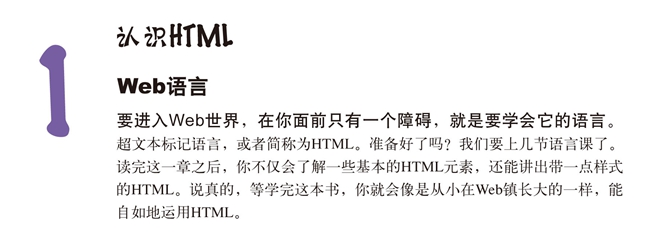
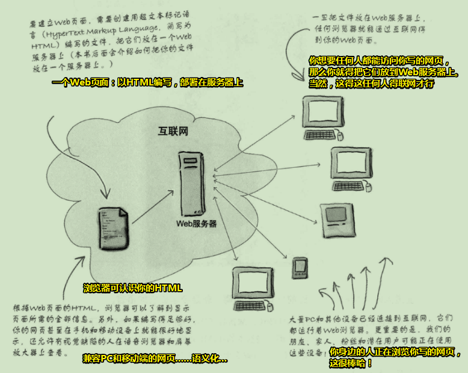
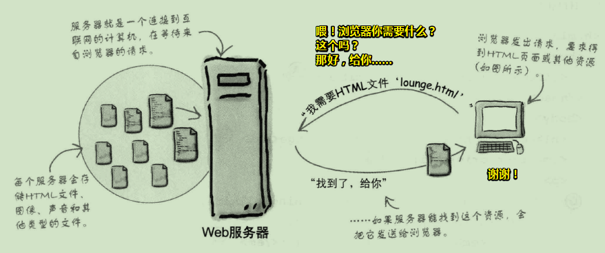

# 认识HTML

## ★内容概述

要想进入Web世界，那么只需要跨过这么一个障碍即可，那就是要学会它的语言——HTML（超文本标记语言）。这就是像是你想要与外国人交流，那么你就得学会英语一样！（别指望肢体语言哈！）

PS：HTML使Web如虎添翼！

## ★Web让广播明星黯然失色

想表达某种想法？——进入Web世界吧！

Web是全球通用的交流方式，而且，你能参与其中！

如果你想有效地使用Web，那么就必须得对HTML有所了解，当然，你还得对Web是如何工作略知一二。

从宏观的角度看Web，**✎：**

## ★Web服务器能做什么？

Web服务器闲来无事，一直在等Web浏览器的请求，而这个请求可能是要个页面？图片？音视频？JS？CSS？等等这些资源……Web服务器收到了对方的请求，就会查找所请求的资源，然后把找到的资源响应给对方浏览器！

## ★Q&A

### ①什么叫Web？

> web 是world wide web（万维网）的简称，不是缩写，万维网是基于http协议进行交互的应用网络。

**➹：**[Web 是什么意思？ - 知乎](https://www.zhihu.com/question/19860216)

