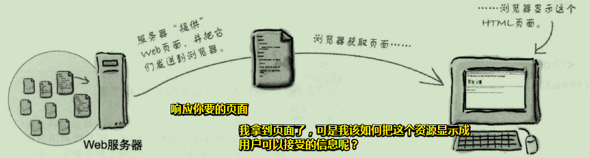
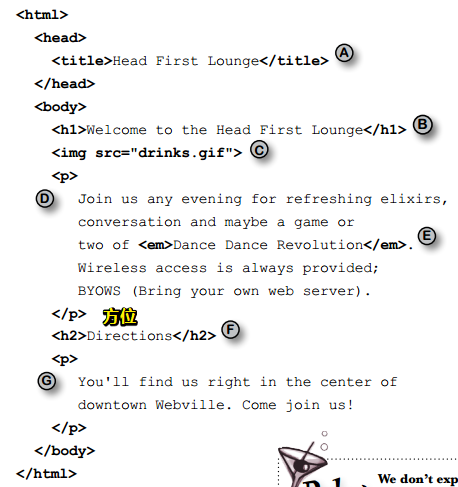

# 认识HTML

## ★内容概述

要想进入Web世界，那么只需要跨过这么一个障碍即可，那就是要学会它的语言——HTML（超文本标记语言）。这就是像是你想要与外国人交流，那么你就得学会英语一样！（别指望肢体语言哈！）

PS：HTML使Web如虎添翼！

## ★Web让广播明星黯然失色

想表达某种想法？——进入Web世界吧！

Web是全球通用的交流方式，而且，你能参与其中！

如果你想有效地使用Web，那么就必须得对HTML有所了解，当然，你还得对Web是如何工作略知一二。

从宏观的角度看Web，**✎：**

## ★Web服务器能做什么？

Web服务器闲来无事，一直在等Web浏览器的请求，而这个请求可能是要个页面？图片？音视频？JS？CSS？等等这些资源……Web服务器收到了对方的请求，就会查找所请求的资源，然后把找到的资源响应给对方浏览器！

## ★Web浏览器能做什么？

浏览器提供了一个可以让用户在网上冲浪的平台，如打开浏览器，输入网址回车或者单击一个链接来访问某个页面，浏览器就会向Web服务器请求一个HTML页面，响应回的页面，就会在你的浏览器窗口中显示！

但是浏览器怎么知道如何显示一个页面呢？

这里就需要用到HTML了。**HTML会告诉浏览器页面的所有内容和结构**……

通过编写一些HTML你就会知道这是如何做到的！

## ★你写的代码（HTML）

HTML：是浏览器显示页面的关键

但是它是什么？它又会做些什么？

在这儿有这么一段HTML代码，**✎：**

讲真，这就是一堆字符，真不知道浏览器什么怎么显示它们的！

总之，在这儿只是让你对HTML的外观有一个初步的了解！并不需要你在此刻了解HTML！

PS：注意这段demo的每个字母注释，如它们在浏览器的显示姿势是怎样的以及它们的位置是怎样的？

## ★浏览器创建的页面

当浏览器读取HTML时，它会解释围绕文本的所有标签。标签只是尖括号中的单词或字符，如 `<head>`、`
`、`<h1>`等等。标签告诉浏览器文本的结构和含义。因此，与给浏览器一堆文本不同，利用HTML，你可以使用标签来告诉浏览器标题中的文本是什么，哪些文本是段落，需要强调的文本又是什么，甚至图片需要被放置在哪儿？

下面就让我们来看一下浏览器是如何解释「Head First Lounge」这个页面中的标签的！

## ★Q&A

### ①什么叫Web？

> web 是world wide web（万维网）的简称，不是缩写，万维网是基于http协议进行交互的应用网络。

**➹：**[Web 是什么意思？ - 知乎](https://www.zhihu.com/question/19860216)

### ②标签和标记的区别？

标记（label）是概描述，而标签（tag）是泛描述！

ps：概描述到泛描述，具体到一般……

标记是本身的，而标签是附加的！

label强调是一种标志，tag强调是一种记号

label标明信息之间的归属，tag区别信息之间的差异

那么为啥HTML叫做超文本标记语言呢？而不是叫超文本标签语言呢？

按照wiki对标记（label）的解释：

> - [标记(程式语言)](https://www.wikiwand.com/zh/%E6%A8%99%E8%A8%98_(%E7%A8%8B%E5%BC%8F%E8%AA%9E%E8%A8%80))，程式语言中加在源代码中识别用的字串。

不知道markup与label是否等价，我发现去理解一个概念到底讲得是啥？是件很操蛋的事！

看了一个回答，说到，**✎：**

> 语言是啥？你想说你好，就发你好的这个音，写这两个字，别人也认为这个音和这两个字表示你好，于是你说的别人就听懂了，你想表达的意思别人就接收到了。**语言就是沟通双方对于什么东西表示什么意思的一种协议。**
> 标记是啥？你在你家门口写上，这是我的家，在卧室写上，这是我家卧室，这种**做个记号说明这是什么东西的事就叫标记。**

回到HTML，按照我的理解就是这些内容是标题，浏览器你给我记住了，还有这些内容是段落，也得要记住，不然会打你屁股的！

我们在对一些内容做个记号，而做记号的东西（尖括号中的单词或字符）我们把它叫做标签如 `
`、`<h1>`……

好了，不知道自己理解得多不多！

似乎可以呼应：tag强调是一种记号，tag区别信息之间的差异

**➹：**[标签 - Wikiwand](https://www.wikiwand.com/zh/%E6%A8%99%E7%B1%A4)

**➹：**[tag和label区别_tag和label区别:标签与标记的区别 - 阿里云](https://yq.aliyun.com/wenji/33906)

**➹：**[概描述和泛描述_网页设计_酷勤网](http://www.kuqin.com/webpagedesign/20090819/67036.html)

**➹：**[内容、标签和分类_交互设计_酷勤网](http://www.kuqin.com/uidesign/20081022/23831.html)

**➹：**[使用标签是迟早的事_交互设计_酷勤网](http://www.kuqin.com/uidesign/20081022/23830.html)

**➹：**[Tag 的分类方式和 Category 有何区别？最直观的就是列出优缺点对比 - 知乎](https://www.zhihu.com/question/19561400/answer/12239027)

**➹：**[标签 (Tags) 是个好的设计吗？ - 知乎](https://www.zhihu.com/question/19561383)

**➹：**[标记语言 脚本语言 有何区别？ - 知乎](https://www.zhihu.com/question/266491364)

