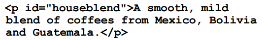
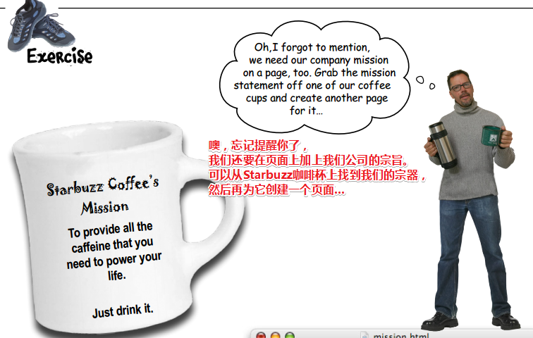

# 认识HTML

## ★内容概述

要想进入Web世界，那么只需要跨过这么一个障碍即可，那就是要学会它的语言——HTML（超文本标记语言）。这就是像是你想要与外国人交流，那么你就得学会英语一样！（别指望肢体语言哈！）

PS：HTML使Web如虎添翼！

## ★Web让广播明星黯然失色

想表达某种想法？——进入Web世界吧！

Web是全球通用的交流方式，而且，你能参与其中！

如果你想有效地使用Web，那么就必须得对HTML有所了解，当然，你还得对Web是如何工作略知一二。

从宏观的角度看Web，**✎：**

## ★Web服务器能做什么？

Web服务器闲来无事，一直在等Web浏览器的请求，而这个请求可能是要个页面？图片？音视频？JS？CSS？等等这些资源……Web服务器收到了对方的请求，就会查找所请求的资源，然后把找到的资源响应给对方浏览器！

## ★Web浏览器能做什么？

浏览器提供了一个可以让用户在网上冲浪的平台，如打开浏览器，输入网址回车或者单击一个链接来访问某个页面，浏览器就会向Web服务器请求一个HTML页面，响应回的页面，就会在你的浏览器窗口中显示！

但是浏览器怎么知道如何显示一个页面呢？

这里就需要用到HTML了。**HTML会告诉浏览器页面的所有内容和结构**……

通过编写一些HTML你就会知道这是如何做到的！

## ★你写的代码（HTML）

HTML：是浏览器显示页面的关键

但是它是什么？它又会做些什么？

在这儿有这么一段HTML代码，**✎：**

讲真，这就是一堆字符，真不知道浏览器什么怎么显示它们的！

总之，在这儿只是让你对HTML的外观有一个初步的了解！并不需要你在此刻了解HTML！

PS：注意这段demo的每个字母注释，如它们在浏览器的显示姿势是怎样的以及它们的位置是怎样的？

## ★浏览器创建的页面

当浏览器读取HTML时，它会解释围绕文本的所有标签。标签只是尖括号中的单词或字符，如 `<head>`、`
`、`<h1>`等等。标签告诉浏览器文本的结构和含义。因此，与给浏览器一堆文本不同，利用HTML，你可以使用标签来告诉浏览器标题中的文本是什么，哪些文本是段落，需要强调的文本又是什么，甚至图片需要被放置在哪儿？

下面就让我们来看一下浏览器是如何解释「Head First Lounge」这个页面中的标签的！

## ★没有愚蠢的问题

**①HTML就是我在文本周围放置的一堆标签?**

> 对初学者来说是这样的。要记住HTML是超文本标记语言的缩写！
>
> 所以HTML为您提供了一种使用标签来“标记”文本的方法，即可以通过标签来告诉浏览器这个文本的结构是怎样的。当然，HTML也有超文本方面的内容，我们稍后会在书中讲到

**②浏览器是怎么确定该如何显示HTML的？**

> HTML会告诉您的浏览器关于您的document结构：如标题的位置，段落的位置，需要强调的文本，等等。鉴于此信息，加上浏览器内置的默认规则，就可确定该如何显示每个元素了。
>
> 当然，您也不必满足于默认设置，您完全可以使用CSS添加自己的样式和格式化规则，以确定字体，颜色，大小和页面很多的其它特征。本章后面还会介绍到CSS

**③Head First 休闲室的HTML有很多缩进和空格，不过在浏览器上显示时，我并没有看到这些缩进和空格，怎么回事？**

> 没错，这个问题问得好。**浏览器会忽略HTML文档中的制表符（tabs）、回车（returns）和大部分空格（spaces）**。实际上，它们会**根据你的标记来确定在哪里换行或分段**。那么，既然浏览器会忽略这些空白符，我们为什么还要插入自己的格式呢？这是为了帮助我们在编辑HTML时能够更容易地读懂文档。随着HTML文档变得越来越复杂，你会发现，在某些地方加一些空格、回车和制表符，这会对提高HTML可读性很有帮助。

**④对了，这HTML文档一共有两个级别标题，`<h1>`和子标题`<h2>`，是吗？**

> 实际上，浏览器通常显示的标题一共有6级，从`<h1>`到`<h6>`，字体由大到小。除非你要创建一个非常复杂、庞大的文档，否则，一般不会用到`<h3>`之后的标题。

**⑤为什么需要用到`<html>`标签？这肯定是一个HTML文档啊，这不是很明显的吗？**

> `<html>`标签告诉浏览器你的文档确实是一个HTML文件。如果没有加这个标签，有些浏览器可以接受，但有一些是不允许的，本书后面介绍到“工业级强度HTML（industrial-strength HTML ）”时，你会看到包含这个标签相当重要。

**⑥一个文件怎么才算是HTML文件呢？**

> HTML文件是一个简单的文本文件。与文字处理文件（word文档）不同的是，它并没有嵌入特殊的格式（如在编辑word文档时可以让字体加粗、变色等）。按照惯例，我们会在文件名末尾加一个“`.html`”，这是为了让操作系统更清楚这个文件是什么。但是，正如你所看到的，真正重要的是我们在文件里放入了什么。

**⑦大家都在谈论HTML5。我们也会用HTML5吗？如果是这样，那么为什么不直接说“HTML-FIVE”，而是“HTML”呢？**

> 你现在学习的是HTML，而HTML5恰好是HTML的最新版本。HTML5最近很受关注，这是因为它让我们**编写HTML的很多做法大大简化**，而且还**提供了一些新的功能**，当然这些都会在这本书中介绍。另外，通过它的JavaScript应用编程接口（Application Programming Interfaces，API），它还**提供了一些高级特性**。对了，这些在《Head First HTML5 Programming》一书有详细介绍。

**⑧标记看起来很傻，“所见即所得（What-you-see-is-what-you-get ）”的应用早就有了，好像从20世纪70年代就已经出现了，是不是？Web为什么不采用一种像Microsoft Word或其他类似应用的格式呢？**

> Web是基于没有任何特殊格式的字符的文本文件创建出来的。这使得世界上任何地方的任何浏览器都能够检索Web页面，并理解它的内容。虽然像Dreamweaver这样的WYSIWYG应用程序非常好用，但在这本书中，我们会从最原始的文本文件入手，然后，你就可以很好地理解Dreamweaver应用程序在幕后做了什么。

**⑨有没有办法在HTML中加入自己的注释？**

> 当然有，如果你把注释放在`<!-- and -->`之间，那么浏览器会完全忽略它们。假设你想对“`Here's the beginning of the lounge content`”添加注释，那么你可以这样写：
>
> `<！--Here's the beginningof the lounge content-->`
>
> 注意，注释可以写为多行。要记住，`“<!--`”和“`-->`”之间放置的所有内容（甚至HTML）都会被浏览器
> 忽略。

## ★Sharpen your pencil

也许你没有想到，其实你对HTML并不陌生！

以下是「Head First Lounge  」这个页面的HTML，仔细看看这些标签并且看看自己是否能够猜出「这些HTML到底在告诉浏览器一些什么样的内容」！

以上就是告诉你浏览器「我标记做的那些事儿！」

## ★你在Starbuzz咖啡店的大好机会

这家星巴兹咖啡店名气很火，因为它有大量的连锁店哈！而且它是发展最迅速的咖啡连锁店！

为此，它们甚至没有时间去建立自己的Web网站，所以你的机会来了！

很凑齐的是，你在这家咖啡店买Chai Tea（印度香茶）时，碰到了这家店的CEO！

这个CEO，向你提出了请求，**✎：**

好了，动动你的大脑，告诉我你的决定，**✎：**

选择C，抓住你给我的这个机会，从此开始了我Web职业生涯的快乐时光！

以上就是因为你会Web语言——HTML，而拿到的offer！

## ★Starbuzz页面上该有什么内容？

该店主给了需求哈，即第一个页面应该有内容哈！**✎：**

你得确定这张餐巾纸的大致结构哈！如你可以用铅笔加些标记，当然你也可以添加一些你认为缺失的内容……

## ★创建Starbuzz web页面

当然，目前的你是没有经验的，即你没有具体创建过任何Web页面，这是你目前唯一的问题！

不过，你显然不会就这么放弃，毕竟这正是你自己决定深入学习HTML的原因，不是吗？

好了，别担心，接下来的工作是这样的，**✎：**

1. 创建一个HTML文件，我用vscode好了！
2. 录入餐巾纸上写的菜单
3. 保存文件为index.html
4. 用你的chrome浏览器打开这个index.html文件，接下来，就是见证奇迹的时候了！

## ★创建一个HTML文件（Mac）

### ◇你需要知道的

1. 所有的HTML文件都是纯粹的文本文件，即咩有花哨的格式和特殊的字符！总之，你需要一个可以创建纯文本的应用，显然我会用VScode。

2. 注意有些软件如Mac上的TextEdit默认当你文件保存的时候，会向该文件增加它自己的格式和特殊字符，即它默认会采用「富文本」模式！总之，你要的是纯文本文件哈！

   还有就是取消那些默认把纯文本文件保存为 `.txt`后缀的选项！

好了，这样你就可以创建一个HTML文件了！

## ★创建一个HTML文件（Windows）

1. 我想你应该不会使用记事本吧！
2. 在windows下，如果你的文件没有扩展名，这显然会让人感到困惑哈！

## ★编辑器和html

**①为啥要用这些简单文本编辑器啊？不是有很强大的工具可以让我们快速地创建web页面吗？**

你要知道你读这本书的目的，你是为了想了解创建一个web页面需要使用到的具体技术！而工具确实牛逼！帮你把很多事情都给做了！可是在熟练使用HTML和CSS之前，你用这些强大工具的话，那么有一些很基础的东西就不需要学了，这样后面那些东西也无法更好地理解了！

总之，从简单的工具的开始，是为了让你能更好地学习知识！毕竟强大的工具做了很多东西，除非你此刻已经很熟练使用HTML和CSS了！

这就像是学习vuejs一样，不要一上来就学习vue-cli，不然你会一脸懵逼的！而且你的目的是学习vuejs的知识点！总之一开始能快速上手、能用就好！

**②编辑器有了，那么如何选择浏览器呢？毕竟市面上有很多浏览器可选啊！**

简单来说，你爱用哪个就哪个。由于HTML和CSS是行业标准，这意味着所有浏览器都试图支持以同样的方式使用HTML和CSS(只要确保使用最新版本的浏览器以获得最佳支持即可)。

复杂来说，不同浏览器显示同一个页面，可能会有细微的差别！可能会没有！如果你使用的HTML和CSS都是最近新出的特性，那么这种细微差别也就愈发地明显了！毕竟你也无法预料到用户到底在使用什么样的浏览器版本来访问你的网页！

总之，你最好准备至少2个不同浏览器，用于测试你的demo哈！

还有就是，还是使用chrome，最好是最新版的，能用新特性就用吧！至于兼容，优雅降级就好了！

**③我已经创建好一个网页了，那么如何在网上浏览这些页面呢？**

首先，你在本地测试哈！然后在把它们发布到Web上。

目前我们只考虑创建文件以及知道文件有些什么内容！

## ★现在，再回到Starbuzz……

此刻的你已具备创建纯文本文件的基础知识了，那么接下来就得把餐巾纸的内容写到文本文件中去了。

而这些内容就是页面的内容，为此你需要添加些HTML标记，这是为什么呢？

这是为了让这些内容有点结构！

当然，此时只需要添加内容即可，**✎：**

## ★保存你的成果

1. 创建一个文件夹——starbuzz，用于存放这个网站的文件
2. 把之前的已经输入内容的txt文件改为index.html，并以utf-8的编码格式保存
3. 把index.html拖到starbuzz目录下即可！

## ★在浏览器打开你的网页

用你喜欢的浏览器打开这个网页即可，如chrome！

## ★测试你的页面

我们打开了这个index.html，不过看起来很low，毕竟这只是些纯文本内容而已，**✎：**

是时候让HTML发挥作用了！ 那么它将发挥什么作用呢？

它将会告知浏览器这个页面的结构是怎样的！

那么到底什么是结构呢？

正如你之前所了解到的，它是一种标记文本的方法！

通过这种方法，浏览器就会知道什么是标题，哪些文本作为段落，哪些文本要作为子标题等等……

总之，一旦浏览器稍微了解了你的页面结构，那么它就能用一种更有意义、更可读的方式来显示你的页面！

> 在我看来这样才会更好地解析成DOM树哈！

ps：打开一个页面最简单的姿势就是拖动它到浏览器的图标上即可！

## ★标记磁贴

此刻，你的任务就是为页面添加结构了！你可以使用我们为你所提供的冰箱磁贴来标记文本！其中冰箱磁贴有标题类型的、子标题类型的和段落文本类型的！

当你把这些冰箱磁贴贴好后，那么恭喜你写出了你的第一个HTML了！**✎：**

在这里我们通常把这些磁贴看作为「标签」。好了，是时候检验你添加的标签是否正确了，**✎：**

解释一波，**✎：**

1. `<h1>` 和 `</h1>` 之间的所有文本就是标题的实际内容了！
2. `<h2>` 和 `</h2>`标签围绕了一个子标题，我们可以把这个h2标题看作是h1标题的子标题
3. p标签包围了一个文本块，而这个文本块它是一个段落哈！其中可以有一个或多个句子！
4. 你需要注意的是，你不必在同一行上放置匹配的标签。你可以在它们之间放置任意多的内容……反正这就是一个段落哈！

## ★完工了吗？

还没有吧！虽然目前目前这个HTML文件已经进化为带有标记的HTML标记，但是这就是一个Web页面吗？

你之前看到的html标签、head标签、title标签、body标签去哪里呢？

此刻，你只需要加上这些标签，那么这个HTML文件才会成为优秀的HTML页面……

解释一波，**✎：**

1. 需要用html标签包围你的HTML，这会告诉浏览器文件的内容是HTML

2. 接下来，添加head标签，head包含web页面的有关信息，如页面标题。现在，这样想：head允许您告诉浏览器关于web page 的那些事……如我这个页面的标题是xxx，就像写作文的标题……

3. 在head标签中放入title标签，title内容总是会出现在浏览器窗口的顶部……

   

4. 一个网页的head（头，面貌、顶端……）由head标签以及head标签之间的所有内容！其实简单来说就是一个head元素，head元素的意思是，标签加其中的所有内容哈！

5. 一个网页的body（主体、主要部分）由一个body元素构成，即body标签以及其中的所有内容哈！

6. body包含了web页面的所有内容和结构——即您在浏览器中看到的web页面的各个部分。

7. 雕塑大叔说「在编写HTML时，你得保证你的头脑（head）和身体（body）是分开的。」这有点像是html元素是个人，而head元素就是你的头，那么你的身体显然就是body元素了！

————再测试一些标记

## ★另一个 test drive

往你的index.html中添加html、head、title、body这些标签……保存后再重新加载该页面

所谓的「更结构化」指的是，内容不再是团的，而是有结构的，有块的……

而「更可读」，在我看来有2个方面，一个是源码的可读，一个是外观显示的可读，毕竟有浏览器自带的默认样式哈！

当你看到所显示的真正的第一个页面，或许你此刻的心情会是这样的，**✎：**

或许这就是学习Web的乐趣了……

## ★标签剖析

目前，您已经看到了一些标记，让我们放大并查看标签是如何工作的。

> 标签和标记？用标签来标记文本

这是标题开头的开标签。

标签由尖括号包围的标签名称组成，即`<`和`>`字符。

您通常在一些内容周围放置标签。这里我们使用标签来告诉浏览器我们的内容「Starbuzz咖啡饮料」是一个顶级标题（即标题级别1）

这是一个标题结束的闭标签，在本例中，`</h1>`用于结束h1标题。它是一个结束（收尾、闭）标签，因为它在内容之后，它有一个 `/` 在 `h1` 之前。所有结束标签中都有一个 `/`

> 为此有了单标签的概念哈！如br、img、hr……

整个过程（shebang）被称为一个**元素**。既然这样，我们可以将其称为h1元素。一个元素由封闭（enclosing）的标签和其中间的内容组成

我们把一个开始标签和它对应的结束标签称为**配对（匹配？）标签**。

总之要告诉浏览器页面的结构，请在内容周围使用成对的标签。

请记住：

**元素 = 开始标签 + 内容 + 结束标签**

---

————元素和配对标签

## ★问题来了

**①配对的标签不一定要在同一行，对吧?**

不需要，你要记住浏览器并不关心制表符、回车和大部分空格……所以标签可以在同一行配对，也可以在不同行配对，只要确保有一个开始标签作为开始，一个结束标签作为结束即可！

**②为什么结束标签有个额外的 `/`呢？**

结束标签中的 `/` 可以帮助您和浏览器都知道某个特定的结构化内容在哪里结束。否则，结束标签看起来就像开始标签，对吧?

**③我注意到有些页面中的HTML并不总是匹配开始标签和结束标签啊？**

嗯，标签原本应该是匹配的。一般来说，即是你编写了不正确的HTML，浏览器可以很好地您的意思。但是，正如您将看到的，现在编写完全无误的HTML有很多好处。如果你担心永远写不出完美的HTML，则大可不必；

在将代码发布到web服务器上以便全世界都能看到它之前，有很多工具可以帮助你验证代码。现在，你只要养成总是将开始标签与结束标签匹配起来的习惯即可。

**④嗯，那么这个休闲室例子里的``标签是怎么回事？你是不是忘记加结束标签了？**

哇，居然被你发现了，真厉害！有些元素会使用一种只有一个标签的简写记法。现在先不去管它，我们将在后面的章节中讨论它。

**⑤元素是一个开始标签+内容+结束标签，那么是不是不能把标签嵌套在其它标签里?比如head标签和body标签怎么能在html标签里呢？**

这是可以的，HTML标签通常都会像这样「嵌套」的。如果您仔细想想，您会发现一个HTML页面中有一个body，其中包含一个段落，如此类推，这其实是很自然的啊！很多HTML元素的标签之间都包含有其它HTML元素。我们将在后面的章节中详细介绍这种情况，但是我们现在只需要注意页面中的元素之间是如何相互关联的。

> 你需要把你所学的知识点之间相互关联起来，即串起来，相互影响。
>
> 在这里我所理解的元素之间的相互关联指的是要么是兄弟、要么是父子、要么是祖孙……

---

标签可能比您目前为止所看到的更有趣。为什么会这么说呢？往下看你就知道了……

这是添加了一点额外内容的段落标签。你觉得这会用来作甚呢？这就像之前做的菜是没有盐的，可是做菜比你想得更加有趣，如各种调味料的搭配，会让这道菜更美味可口！

## ★练习

所以怎么做呢？**✎：**

## ★使用CSS指定样式

看来你掌握得不错！现在主页面和宗旨页面都已经搞定了。但是CEO之前说过，网站还得漂亮才行啊！

所以，你不觉得需要加点样式吗？

目前，我们已经确定了这2个页面的结构了，那么接下来就该集中注意力去关注它的表现（presentation ）了

你已经知道了，HTML提供了一种方式来描述文件中内容的结构了！

而浏览器在显示HTML时，它会使用内置的默认样式来表现这个结构。不然用户是无法区分页面内容是否有结构感的，而且也不好理解页面内容！

既然有默认样式了，为啥还有自己写样式呢？

因为如果你完全依赖于浏览器所提供的样式，那么本月的「月最佳设计」的称号将会与你无关了啊！

所以CSS这厮就得发挥作用了啊！

这就是我们为什么要使用CSS的原因了……

利用CSS可以描述要如何表现你的内容，如文字多大啊！各个元素之间的间距是多少啊！字体是咋的啊！等等这些由你和设计师自行决定的样式！总之目的是为了页面更为美观的，而且让用户更容易理解你页面中的信息！

那么CSS是什么呢？

它是层叠样式表的缩写，之后会介绍到它是什么意思！不过现在，你只需要知道CSS提供了一种方法来告诉浏览器页面中的元素应该是什么样子的！

> 潜台词就是说「浏览器你那些默认的样式，并不是我们想要给这些元素所呈现的样子哈！」
>
> 还有就是说，我们添加样式的方法是多种的，但就目前来说，使用CSS是最为常用的方法！我不知道在哪本书看到过，说是CSS战胜了其它方法，才作为主流，或者说是唯一的一种用于为HTML页面指定样式的方法！

## ★认识style元素

为了添加样式，你需要往页面中添加一个新的元素——一个叫style的元素！

回到主页面，增加样式，试试这个style元素的威力，**✎：**

话说这个style元素放在哪儿呢？

放到HTML的head元素中去！

与其它元素类似，同样有开始标签和结束标签，其中开始标签中还有一个可选的属性，名为type，它能告诉浏览器你在使用一种什么类型的样式。由于你将要使用CSS，所以你可以指定是「text/css」类型的！

那么我们该把样式写在哪儿呢？

很简单，直接在style元素中定义页面的样式哈！

### ◇没有愚蠢的问题

**①元素可以有「属性」？这是啥意思？**

通过属性，可以为元素提供一些附加信息。就像是，如果你有一个style元素，那么属性将会允许你准确地指定是什么类型的样式。比如它的type属性就是如此………之后你还会看到不同元素的更多属性：总之，你只需要记住一点就是**属性能为元素提供一些额外的信息**……

> 并没有说标签可以有「属性」哈！那我以后就就说style元素的属性type了，而不是style标签的属性type哈！毕竟元素是个整体，为此属性才会有意义哈！

**②为什么必须指定样式类型（「text/css」）作为style元素的一个属性？难道还有其他类型的样式吗？**

从前，HTML的设计者认为以后应该还会有其他样式，不过如今我们已经醒悟，事实表明，完全可以只使用style元素而不带类型属性，所有浏览器都知道你指的是CSS。哈哈，是不是很失望！此刻让我们屏住呼吸，拭目以待 `<style type="50sKitsch">` 样式的到来吧。呵呵，开玩笑的。

> 50sKitsch：1950年代的[媚俗](https://www.wikiwand.com/zh-hans/%E5%AA%9A%E4%BF%97)风格——一些毫无价值的模仿，没有创意的东西！
>
> **➹：**[50skitsch 是什么？ - 知乎](https://www.zhihu.com/question/28064791)
>
> 既然指定了样式类型，那么显然往style元素中写的内容显然是得符合CSS语法的，总不能嵌套元素吧！

————增加一个Style元素

## ★给Starbuzz网站加点样式

现在您已经在HTML的head中获得了style元素，此刻，您所需要的要做的就是提供一些CSS来让页面有活力一点，别死气沉沉的哈！下面的图中，你会发现一些CSS已经为您“烤”好了。无论什么时候你看到这个标志，你都得应该按你所看到的样子输入HTML和CSS。相信我们。后面还会学习这些标记是如何工作的，不过此刻你还是先看看它们能做什么。

现在先来看看这个CSS，再把它增加到“index.html”文件。一旦输入好这个CSS之后，那就保存文件。

## ★测试样式

重新加载你的index.html，你会发现该页面有了全新的面貌！

关于兼容，**✎：**

### ◇深入研究CSS

### ◇没有蠢问题

**①CSS看上去与HTML完全是两种不同的语言。为什么要用两种语言?这样一来，岂不是要学更多东西了，是吗?**

你说的没错，HTML和CSS确实是完全不同的语言，不过这是因为它们的工作截然不同。就像你不能用英语算账，也不能用数学写诗一样，你不会用CSS来创建结构，或者使用HTML创建样式，因为这并不是当初设计它们的初衷。尽管这意味着你得学习两种语言，但你会发现，由于每个语言各有其擅长的方面，与试图使用一种语言兼顾这两方面的工作相比，实际上学习两种语言让它们各司其职反而更为容易。

> 你让一门语言同时具备写结构和样式的能力，显然这会很有难度哈！为什么不再弄出一门语言呢？即便得肩负起学习2门语言的负担，但这还是很值得的！毕竟各司其职更为简单而且更易找到bug……
>
> 那么行为？显然就需要第三门语言了，即JavaScript
>
> 我想起了一个比喻，HTML是骨骼，CSS是衣服，动作就是JavaScript……

**②#d2b48c看起来可不像是个颜色。#d2b48c怎么会是“土黄色”呢？**

用CSS指定颜色有很多不同的方式。最常用的一种方式称为“十六进制码”，#d2b48c就是一个十六进制码。这实际上就是土黄色。现在知道就行了，稍后还会告诉你#d2b48c为什么是一种颜色。

**③为什么CSS规则前面有一个“body”？这是什么意思？**

CSS中的“body”表示“{”和“}”之间的所有CSS要应用于HTML `<body>`元素中的内容。所以，将字体设置为sans-serif时，就是说页面主体中的默认字体是sans-serif。稍后还会更详细地介绍CSS如何工作，请继续读下去。很快你就会发现自己能更熟悉地应用这些规则，这会让你做出漂亮的设计。

### ◇练习

## ★内容和样式

1. HTML控制的是结构，而不是表现
2. 表现是CSS才应该干的事儿
3. 好的设计和布局对页面的可读性和可用性会有非常大的影响！
4. 没有CSS，页面是枯燥乏味的，即便结构写得再好也是白嫖……
5. 没有CSS，你会发现页面的结构元素真是一团糟！
6. HTML眼中的CSS是外星人语言
7. CSS除了在style元素中编写以外，还有其它姿势也可以，如使用link元素！其中的href属性可以指定外部样式表的地址！

## ★基本的HTML和CSS复习

目前，我们不仅有了香浓的咖啡馆，还有一个向顾客们介绍我们咖啡的网页！对了，你得想一想怎么把这些网页发布到互联网上，为此来让所有人都看到！

### ◇bullet points（要点）

- HTML和CSS是我们用来创建网页的语言。

- Web服务器存储并提供由HTML和CSS创建的网页，用于让世界各地的人都可以访问到这个网页。浏览器检索页面并根据HTML和CSS来渲染网页的内容

- HTML是超文本标记语言（HyperText Markup Language）的缩写，用来构建网页的结构。

- CSS是层叠样式表（Cascading Style Sheets）的缩写，用来控制HTML的表现。

- 通过HTML，我们利用标签标记内容来提供结构。我们把匹配标签以及它们所包围的内容称为元素。

- 一个元素由3部分组成：一个开始标签、内容和一个结束标签。不过有些元素（比如``）有所例外。

- 开始标签可以有属性。目前，我们已经见过了一个属性：type。

- 结束标签在左尖括号后面、标签名前面有一个“/”，以明确这是结束标签。

- 所有页面都要有一个`<html>`元素，其中连同一起的还有一个`<head>`元素和一个`<body>`元素。

- 关于网页的信息会放在`<head>`元素里。

- `<body>`元素里的内容就是你将在浏览器里看到的东西。

- 大多数空白符（制表符、回车、空格）都会被浏览器忽略，不过可以利用空白符让你的HTML（对你）更有可读性。如段落太长不能让配对标签都在一行了！

- 通过在`<style>`元素中编写CSS规则，来为HTML网页增加CSS。`<style>`元素总是放在`<head>`元素里。

  > 之前有看到过吧style元素写到body元素中去的，而且样式也照常执行了！

- 可以使用CSS来指定HTML中的元素的样式特征

  > 哈，元素有样式特征，那么元素有哪些样式特征呢？可以用CSS来指定！

### ◇HTML填字游戏

为了让你的左脑活动活动，所以搞了一个标准的填字游戏，这其中所有的答案都在本章出现过！

提示：

答案：

---

## ★总结

- 把HTML标签当作是食材，一道没有添加任何调味品的菜，是很「塑料」的，即很普通的！但我们加了点油、加了点盐、加了点酱油等，即相当于是对HTML标签上添加了一些属性，如id、class之类的，会让标签更有趣，会让食材更鲜更美味……

- 该章节中总是出现这样的话——「此刻你并不需要去理解这个点，你只需要知道这个能干啥就可以了，后面我们会讲到！」

- HTML元素有属性，CSS同样有属性，前者如id、class等这些属性，而后者则如color、margin等这些属性。总之，它们是两门语言，有着各自的语法！

- 或许我应该叫flex布局为flexible布局，即灵活布局，我对「灵活」二字有更好地感触！为什么会想到flexible呢？因为看到HTML和CSS的对话中有这个关键字，**✎：**

  

---

## ★Q&A

### ①什么叫Web？

> web 是world wide web（万维网）的简称，不是缩写，万维网是基于http协议进行交互的应用网络。

**➹：**[Web 是什么意思？ - 知乎](https://www.zhihu.com/question/19860216)

### ②标签和标记的区别？

标记（label）是概描述，而标签（tag）是泛描述！

ps：概描述到泛描述，具体到一般……

标记是本身的，而标签是附加的！

label强调是一种标志，tag强调是一种记号

label标明信息之间的归属，tag区别信息之间的差异

那么为啥HTML叫做超文本标记语言呢？而不是叫超文本标签语言呢？

按照wiki对标记（label）的解释有这么一个：

> - [标记(程式语言)](https://www.wikiwand.com/zh/%E6%A8%99%E8%A8%98_(%E7%A8%8B%E5%BC%8F%E8%AA%9E%E8%A8%80))，程式语言中加在源代码中识别用的字串。

而对标签（Tag）的解释有这么一个：

> - [标签(元数据)](https://www.wikiwand.com/zh/%E6%A8%99%E7%B1%A4_(%E5%85%83%E6%95%B8%E6%93%9A))，关键字或分配某项物品的信息资料，包含叙述子与物件关连性的一种元数据。应用于档案管理、文章、网站的分类等。

不知道markup与label是否等价，我发现去理解一个概念到底讲得是啥？是件很操蛋的事！

看了一个回答，说到，**✎：**

> 语言是啥？你想说你好，就发你好的这个音，写这两个字，别人也认为这个音和这两个字表示你好，于是你说的别人就听懂了，你想表达的意思别人就接收到了。**语言就是沟通双方对于什么东西表示什么意思的一种协议。**
> 标记是啥？你在你家门口写上，这是我的家，在卧室写上，这是我家卧室，这种**做个记号说明这是什么东西的事就叫标记。**

回到HTML，按照我的理解就是这些内容是标题，浏览器你给我记住了，还有这些内容是段落，也得要记住，不然会打你屁股的！

我们在对一些内容做个记号，而做记号的东西（尖括号中的单词或字符）我们把它叫做标签如 `
`、`<h1>`……

好了，不知道自己理解得多不多！

似乎可以呼应：tag强调是一种记号，tag区别信息之间的差异

**➹：**[标签 - Wikiwand](https://www.wikiwand.com/zh/%E6%A8%99%E7%B1%A4)

**➹：**[tag和label区别_tag和label区别:标签与标记的区别 - 阿里云](https://yq.aliyun.com/wenji/33906)

**➹：**[概描述和泛描述_网页设计_酷勤网](http://www.kuqin.com/webpagedesign/20090819/67036.html)

**➹：**[内容、标签和分类_交互设计_酷勤网](http://www.kuqin.com/uidesign/20081022/23831.html)

**➹：**[使用标签是迟早的事_交互设计_酷勤网](http://www.kuqin.com/uidesign/20081022/23830.html)

**➹：**[Tag 的分类方式和 Category 有何区别？最直观的就是列出优缺点对比 - 知乎](https://www.zhihu.com/question/19561400/answer/12239027)

**➹：**[标签 (Tags) 是个好的设计吗？ - 知乎](https://www.zhihu.com/question/19561383)

**➹：**[标记语言 脚本语言 有何区别？ - 知乎](https://www.zhihu.com/question/266491364)

