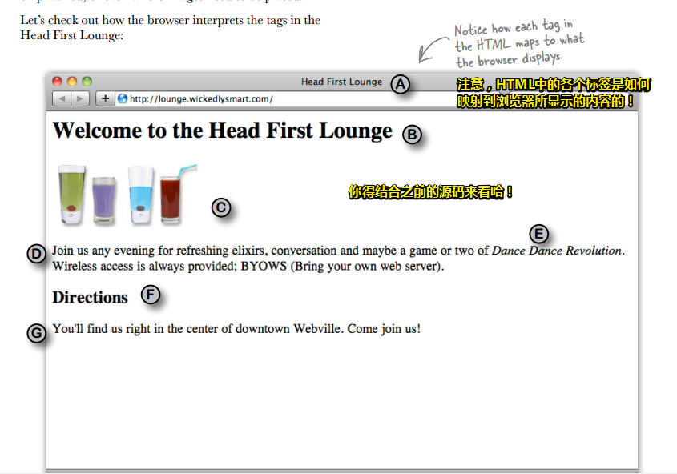

# 认识HTML

## ★内容概述

要想进入Web世界，那么只需要跨过这么一个障碍即可，那就是要学会它的语言——HTML（超文本标记语言）。这就是像是你想要与外国人交流，那么你就得学会英语一样！（别指望肢体语言哈！）

PS：HTML使Web如虎添翼！

## ★Web让广播明星黯然失色

想表达某种想法？——进入Web世界吧！

Web是全球通用的交流方式，而且，你能参与其中！

如果你想有效地使用Web，那么就必须得对HTML有所了解，当然，你还得对Web是如何工作略知一二。

从宏观的角度看Web，**✎：**

## ★Web服务器能做什么？

Web服务器闲来无事，一直在等Web浏览器的请求，而这个请求可能是要个页面？图片？音视频？JS？CSS？等等这些资源……Web服务器收到了对方的请求，就会查找所请求的资源，然后把找到的资源响应给对方浏览器！

## ★Web浏览器能做什么？

浏览器提供了一个可以让用户在网上冲浪的平台，如打开浏览器，输入网址回车或者单击一个链接来访问某个页面，浏览器就会向Web服务器请求一个HTML页面，响应回的页面，就会在你的浏览器窗口中显示！

但是浏览器怎么知道如何显示一个页面呢？

这里就需要用到HTML了。**HTML会告诉浏览器页面的所有内容和结构**……

通过编写一些HTML你就会知道这是如何做到的！

## ★你写的代码（HTML）

HTML：是浏览器显示页面的关键

但是它是什么？它又会做些什么？

在这儿有这么一段HTML代码，**✎：**

讲真，这就是一堆字符，真不知道浏览器什么怎么显示它们的！

总之，在这儿只是让你对HTML的外观有一个初步的了解！并不需要你在此刻了解HTML！

PS：注意这段demo的每个字母注释，如它们在浏览器的显示姿势是怎样的以及它们的位置是怎样的？

## ★浏览器创建的页面

当浏览器读取HTML时，它会解释围绕文本的所有标签。标签只是尖括号中的单词或字符，如 `<head>`、`
`、`<h1>`等等。标签告诉浏览器文本的结构和含义。因此，与给浏览器一堆文本不同，利用HTML，你可以使用标签来告诉浏览器标题中的文本是什么，哪些文本是段落，需要强调的文本又是什么，甚至图片需要被放置在哪儿？

下面就让我们来看一下浏览器是如何解释「Head First Lounge」这个页面中的标签的！

## ★没有愚蠢的问题

**①HTML就是我在文本周围放置的一堆标签?**

> 对初学者来说是这样的。要记住HTML是超文本标记语言的缩写！
>
> 所以HTML为您提供了一种使用标签来“标记”文本的方法，即可以通过标签来告诉浏览器这个文本的结构是怎样的。当然，HTML也有超文本方面的内容，我们稍后会在书中讲到

**②浏览器是怎么确定该如何显示HTML的？**

> HTML会告诉您的浏览器关于您的document结构：如标题的位置，段落的位置，需要强调的文本，等等。鉴于此信息，加上浏览器内置的默认规则，就可确定该如何显示每个元素了。
>
> 当然，您也不必满足于默认设置，您完全可以使用CSS添加自己的样式和格式化规则，以确定字体，颜色，大小和页面很多的其它特征。本章后面还会介绍到CSS

**③Head First 休闲室的HTML有很多缩进和空格，不过在浏览器上显示时，我并没有看到这些缩进和空格，怎么回事？**

> 没错，这个问题问得好。**浏览器会忽略HTML文档中的制表符（tabs）、回车（returns）和大部分空格（spaces）**。实际上，它们会**根据你的标记来确定在哪里换行或分段**。那么，既然浏览器会忽略这些空白符，我们为什么还要插入自己的格式呢？这是为了帮助我们在编辑HTML时能够更容易地读懂文档。随着HTML文档变得越来越复杂，你会发现，在某些地方加一些空格、回车和制表符，这会对提高HTML可读性很有帮助。

**④对了，这HTML文档一共有两个级别标题，`<h1>`和子标题`<h2>`，是吗？**

> 实际上，浏览器通常显示的标题一共有6级，从`<h1>`到`<h6>`，字体由大到小。除非你要创建一个非常复杂、庞大的文档，否则，一般不会用到`<h3>`之后的标题。

**⑤为什么需要用到`<html>`标签？这肯定是一个HTML文档啊，这不是很明显的吗？**

> `<html>`标签告诉浏览器你的文档确实是一个HTML文件。如果没有加这个标签，有些浏览器可以接受，但有一些是不允许的，本书后面介绍到“工业级强度HTML（industrial-strength HTML ）”时，你会看到包含这个标签相当重要。

**⑥一个文件怎么才算是HTML文件呢？**

> HTML文件是一个简单的文本文件。与文字处理文件（word文档）不同的是，它并没有嵌入特殊的格式（如在编辑word文档时可以让字体加粗、变色等）。按照惯例，我们会在文件名末尾加一个“`.html`”，这是为了让操作系统更清楚这个文件是什么。但是，正如你所看到的，真正重要的是我们在文件里放入了什么。

**⑦大家都在谈论HTML5。我们也会用HTML5吗？如果是这样，那么为什么不直接说“HTML-FIVE”，而是“HTML”呢？**

> 你现在学习的是HTML，而HTML5恰好是HTML的最新版本。HTML5最近很受关注，这是因为它让我们**编写HTML的很多做法大大简化**，而且还**提供了一些新的功能**，当然这些都会在这本书中介绍。另外，通过它的JavaScript应用编程接口（Application Programming Interfaces，API），它还**提供了一些高级特性**。对了，这些在《Head First HTML5 Programming》一书有详细介绍。

**⑧标记看起来很傻，“所见即所得（What-you-see-is-what-you-get ）”的应用早就有了，好像从20世纪70年代就已经出现了，是不是？Web为什么不采用一种像Microsoft Word或其他类似应用的格式呢？**

> Web是基于没有任何特殊格式的字符的文本文件创建出来的。这使得世界上任何地方的任何浏览器都能够检索Web页面，并理解它的内容。虽然像Dreamweaver这样的WYSIWYG应用程序非常好用，但在这本书中，我们会从最原始的文本文件入手，然后，你就可以很好地理解Dreamweaver应用程序在幕后做了什么。

**⑨有没有办法在HTML中加入自己的注释？**

> 当然有，如果你把注释放在`<!-- and -->`之间，那么浏览器会完全忽略它们。假设你想对“`Here's the beginning of the lounge content`”添加注释，那么你可以这样写：
>
> `<！--Here's the beginningof the lounge content-->`
>
> 注意，注释可以写为多行。要记住，`“<!--`”和“`-->`”之间放置的所有内容（甚至HTML）都会被浏览器
> 忽略。

## ★Sharpen your pencil

也许你没有想到，其实你对HTML并不陌生！

以下是「Head First Lounge  」这个页面的HTML，仔细看看这些标签并且看看自己是否能够猜出「这些HTML到底在告诉浏览器一些什么样的内容」！

以上就是告诉你浏览器「我标记做的那些事儿！」

## ★你在Starbuzz咖啡店的大好机会

这家星巴兹咖啡店名气很火，因为它有大量的连锁店哈！而且它是发展最迅速的咖啡连锁店！

为此，它们甚至没有时间去建立自己的Web网站，所以你的机会来了！

很凑齐的是，你在这家咖啡店买Chai Tea（印度香茶）时，碰到了这家店的CEO！

这个CEO，向你提出了请求，**✎：**

好了，动动你的大脑，告诉我你的决定，**✎：**

选择C，抓住你给我的这个机会，从此开始了我Web职业生涯的快乐时光！

以上就是因为你会Web语言——HTML，而拿到的offer！

## ★Starbuzz页面上该有什么内容？

该店主给了需求哈，即第一个页面应该有内容哈！**✎：**

你得确定这张餐巾纸的大致结构哈！如你可以用铅笔加些标记，当然你也可以添加一些你认为缺失的内容……

## ★创建Starbuzz web页面

当然，目前的你是没有经验的，即你没有具体创建过任何Web页面，这是你目前唯一的问题！

不过，你显然不会就这么放弃，毕竟这正是你自己决定深入学习HTML的原因，不是吗？

好了，别担心，接下来的工作是这样的，**✎：**

1. 创建一个HTML文件，我用vscode好了！
2. 录入餐巾纸上写的菜单
3. 保存文件为index.html
4. 用你的chrome浏览器打开这个index.html文件，接下来，就是见证奇迹的时候了！

## ★创建一个HTML文件（Mac）

### ◇你需要知道的

1. 所有的HTML文件都是纯粹的文本文件，即咩有花哨的格式和特殊的字符！总之，你需要一个可以创建纯文本的应用，显然我会用VScode。

2. 注意有些软件如Mac上的TextEdit默认当你文件保存的时候，会向该文件增加它自己的格式和特殊字符，即它默认会采用「富文本」模式！总之，你要的是纯文本文件哈！

   还有就是取消那些默认把纯文本文件保存为 `.txt`后缀的选项！

好了，这样你就可以创建一个HTML文件了！

## ★创建一个HTML文件（Windows）

1. 我想你应该不会使用记事本吧！
2. 在windows下，如果你的文件没有扩展名，这显然会让人感到困惑哈！

## ★编辑器和html

**①为啥要用这些简单文本编辑器啊？不是有很强大的工具可以让我们快速地创建web页面吗？**

你要知道你读这本书的目的，你是为了想了解创建一个web页面需要使用到的具体技术！而工具确实牛逼！帮你把很多事情都给做了！可是在熟练使用HTML和CSS之前，你用这些强大工具的话，那么有一些很基础的东西就不需要学了，这样后面那些东西也无法更好地理解了！

总之，从简单的工具的开始，是为了让你能更好地学习知识！毕竟强大的工具做了很多东西，除非你此刻已经很熟练使用HTML和CSS了！

这就像是学习vuejs一样，不要一上来就学习vue-cli，不然你会一脸懵逼的！而且你的目的是学习vuejs的知识点！总之一开始能快速上手、能用就好！

**②编辑器有了，那么如何选择浏览器呢？毕竟市面上有很多浏览器可选啊！**

简单来说，你爱用哪个就哪个。由于HTML和CSS是行业标准，这意味着所有浏览器都试图支持以同样的方式使用HTML和CSS(只要确保使用最新版本的浏览器以获得最佳支持即可)。

复杂来说，不同浏览器显示同一个页面，可能会有细微的差别！可能会没有！如果你使用的HTML和CSS都是最近新出的特性，那么这种细微差别也就愈发地明显了！毕竟你也无法预料到用户到底在使用什么样的浏览器版本来访问你的网页！

总之，你最好准备至少2个不同浏览器，用于测试你的demo哈！

还有就是，还是使用chrome，最好是最新版的，能用新特性就用吧！至于兼容，优雅降级就好了！

**③我已经创建好一个网页了，那么如何在网上浏览这些页面呢？**

首先，你在本地测试哈！然后在把它们发布到Web上。

目前我们只考虑创建文件以及知道文件有些什么内容！

---

## ★Q&A

### ①什么叫Web？

> web 是world wide web（万维网）的简称，不是缩写，万维网是基于http协议进行交互的应用网络。

**➹：**[Web 是什么意思？ - 知乎](https://www.zhihu.com/question/19860216)

### ②标签和标记的区别？

标记（label）是概描述，而标签（tag）是泛描述！

ps：概描述到泛描述，具体到一般……

标记是本身的，而标签是附加的！

label强调是一种标志，tag强调是一种记号

label标明信息之间的归属，tag区别信息之间的差异

那么为啥HTML叫做超文本标记语言呢？而不是叫超文本标签语言呢？

按照wiki对标记（label）的解释有这么一个：

> - [标记(程式语言)](https://www.wikiwand.com/zh/%E6%A8%99%E8%A8%98_(%E7%A8%8B%E5%BC%8F%E8%AA%9E%E8%A8%80))，程式语言中加在源代码中识别用的字串。

而对标签（Tag）的解释有这么一个：

> - [标签(元数据)](https://www.wikiwand.com/zh/%E6%A8%99%E7%B1%A4_(%E5%85%83%E6%95%B8%E6%93%9A))，关键字或分配某项物品的信息资料，包含叙述子与物件关连性的一种元数据。应用于档案管理、文章、网站的分类等。

不知道markup与label是否等价，我发现去理解一个概念到底讲得是啥？是件很操蛋的事！

看了一个回答，说到，**✎：**

> 语言是啥？你想说你好，就发你好的这个音，写这两个字，别人也认为这个音和这两个字表示你好，于是你说的别人就听懂了，你想表达的意思别人就接收到了。**语言就是沟通双方对于什么东西表示什么意思的一种协议。**
> 标记是啥？你在你家门口写上，这是我的家，在卧室写上，这是我家卧室，这种**做个记号说明这是什么东西的事就叫标记。**

回到HTML，按照我的理解就是这些内容是标题，浏览器你给我记住了，还有这些内容是段落，也得要记住，不然会打你屁股的！

我们在对一些内容做个记号，而做记号的东西（尖括号中的单词或字符）我们把它叫做标签如 `
`、`<h1>`……

好了，不知道自己理解得多不多！

似乎可以呼应：tag强调是一种记号，tag区别信息之间的差异

**➹：**[标签 - Wikiwand](https://www.wikiwand.com/zh/%E6%A8%99%E7%B1%A4)

**➹：**[tag和label区别_tag和label区别:标签与标记的区别 - 阿里云](https://yq.aliyun.com/wenji/33906)

**➹：**[概描述和泛描述_网页设计_酷勤网](http://www.kuqin.com/webpagedesign/20090819/67036.html)

**➹：**[内容、标签和分类_交互设计_酷勤网](http://www.kuqin.com/uidesign/20081022/23831.html)

**➹：**[使用标签是迟早的事_交互设计_酷勤网](http://www.kuqin.com/uidesign/20081022/23830.html)

**➹：**[Tag 的分类方式和 Category 有何区别？最直观的就是列出优缺点对比 - 知乎](https://www.zhihu.com/question/19561400/answer/12239027)

**➹：**[标签 (Tags) 是个好的设计吗？ - 知乎](https://www.zhihu.com/question/19561383)

**➹：**[标记语言 脚本语言 有何区别？ - 知乎](https://www.zhihu.com/question/266491364)

