# 一看就觉得很重要

## ★a元素

1. 我们要做什么，比如做成这个样子……那么怎么做呢？第一步、第二步……第五步……

2. 提供的图像文件可以看作是一堆10101010111……

   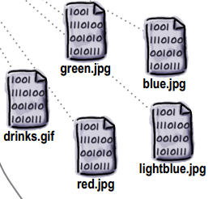

3. 你弄得网站是会成长的，所以别想着为了省事就把所有需要用到的文件放在同一个目录下面！不然的话，就不能很好地组织这个网站呢……正应如此，才会有「相对」和「绝对」的概念，毕竟找一个文件的姿势有两种哈！

4. 要创建链接需要a元素哈！那么这个元素是如何工作的呢？

   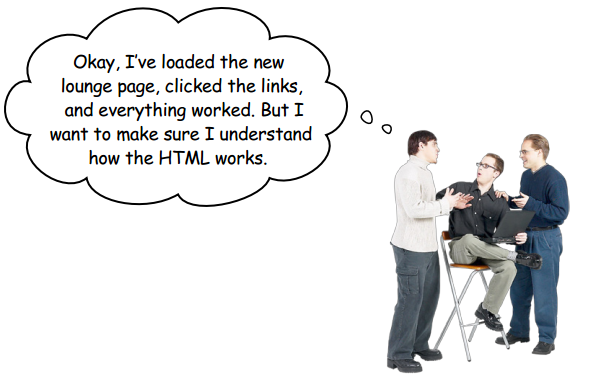

5. 为啥需要添加链接文本呢？因为需要指引顾客访问新增的路线说明呀，所以这不会平白无故的添加一个链接文本哈！

6. 单击一个链接就会显示新的页面，单击浏览器的后退按钮，会再次回到原先的页面

7. 剖析一下所谓的HTML「链接」：

   1. 需要一个链接文本，即a元素中的内容

   2. 话说a元素的作用是什么呢？——用于创建指向另一个页面的链接

      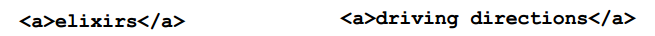

      链接文本默认在浏览器中的显示是有下划线的，用于告诉浏览网页的人，这是可以单击的哈！

   3. 有了链接文本，就需要增加一些HTML来告诉浏览器这个链接指向哪儿，首先你的需要一个a元素对吧，其次需要给a元素加点属性，比如href属性，用于指定链接的目标文件对吧！

      当你单击这个链接文本，用户的视角将会被带到另一个页面去了，即href属性指定的目标文件！

      

## ★浏览器干了啥？

1. 有页面来了，那就渲染（render）这个页面吧！如果遇到一个a元素，那么就取这个元素的内容吧！即链接文本，然后把它显示为可单击的链接

   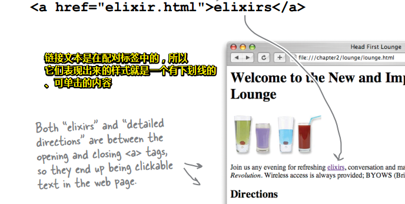

## ★小结一波

- 使用`<a>`元素创建一个起文本链接，链接到另一个Web页面。
- `<a>`元素的内容会成为Web页面中可单击的文本
- `href`属性告诉浏览器链接的目标文件。

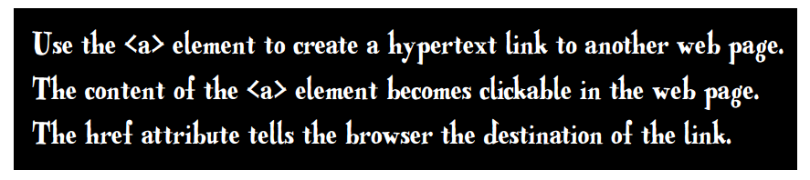

## ★话说，链接（link）是如何工作的？

用户单击了一个链接，然后浏览器就获取a元素的href值，然后确定这个链接是指向哪个页面的，然后就加载这个目标页面咯！

## ★了解属性

### ◇简单了解属性

之前说到过，我们可以利用属性为一个元素指定附加信息哈！如，**✎：**

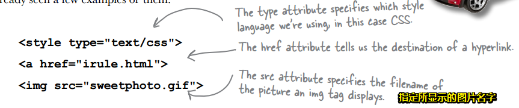

### ◇更深入地了解属性是如何工作的

假如我有一个car元素，我会这样做，**✎：**

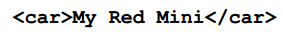

嗯……我的红色迷你小车，有了标签哈！


由于咩有属性，所以我们只能这样做了，即它是红色，而且是迷你的……等这样的描述性名称或者说是形容词来表示这辆车的信息……

话说，你这辆红色的小车是啥型号的？还有是不是敞篷的？还有……很多我想要了解的其它细节

那我这样做好了，**✎：**

```html
<ar>my 一辆 xxx型号 咩有敞篷的 红色 小车</car>
```

难道你要想多了解我的红色小车更多的细节，我就得要多添加点文本内容？这岂不是很不方便……

不管怎样，我还是得为这个元素，为这辆红色小车附加点信息才行吧！可是，难道就没有其它方式了吗？

有啊！比如这样，**✎：**

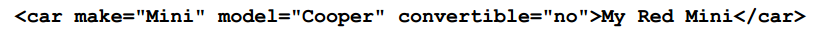

哇！怎么可以这样，这种写法甚是简单、方便啊！而且也能提供更多的信息……

好了，这就是「属性」的由来了！

### ◇安全第一，最佳实践

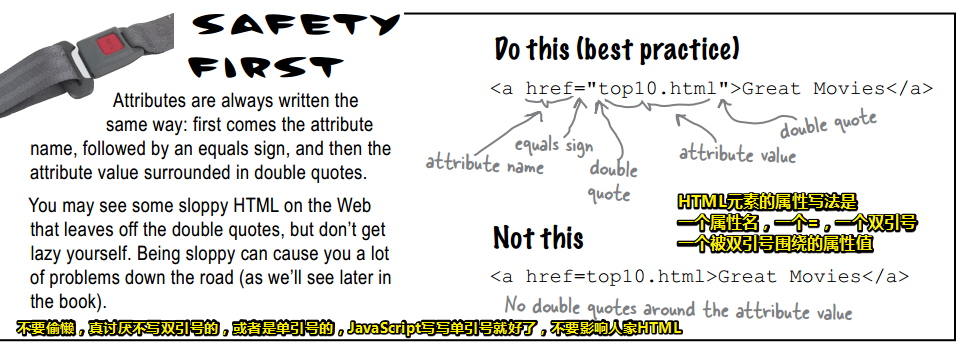

ps：或者是写了单引号的

### ◇属性和元素——没有愚蠢的问题

**①我能为一个HTML元素造新属性吗？**

Web浏览器只认识每个元素的一组预定义的属性。如果你造了新属性，那么浏览器将不知道该怎么处理它们，另外在本书后面你会看到，这样做很可能给你带来麻烦。当浏览器可以识别一个元素或属性时，我们会说浏览器“支持“这个元素或属性。总之，你应该只使用浏览器支持的那些属性。

尽管如此，关于编写Web应用（这是《Head First HTML5 Programming》讨论的主题），HTML5现在已经支持自定义data属性，允许您为新属性创建自定义名称。

**②谁来决定“支持”哪些属性？**

答：有一些标难委员会专门考虑HTML的元素和属性。这些委员会由「~~没其他事可干的~~」这样一群人组成，他们不计得失、不计报酬，无私地投入时间和精力来确保建立一个通用的HTML路线图，使得所有组织都能使用这样一个标准来实现它们的浏览器。

**③我如何知道哪些属性和元素得到支持呢？另外，所有属性都可以应用于任何元素吗？**

答：**一个给定元素只能使用某些特定的属性**。可以这样来考虑：你不会对元素`<toaster>`（烤箱）使用属性
“`convertible`”（敞篷版）吧，是不是？也就是说，你只希望使用元素支持的那些有意义的属性。

通过这本书的介绍，你会逐步了解哪些元素支持哪些属性。学完这本书之后，还有很多不错的参考书可以帮你复习，如《HTML&XHTML:The Definitive Guide》（O'Reilly）。

### ◇关于「href」的读音？

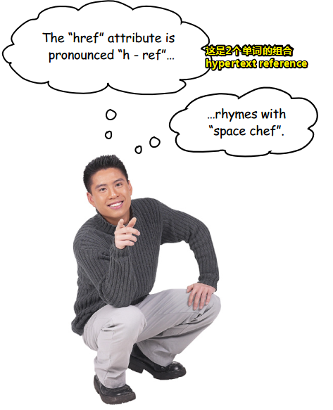

### ◇本周访谈——href属性的自白（吹牛逼）

我是咩有想到可以把一个属性当作是一个采访对象来看待，它们就像是会说话一样！

href属性做了什么？每次有人单击一个链接时，浏览器就得问问href属性下一步该去哪里，这就是href属性了！

让我们从头说起，属性到底能做什么……

属性可以用来定制一个元素，如就像定制一双特殊的鞋子也一样。我们用a标签包围一些内容是很容易的，如「Sign up now! 」→☞ `<a>Sign up now!</a> `。那么问题来了，如果没有属性的话，那么也就没有所谓的href属性了！既然没有href属性，那么你也就没法告诉a元素链接的destination（目标文件、目的地）是什么了！

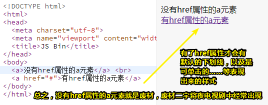

为什么会没有样式呢？我看了一下默认样式，**✎：**

有href属性的a，**✎：**

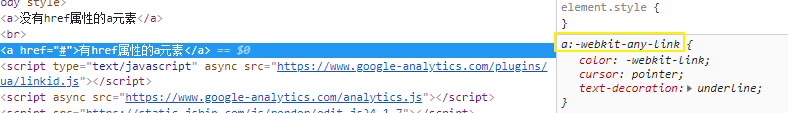

没有href属性的a，**✎：**

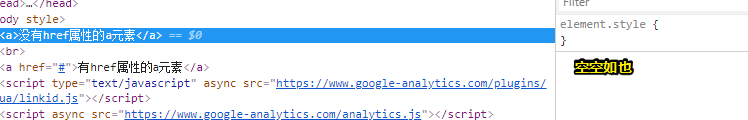

那么我为p元素定制一个href属性会怎样呢？

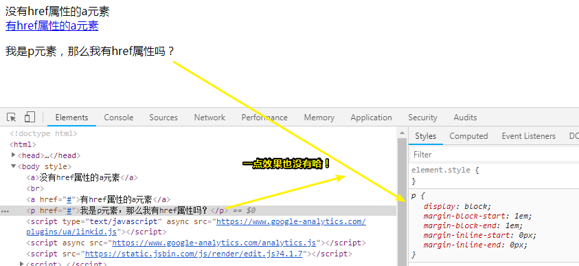

言归正传，总之就是有了属性，您就可以提供关于元素的其他信息了或者说「你就能提供元素的附加信息」。

就我href而言，就是为a元素提供了「链接文本要指向的地方」这样的附加消息……

如，**✎：**

```html
<a href="signup.html">Sign up now!</a>
```

这demo是说，「Sign up now!」的标签为a的这个元素要链接到「signup.html」这个页面。

当今世界还有许许多多的其它属性，不过在a元素中只能用href属性来告诉a元素自己要指向哪里！

关于href属性的这个名字，这是互联网家族的一个古老名字，含义是超文本引用（hypertext reference）,当然，缩写就是或者说小名就是「href」哈！

那么「超文本引用」又是什么呢？

**超文本引用就是「互联网或你的计算机」上的一个资源的别称。通常这个资源就是一个Web页面，不过href也可以指向PDF文档……实际上href可以指向各种各样的资源。**

目前，我们只看到的链接都是指向它们自己的页面，那么如何链接到Web上的其它页面和资源呢？

下节课再聊这个问题！

总之，没有了href属性，那么整个Web都成一团乱麻了！即Web将会混乱不堪！毕竟网页都变成孤零零的，这样一来整个Web上的网民岂不是要哭爹喊娘了！

### ◇链接回到主页面

往 `elixir.html `和 `directions.html `中 添加一个回到主页面 `lounge.html ` 的链接

其中链接文本是 `Back to the Lounge `

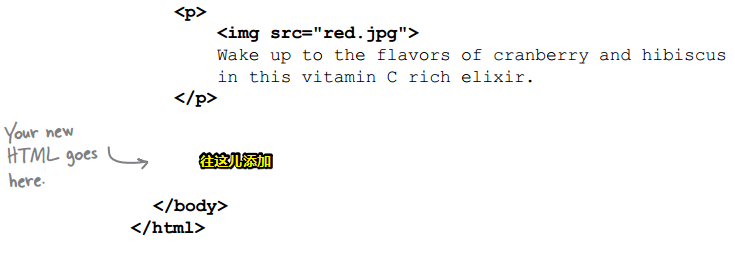

### ◇为a元素填入缺少的信息

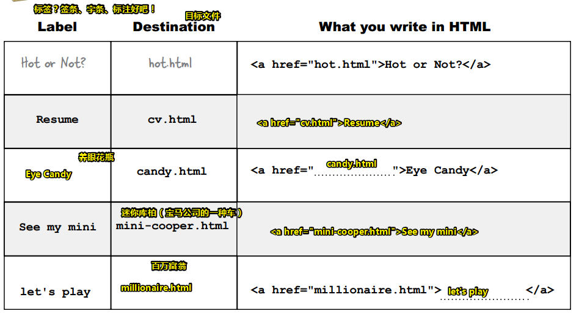

我在想，我是叫a标记还是a标签呢？这里的Label是什么意思？难道真得是标签之意，我用一些字符，如 `<a>` 标记了标签？

额，我还是叫a标签比较顺口

### ◇没有蠢问题

**①我见过很多页面上还可以单击图像而不只是文本。能用`<a>`元素来实现吗？**

答：可以，如果把一个``元素放在`<a>`标签之间，那么这个图像就会像文本一样可单击。我们不打算花好几章来深入讨论图像（images），不过要知道，图像确实也可以作为链接。

**②这么说任何东西只要放在`<a>`标签（tags）之间就会成为可单击的，是吗？比如说，一个段落？**

答：确实可以把一个`<p>`元素放在`<a>`元素中来链接整个段落。我们大多会在`<a>`元素中使用文本和图像（或者二者同时使用），不过，如果你需要链接一个`<p>`或`<h1>`元素，则完全可以。哪些标签可以嵌在哪些标签里，这完全是另一个话题了，不过不用担心，很快就会谈到这个内容。

> 比如你就不能在span元素中嵌入div元素！

————用文件夹组织你的网站

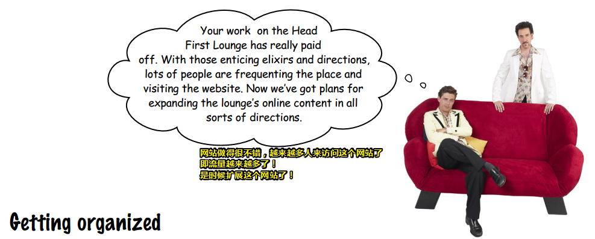


---

## ★总结

- 我之前一直都对HTML很不「感冒」，看了这一章节，开始有点感冒了！我开始意识到知其所以然，对一个东西的理解，对一个东西的感冒程度，有很大的关系！如元素的属性……
- 每次为元素添加属性，我都会这样说「定制一个有xx属性的xxx元素」——定制一个有href属性的a元素
- Got it so far… 不太明白……

## ★Q&A

**①什么叫超文本？**

简单理解就是超链接……

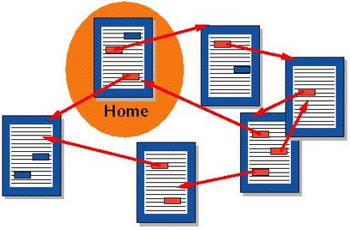

**超文本**（英语：**Hypertext**）是一种可以显示在[电脑显示器](https://www.wikiwand.com/zh-hans/%E9%9B%BB%E8%85%A6%E9%A1%AF%E7%A4%BA%E5%99%A8)或其他[电子设备](https://www.wikiwand.com/zh-hans/%E9%9B%BB%E5%AD%90%E8%A8%AD%E5%82%99)的文本及与文本相关的内容，其中的文字包含有可以链接到其他字段或者文档的[超链接](https://www.wikiwand.com/zh-hans/%E8%B6%85%E9%80%A3%E7%B5%90)，允许从当前阅读位置直接切换到链接所指向的文字

总之，文字可以是一种非线性结构的！即信息是可以切换的，而不是静止的！有种对文本的补充说明，或者说这个链接文本是有大脑的，你想看它里面的信息，只需要单击一下即可！当然这个大脑信息可以是本地的，也可以是远方的，如果是远方的，那么你得需要联网，发送http请求才行……

**➹：**[超文本 - Wikiwand](https://www.wikiwand.com/zh-hans/%E8%B6%85%E6%96%87%E6%9C%AC)

**➹：**[memex_百度百科](https://baike.baidu.com/item/Memex)


