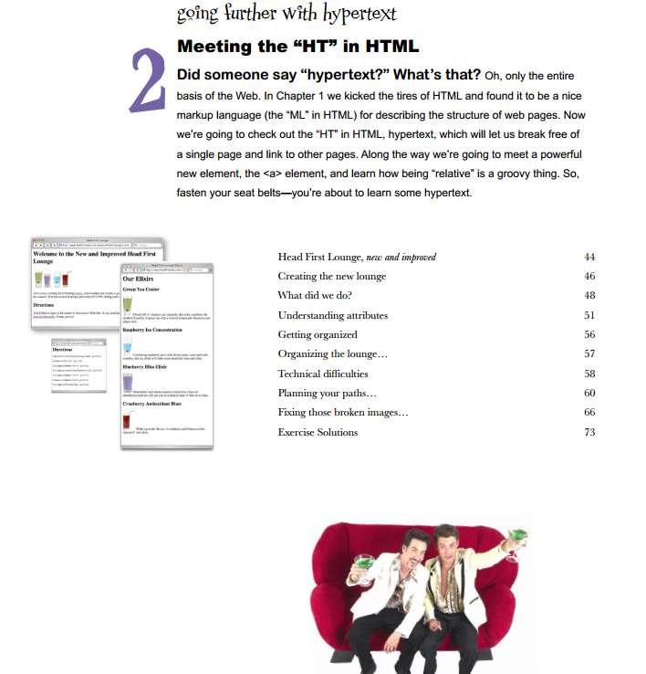
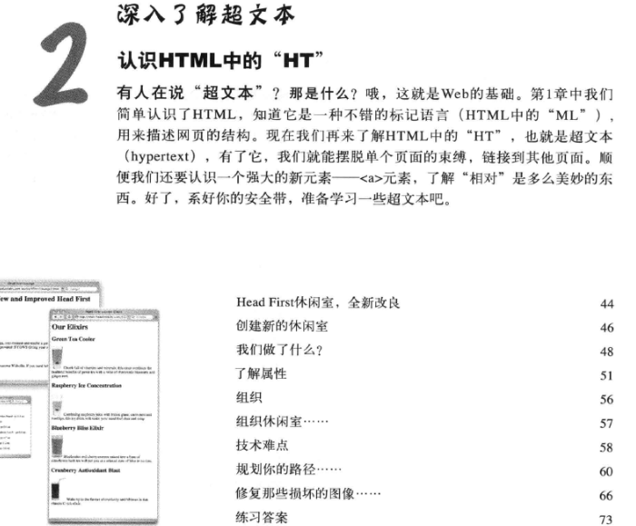

# README

## ★目录

### ◇英文

我们之前学习了标记语言，即HTML中的「ML」，用于描述网页的结构。那么「HT」呢？即所谓的超文本呢？

超文本是个神奇的家伙，它可以让我们摆脱单个页面的束缚，链接到其它页面！在这个过程中，我们将会遇到一个强大的元素——「a」元素。并且了解到「相对」路径是个什么东西！

系上你的安全带，让我们看看超文本到底是个什么鬼东西！

> 额……它是整个Web的基础哈！可见，是多么的重要！

### ◇中文

