# building blocks

> 积木？添砖加瓦？

回顾之前的两章，**✎：**

第一章——认清了网页结构的重要性、认识了一些HTML元素、知道了CSS到底是个什么东西。

第二章——告诉了我什么是超文本以及在Web上a元素扮演了什么角色！

## ★三张图

### ◇粗略的设计草图

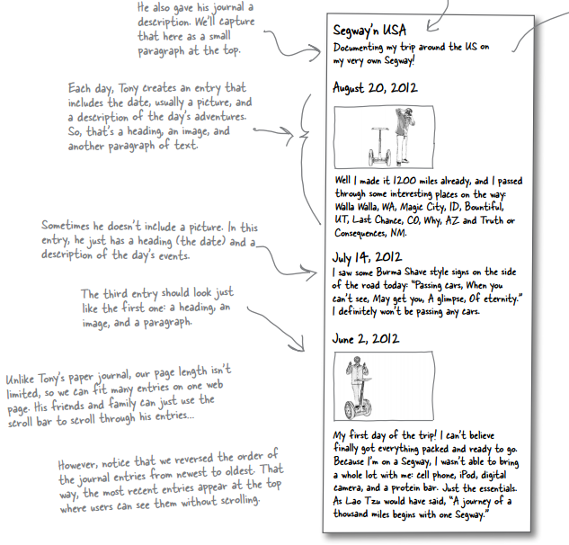

### ◇从草图到略图

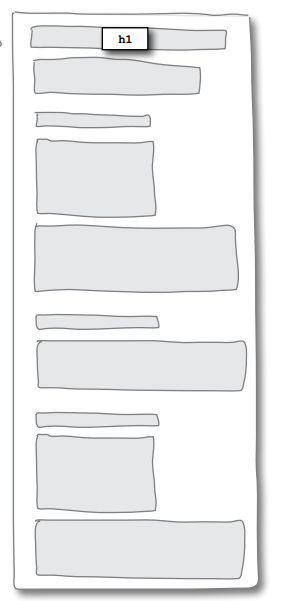

> **➹：**[聊天缩略图背后的故事 - 知乎](https://zhuanlan.zhihu.com/p/25551415)

### ◇从略图到网页

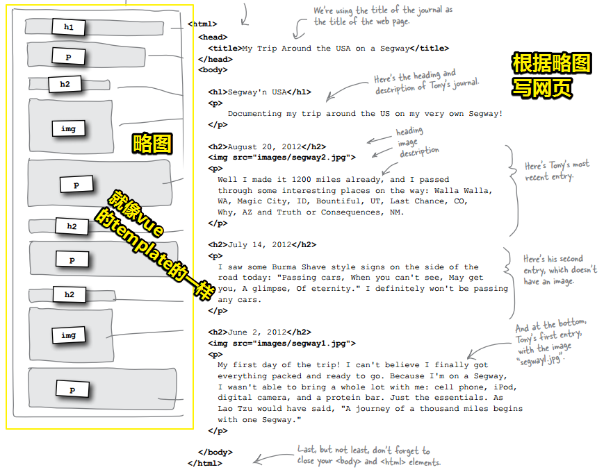

### ◇效果

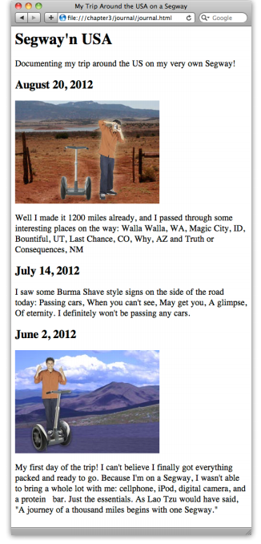

## ★没有蠢问题

> 关于quotes和blockquotes的问题

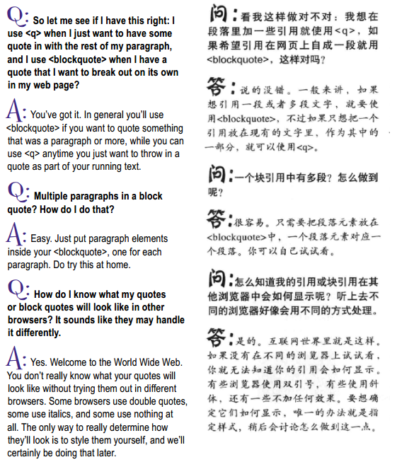

---

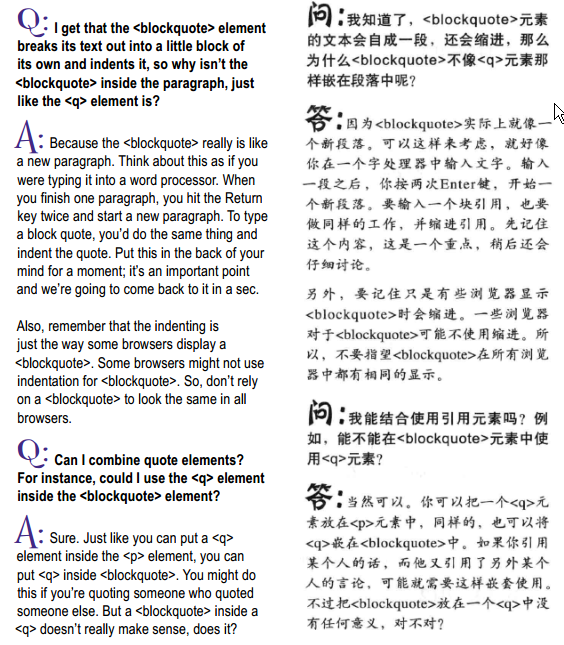

---

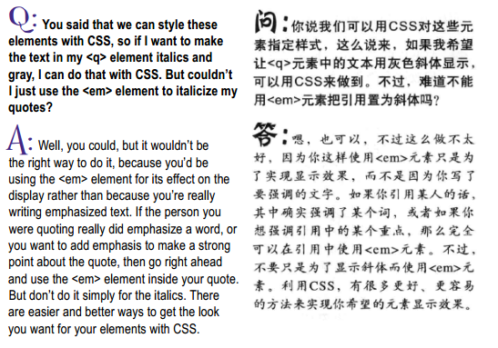

---

## ★块级元素和行内元素

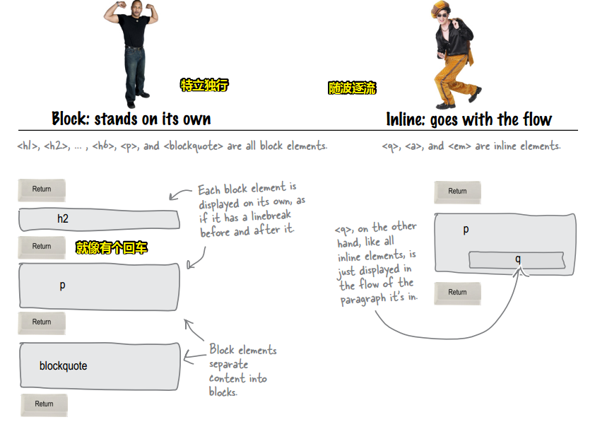

总之你要记住，**✎：**

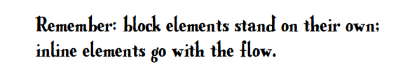

只要使用了块元素就能换行了，之前在HTML文件中敲了回车也不会换行！

> 我觉得把inline翻译成「行内」是个好翻译！因为这证明这个元素没有换行啊！

在页面中组合元素的方式与元素是作为块显示还是行内显示有很大关系。

> 块元素通常用作web页面的主要构建块，而内联元素通常用来标记小块内容。在设计页面时，通常从较大的块(块元素)开始，然后在改进页面时再添加行内元素

在用CSS控制HTML的表现时，这些知识就能派上用场了。如果你清楚行内元素和块元素的区别，就可以轻松设计好布局，在别人为布局设计忙得焦头烂额时，你却能悠闲地喝着马提尼。

## ★为啥需要br元素

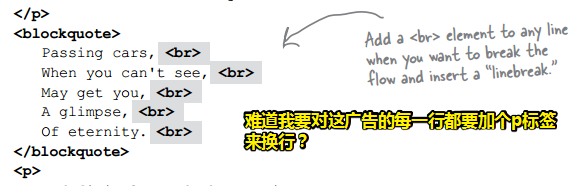

## ★void元素

我们之前说过，元素=开始标签+内容+结束标签，而br元素既然作为一个元素，那么我们这样写 `<br>`岂不是很有问题？即没有任何内容的元素，甚至没有结束标签……

是时候引出要讲的内容了——void元素

它是一个没有内容和闭标签的元素，如br元素和img元素等等……过去通常叫empty元素，不过现在叫void元素了！当然，有很多人依旧喜欢empty元素这种叫法，不过没关系，反正你知道它是什么就好了！

为什么这些void元素要被设计成这样？

没有这种 `<br>`速记（shorthand ）姿势，如果每次都 使用`<br></br>`来换行，这岂不是很没有意义吗？或许你会说为了保证每个元素的写法的一致性，而必须得「元素=开始标签+内容+结束标签」这样做。但这其实很没有效率。而使用了void元素显然会更高效，因为输入的字符更少了那么相应的页面中字符数也更少，实际上，当你看了HTML之后，你会发现阅读起来贼轻松……

总之我们用shorthand（速记、简写）姿势并不是因为我们懒惰，而是因为这样做很有意义……

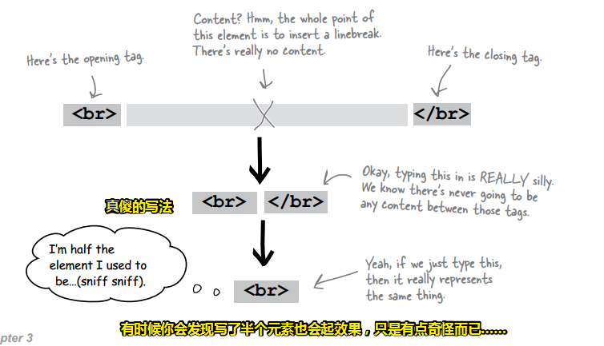

### ◇没有愚蠢的问题

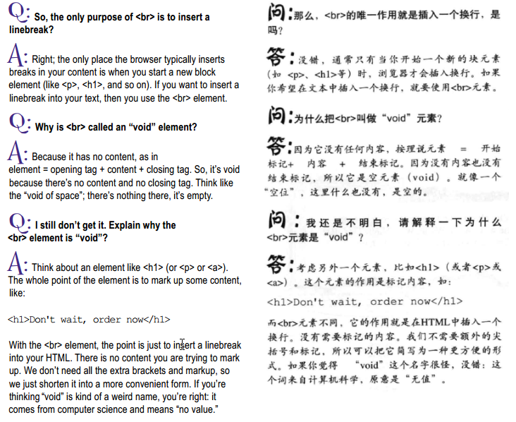

---

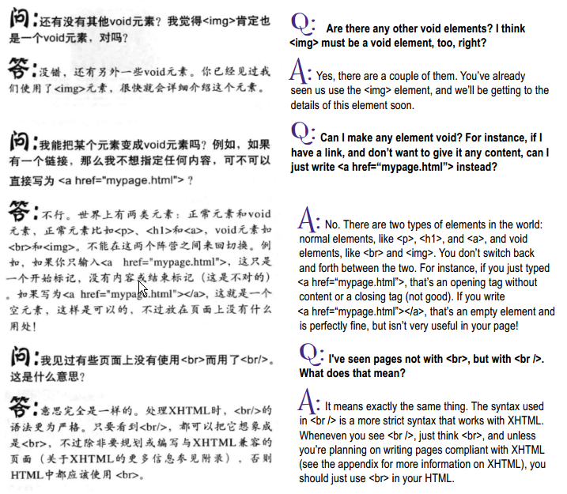

### ◇小结

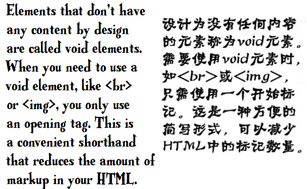

## ★列表元素

### ◇为什么需要？

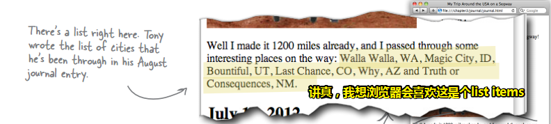

### ◇应该显示的样子

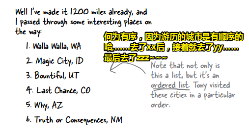

这不仅仅是个列表，而且还是个有序列表……

### ◇我用p元素创建列表好了

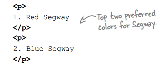

不过，**✎：**

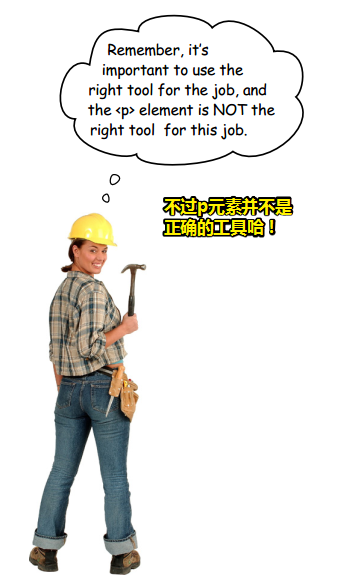

目前，你应该有点常识了：

我们总是希望选择与内容结构含义最接近的HTML元素。如果这是一个列表，就使用一个列表元素。这样做可以让浏览器和您(您将在本书后面看到)以一种有用的方式显示内容，从而获得最大的能力和灵活性。

### ◇为什么不该用p元素？

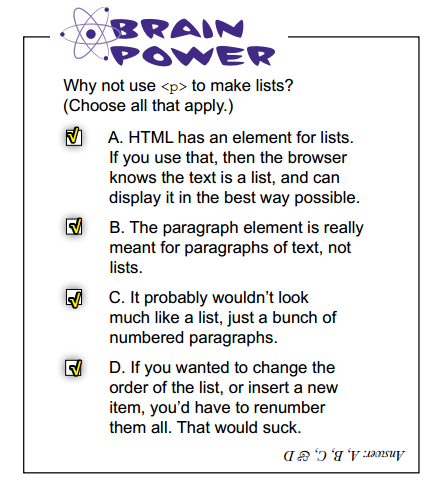


你要知道，HTML专门提供了一个列表元素。如果使用了这个元素，那么浏览器就会知道这个文本是一个列表，而不是一个所谓的段落了！这样一来就能用最佳方式来显示了！

段落元素终究表示的是文本段落，而不是列表……

如果你用了p元素，那么结果显然看上去是个有编号的段落，而不是一个你真正想要的列表

再比如，你用了p元素，那么当你想改变列表顺序或者想插入一个新的列表项时，就必须对所有列表项重新编号，重新洗牌，讲真，这真得贼麻烦……

> 往数组中插入一个元素，也是件很麻烦的事儿……

### ◇如何构建列表呢？（2步足矣）

创建一个HTML列表需要2个元素。这2个元素结合起来使用就构成了列表！

1. 第一个元素用来标记每个列表项
2. 第二个元素确定你创建的是那种类型的列表，即这是有序列表还是无序列表……

#### 第一步

**①Put each list item in an `<li> `element .**

把每个列表项放在单独的 `li`元素中，li元素中的内容可以很短，可以很长，也可以分为多行……总之由你决定！

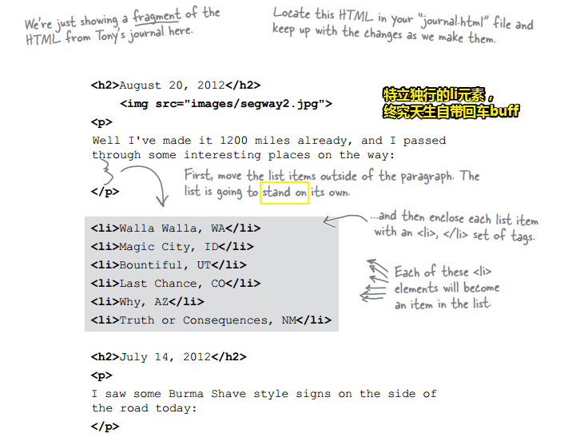

#### 第二步

**②Enclose your list items with either the `<ol> `or `<ul> `element.** 

用ol元素或者ul元素包围你的列表项……前者表示这些列表项将被作为一个有序列表显示，那么后者则是无序列表了……

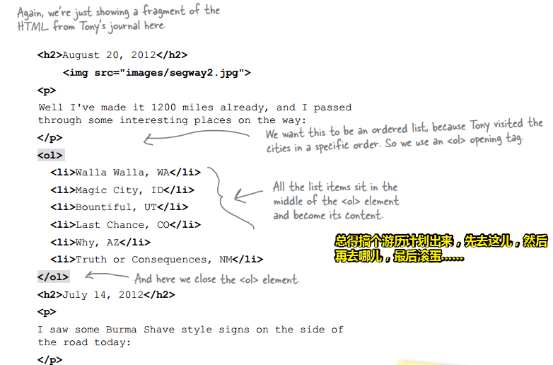

### ◇小问题？

记下来，关于ul、ol、li的单词缩写……

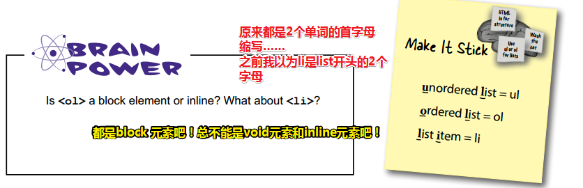

> 额……我测试了一下，li元素是list-item，即它的CSS样式display属性值为 `list-item`。而ol则是 `display: block;`


## ★总结

- 把构建一个网页的过程，当作是建造房子一样……

- 我觉得我看到的设计稿应该是草图（有内容），而蓝图（没有内容，只有一个个矩形或者说是一块块矩形积木）似乎对草图的抽象，为此可以添加相应的HTML元素！

- 不要为了实现显示斜体效果而使用em元素，因为这个元素是用于强调文字的啊！，如强调引用中的重点内容！所以你最好的做法是使用CSS来决定元素的表现效果！

- q元素和blockquote的区别，前者通常是不起眼的的小引用，而后者则是自成一块，格外突出的引用，即是很多句的段落！

- 我没有想到书中谈论 `block`元素和 `inline`元素这个话题，是通过q元素和blockquote元素这对孪生兄弟来引出的！

- sniff sniff（嗤之以鼻、呵呵……）

- 我从未想过写一个列表的姿势是先写li元素，然后再决定这是有序列表ol还是无序列表ul……

  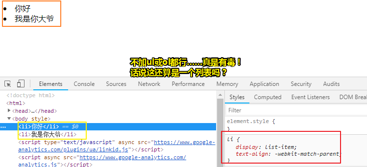


  ---

  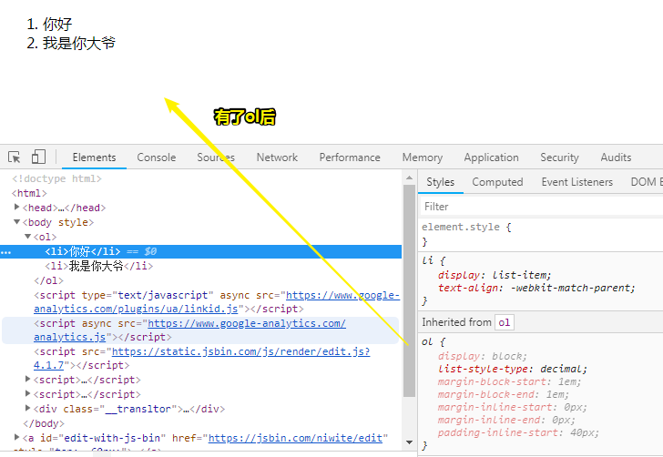

  ---

  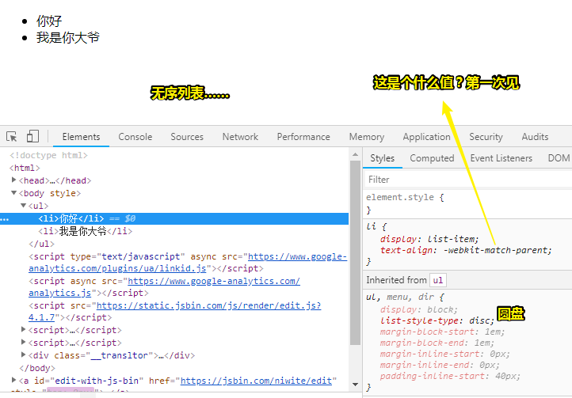

  ps：如果jsbin没有刷新那就在地址栏加个问号？

  **➹：**`https://output.jsbin.com/niwite?`


## ★Q&A

### ①蓝图？

> 蓝图（英语：Blueprint），港澳地区又称“蓝纸”，是工程制图的原图经过描图、晒图和薰图后生成的复制品，因为图纸是蓝色的，所以被称为“蓝图”。蓝图类似照相用的相纸，可以反复复制新图，而且易于保存，不会模糊，不会掉色，不易玷污。
>
> 在中文语境中，蓝图一词通常引申为一种对未来的构想或计划。

**➹：**[蓝图 - Wikiwand](https://www.wikiwand.com/zh-hans/%E8%97%8D%E5%9C%96)

### ②match-parent？

> ```
> match-parent
> ```
>
> 和inherit类似，区别在于start和end的值根据父元素的[direction](https://developer.mozilla.org/zh-CN/docs/Web/CSS/direction)确定，并被替换为恰当的`left`或`right`。

**➹：**[text-align - CSS：层叠样式表 - MDN](https://developer.mozilla.org/zh-CN/docs/Web/CSS/text-align)

讲真，其实还是不懂哈！