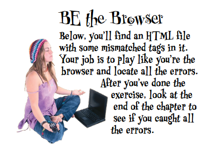
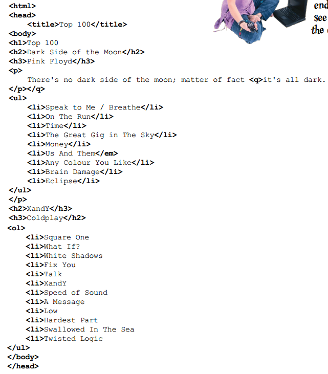

# building blocks

> 积木？添砖加瓦？

回顾之前的两章，**✎：**

第一章——认清了网页结构的重要性、认识了一些HTML元素、知道了CSS到底是个什么东西。

第二章——告诉了我什么是超文本以及在Web上a元素扮演了什么角色！

## ★三张图

### ◇粗略的设计草图


### ◇从草图到略图


> **➹：**[聊天缩略图背后的故事 - 知乎](https://zhuanlan.zhihu.com/p/25551415)

### ◇从略图到网页


### ◇效果


## ★没有蠢问题

> 关于quotes和blockquotes的问题


---


---


---

## ★块级元素和行内元素


总之你要记住，**✎：**


只要使用了块元素就能换行了，之前在HTML文件中敲了回车也不会换行！

> 我觉得把inline翻译成「行内」是个好翻译！因为这证明这个元素没有换行啊！

在页面中组合元素的方式与元素是作为块显示还是行内显示有很大关系。

> 块元素通常用作web页面的主要构建块，而内联元素通常用来标记小块内容。在设计页面时，通常从较大的块(块元素)开始，然后在改进页面时再添加行内元素

在用CSS控制HTML的表现时，这些知识就能派上用场了。如果你清楚行内元素和块元素的区别，就可以轻松设计好布局，在别人为布局设计忙得焦头烂额时，你却能悠闲地喝着马提尼。

## ★为啥需要br元素


## ★void元素

我们之前说过，元素=开始标签+内容+结束标签，而br元素既然作为一个元素，那么我们这样写 `<br>`岂不是很有问题？即没有任何内容的元素，甚至没有结束标签……

是时候引出要讲的内容了——void元素

它是一个没有内容和闭标签的元素，如br元素和img元素等等……过去通常叫empty元素，不过现在叫void元素了！当然，有很多人依旧喜欢empty元素这种叫法，不过没关系，反正你知道它是什么就好了！

为什么这些void元素要被设计成这样？

没有这种 `<br>`速记（shorthand ）姿势，如果每次都 使用`<br></br>`来换行，这岂不是很没有意义吗？或许你会说为了保证每个元素的写法的一致性，而必须得「元素=开始标签+内容+结束标签」这样做。但这其实很没有效率。而使用了void元素显然会更高效，因为输入的字符更少了那么相应的页面中字符数也更少，实际上，当你看了HTML之后，你会发现阅读起来贼轻松……

总之我们用shorthand（速记、简写）姿势并不是因为我们懒惰，而是因为这样做很有意义……


### ◇没有愚蠢的问题


---


### ◇小结


## ★列表元素

### ◇为什么需要？


### ◇应该显示的样子


这不仅仅是个列表，而且还是个有序列表……

### ◇我用p元素创建列表好了


不过，**✎：**


目前，你应该有点常识了：

我们总是希望选择与内容结构含义最接近的HTML元素。如果这是一个列表，就使用一个列表元素。这样做可以让浏览器和您(您将在本书后面看到)以一种有用的方式显示内容，从而获得最大的能力和灵活性。

### ◇为什么不该用p元素？


你要知道，HTML专门提供了一个列表元素。如果使用了这个元素，那么浏览器就会知道这个文本是一个列表，而不是一个所谓的段落了！这样一来就能用最佳方式来显示了！

段落元素终究表示的是文本段落，而不是列表……

如果你用了p元素，那么结果显然看上去是个有编号的段落，而不是一个你真正想要的列表

再比如，你用了p元素，那么当你想改变列表顺序或者想插入一个新的列表项时，就必须对所有列表项重新编号，重新洗牌，讲真，这真得贼麻烦……

> 往数组中插入一个元素，也是件很麻烦的事儿……

### ◇如何构建列表呢？（2步足矣）

创建一个HTML列表需要2个元素。这2个元素结合起来使用就构成了列表！

1. 第一个元素用来标记每个列表项
2. 第二个元素确定你创建的是那种类型的列表，即这是有序列表还是无序列表……

#### 第一步

**①Put each list item in an `<li> `element .**

把每个列表项放在单独的 `li`元素中，li元素中的内容可以很短，可以很长，也可以分为多行……总之由你决定！


#### 第二步

**②Enclose your list items with either the `<ol> `or `<ul> `element.** 

用ol元素或者ul元素包围你的列表项……前者表示这些列表项将被作为一个有序列表显示，那么后者则是无序列表了……


### ◇小问题？

记下来，关于ul、ol、li的单词缩写……


> 额……我测试了一下，li元素是list-item，即它的CSS样式display属性值为 `list-item`。而ol则是 `display: block;`

### ◇测试列表

> test driving the list 


浏览器会自动为每个列表项编号，所以你不需要用p元素搞事情了，如 `<p>1. 我是 one item</p>`

### ◇了解lists的更多细节


> ol或者ul元素总是要与li元素在一起才行，这些元素离不开对方……
>
> li元素标识了这些内容是一个个列表项，而ol元素则把它们都打包起来为一组！就像上学时，一个班里有4组学生，每组有12位同学，总共48名学生……
>
> 不要想着在你的座位上放一张你的照片，就表示你来上学了，如果真这样做了，那就只能请家长了呀！就像是不要在ol元素或者ul元素插入其它非li的元素，如img元素，当然你可以在li元素中使用，总之ol或ul的儿子只能是li……

---


> 如何体现嵌套列表呢？——在此之前，你得知道`元素=开始标签+内容+结束标签`，至于内容嵌套元素的那些事儿，就不是此时这个内容的爸爸该管的事儿了……即子孙后代的事管不了了， 毕竟年纪大了，但是管孙子他爸还是可以的！
>
> 做法：
>
> 直接往li元素的内容中再搞个列表不就好了，当然，始终得注意ul或ol的儿子必须是li
>
> 话说，嵌套这东西是不是有限制，比如ul或ol就只能嵌套一些li元素，不能是诸如img等元素

---


> 难道这世界就只有无序列表和有序列表？
>
> 不，还有一个叫定义列表（definition lists）的家伙！
>
> 这个列表的姿势很不一样，如dl元素只能嵌套两种元素，一种是dt、一种是dd，而且这2个元素是合起来作为一个列表项的！功能就是dd的内容用于描述dt的内容是个什么东西……
>
> **➹：**[66号美国国道 - Wikiwand](https://www.wikiwand.com/zh-hans/66%E5%8F%B7%E7%BE%8E%E5%9B%BD%E5%9B%BD%E9%81%93)
>
> 讲真，为了讲个列表植入广告好吗？不过，理解起来确实相当不错……

## ★嵌套

### ◇是什么


什么叫嵌套呢？


把一个元素放入另一个元素中称为“嵌套”

目前我们已经见过很多元素可以嵌套在其它元素中，如「p元素嵌套在body元素中」「把body元素放在html元素中」等等……总之HTML页面就是以这种方式构造的

形象理解一点就是，**✎：**


### ◇重要性

> The more you learn about HTML, the more important having this nesting in your brain becomes.
> But no worries—before long you’ll naturally think about elements this way 

您对HTML了解得越多，在您的大脑中建立这种嵌套就越重要。但不用担心，不久之后，您就会自然地以这种方式考虑元素

还可以这样翻译：

你对HTML了解得越多，**很好地掌握嵌套**就越显重要。不过不用担心，很快你就能很自然地以这种方式考虑元素了。

> 之前，在为页面写样式的时候，就说过，不要添加多余的嵌套……偶尔，迫不得已可以为了让样式写得更方便可以添加嵌套，不过大多数我们都可以添加伪元素来做到！

### ◇通过画图来理解嵌套


如何画出网页中元素的嵌套关系？

你就画一颗像家谱那样的树（a family tree ）就可以了！最顶的是great-grandparents ，而下面的则是children 和 grandchildren

#### 简单的网页


那么如何把它画成图呢？

把每个元素画成是一个box就可以了，然后用线把那些嵌套的元素都给连接起来，换句话说就是兄弟元素之间就不需要用一根线连起来……


### ◇需要注意的

#### 不要在元素中搞个闭标签出来

> Using nesting to make sure your tags match 

使用嵌套的话，那么你必须确保标签是匹配的！

如果你了解元素如何嵌套，则第一个好处是你能避免标签不匹配。

那么什么是标签不匹配呢？ 

首先来看看正常的，**✎：**


这一切看起来都很正常，那么下面就给你一些写的不像样的HTML，让你看看何为不正常，**✎：**


你能告诉我为啥p元素就这样「心急」地结束了呢？为啥不等em元素结束了，你才结束呢？

根据目前对嵌套的理解，em元素必须完全嵌套在p元素中，或者说em元素完全在p元素的肚子里面才行哈！

而你的这种情况就像是这样，**✎：**


所以你必须，**✎：**


适当嵌套你的元素……

#### 如果搞了呢？so what？

如果你喜欢把嵌套弄得一团糟，而且也无所谓，这就像是你喜欢玩[俄罗斯轮盘](https://www.wikiwand.com/zh-cn/%E4%BF%84%E7%BE%85%E6%96%AF%E8%BC%AA%E7%9B%A4)（Russian roulette ）一样，即自杀式玩命游戏（在左轮手枪的六个弹巢放入一颗子弹，然后关上，之后将弹巢旋转，参与者需轮流将弹巢在旋转中的手枪，把枪口对着自己的脑袋按下扳机。直至有人中枪，或不敢按下扳机为止）……

或许有时候你没有写正确的嵌套，在一些浏览器上也能正常显示，但是另外一些就GG了

总之如果你能很好地掌握嵌套，那么就能避免标签不匹配的问题，即能让你的HTML能好好地在所有浏览器中正常工作！对于这一点，在后面的章节中关于对「industrial strength HTML 」的探讨尤为重要！

### ◇练习

#### 扮演浏览器找错误



这是一份有错误的HTML，**✎：**



#### 盛装舞会，猜猜我是谁？


我测试了下这个真正地换行元素——br元素，它默认计算出来的display为inline，**✎：**


## ★对应特殊字符的字符实体


我有个问题，我希望在我的网页中提到 `<html>`元素，如果我真这么做了，那岂不是会把嵌套给搞乱呢？

话说，用双引号或者其它什么字符括起来能行不？

不行哈！

你要知道浏览器是要用 `<`和 `>`来开始和结束标签的，如果在你的HTML内容中使用这2个字符，那么这就会有问题了啊！

如果我非得用这2个字符呢？

HTML提供了一种简单的方法来指定这些字符和其他特殊字符。那么这是一种什么样的简单方法呢？

使用一种称为字符实体（character entity ）的简单缩写来指定这样一些特殊字符……

那么它是如何工作的呢？

1. 被认为是「特殊」的字符，如版权符号等这些你想在web页面中使用，但是无法在编辑器里输入的字符
2. 如果你想要在HTML中直接输入这些字符，那么你就得查找这些字符相应的缩写，然后把它们输入进去就可以了
3. 如 `>`字符的缩写是 `&gt;`

所以，你如果想在你的页面中输入 `The <html> element rocks`，那么你就可以使用这些字符实体来做到，**✎：**


对了，有个很重要的特殊字符你需要知道，那就是 `&`（ampersand，＆等于and）字符。如果你想在你的HTML内容中出现一个 `&`字符，那么你就使用字符实体 `&amp;`，而不是直接使用这个 `&`字符，你要知道这个字符在你的键盘是存在的，就是数字键7头顶的那个 `&`。毕竟字符实体的开头是个 `&`哈，即它是有特别含义的……就像 `<`等这些特殊字符在浏览器看来是有特殊含义的！谁叫HTML的设计就是如此呢！

之前说到版权符号的字符实体是 `&copy;` →☞    `&copyright;`

如果你还想要了解其他的所有symbols（符号）以及foreign（外文）字符，你可以根据以下URL找到一些常用的字符实体……

**➹：**[HTML Entities](https://www.w3schools.com/html/html_entities.asp)

下面这个是更详尽的字符实体清单，**✎：**

**➹：**[Code Charts](http://www.unicode.org/charts/)

总之特殊字符需谨慎对待，因为它们并不是表面上所看到那个样子，而是有特殊含义的，是能够被解析的，而不是单纯地作为一个要被显示的字符对待……

**➹：**[Emoji 简介 - 阮一峰的网络日志](http://www.ruanyifeng.com/blog/2017/04/emoji.html)

### ◇没有蠢问题


如果没有实体名，那就使用编号

如大于号 `&gt;`→☞ `&#62;`

### ◇破解位置挑战

Evel博士想要统治全世界，为了与他的党羽们通信，他搭建了一个私人网页。

此刻，你接收到了一个被拦截到的HTML片段，而其中可能包含着这位博士的行踪。所以需要根据你所掌握的HTML专业知识来破解这个代码，为此来发现他的行踪……


你可以老实一点，在[HTML Entities](https://www.w3schools.com/html/html_entities.asp)这个页面上找资料，也可以copy这份HTML，然后在浏览器上打开，看看显示的是什么内容，**✎：** `  &#208;&epsilon;&tau;&#114;&ouml;&igrave;&tau;`

> There's going to be an evil henchman meetup next month at my underground lair in Ðετröìτ Come join us.
>
> 将会有一个邪恶的亲信meetup下个月在我的地下巢穴Ðετroiτ来加入我们。

## ★测试一些元素

### ◇元素大杂烩


我们这是要吃火锅吗？话说，HTML元素这种我第一次见的食材真得好吃吗？

## ★要点

日志主人公说要感谢你，**✎：**


---


---


> 什么鬼？void元素和 「empty」元素不是同一个含义吗？好吧！以后叫img元素为void元素好了……

## ★练习

### ◇填字游戏

> 右脑休息，左脑开动……


提示，**✎：**


翻译，**✎：**


答案，**✎：**


### ◇区分块级和行内元素


嗯，看起来像是一个内联元素，但是`<a>`还可以包围块无素，而不只是文本。所以，根据具体的上下文，`<a>`
既可以是内联无素，也可以是块元素。

糊涂了：
`<br>`是块元素和内联无素之间的一个模糊地段。它确实会创建一个换行，不过不会像有两个`<p>`元素那样把文本分成单独的两块。

我们还没有详细讨论这个元素，不过，没错，``确实是内联无素。先记住这一点。我们在第5章还会专门介绍。

### ◇字符实体


---

## ★总结

- 把构建一个网页的过程，当作是建造房子一样……

- 我觉得我看到的设计稿应该是草图（有内容），而蓝图（没有内容，只有一个个矩形或者说是一块块矩形积木）似乎对草图的抽象，为此可以添加相应的HTML元素！

- 不要为了实现显示斜体效果而使用em元素，因为这个元素是用于强调文字的啊！，如强调引用中的重点内容！所以你最好的做法是使用CSS来决定元素的表现效果！

- q元素和blockquote的区别，前者通常是不起眼的的小引用，而后者则是自成一块，格外突出的引用，即是很多句的段落！

- 我没有想到书中谈论 `block`元素和 `inline`元素这个话题，是通过q元素和blockquote元素这对孪生兄弟来引出的！

- sniff sniff（嗤之以鼻、呵呵……）

- 我从未想过写一个列表的姿势是先写li元素，然后再决定这是有序列表ol还是无序列表ul……

  


---

  

---

  

  ps：如果jsbin没有刷新那就在地址栏加个问号？

  **➹：**`https://output.jsbin.com/niwite?`


## ★Q&A

### ①蓝图？

> 蓝图（英语：Blueprint），港澳地区又称“蓝纸”，是工程制图的原图经过描图、晒图和薰图后生成的复制品，因为图纸是蓝色的，所以被称为“蓝图”。蓝图类似照相用的相纸，可以反复复制新图，而且易于保存，不会模糊，不会掉色，不易玷污。
>
> 在中文语境中，蓝图一词通常引申为一种对未来的构想或计划。

**➹：**[蓝图 - Wikiwand](https://www.wikiwand.com/zh-hans/%E8%97%8D%E5%9C%96)

### ②match-parent？

> ```
> match-parent
> ```
>
> 和inherit类似，区别在于start和end的值根据父元素的[direction](https://developer.mozilla.org/zh-CN/docs/Web/CSS/direction)确定，并被替换为恰当的`left`或`right`。

**➹：**[text-align - CSS：层叠样式表 - MDN](https://developer.mozilla.org/zh-CN/docs/Web/CSS/text-align)

讲真，其实还是不懂哈！