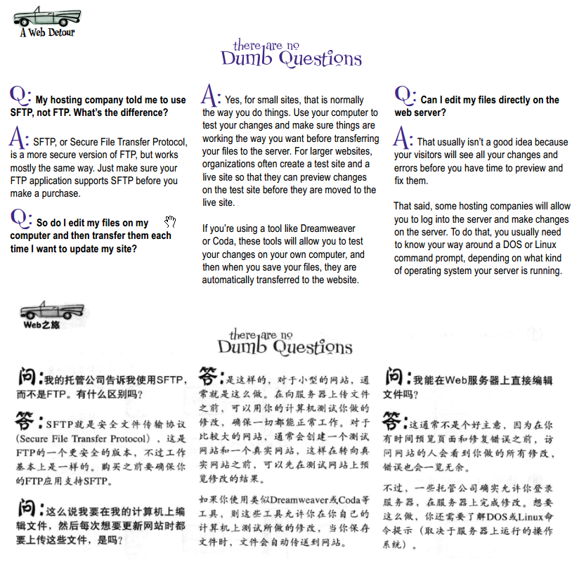
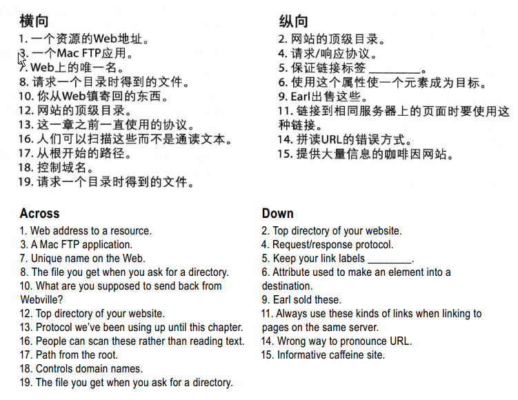
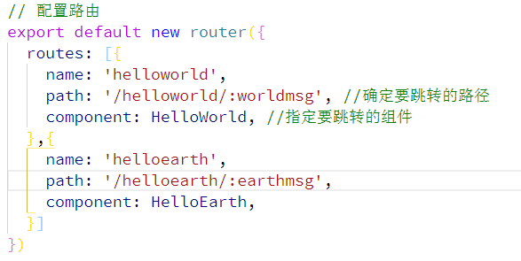

# 连接起来

离开落满灰尘的本地文件系统……前往Web镇，开始我们新的生活……

一旦离开了，或许就不会来了

为什么这么说呢？因为

> Web pages are a dish best served on the Internet. 

Web页面是互联网给我们的最好的一道菜。

## ★发布自己的网站

需要把本地的文件夹映射到服务器上的文件夹，一旦把页面放在服务器上了，那么就得想想该如何指示浏览器访问你的页面！

那么如何把自己的网站发布到Web上呢？


找一家托管公司……然后搞点域名……然后想想如何上传到托管公司的服务器上（有很多姿势可以做到）……告诉大家，享受你的成果……

这章你将会学到以后需要知道的一些重要知识，即便此刻的你并不打算让你的网站上线……

总之，来吧，做好准备，从HTML开始我们的Web之旅吧……

## ★选择托管公司

1. 技术支持（Technical support ）：处理你的技术问题，如电话和邮件……
2. 数据传输（Data transfer ）：允许你在一定时间内向访问者发送的页面和数据量，如果你的网站有大量访问者就得注意了
3. 备份（Backups ）：服务器出现硬件故障时能够修复
4. 域名（Domain names）：最好还是自己注册一个
5. 可靠性（Reliability ）：一天24h都在运行
6. 赠品（Goodies ）：Email地址、论坛、脚本语言支持……

## ★如何得到域名？


域名是`baidu.com`（domain name ）。而`www.baidu.com`则是网站名（website nam ）

购买域名就像买了一块地 `ppambler.cn` ，然后在这块地上就可以建很多网站了，如 `blog.ppambler.cn`、 `music.ppambler.cn`……

最好不要使用托管公司提供的域名，因为托管公司破产的话，那么这个域名就无法使用了，那么那些访问 你网站的人就不没办法找到你的网站了。而购买域名则可以随意选择新的托管公司……用户根本就不需要知道托管公司是不是原先那个！

域名是独一无二的……所以你想注册的域名很有可能已经被人注册了，不过，不用担心，提供域名注册的公司都允许你搜索一个域名是否被占用了，就像是搜索一个未用的车牌一样……

## ★Moving in（搬家）

从一个地方搬到另外一个地方去，把本地的根目录搬到Web服务器的根目录下！


### ◇没有蠢问题


根文件夹的概念很重要，尤其是在Web服务器上！因为根文件夹的内容可以从网上访问到！

关于Web服务器上的root文件夹命名，随意，只要你能找到这个root文件夹就好了！不需要一定非得与本地的root文件夹名字一样……

确定好Web服务器上你的root文件夹，那么你就copy本地root文件夹下所有的文件到这个目标root文件夹即可！

### ◇如何搬家呢？

我们知道了往哪里搬，可是如何搬呢？是自己使出吃奶的劲搬？还是雇一辆车来搬？还是……？

可见这是有很多办法的！

我们想把文件传送到Web服务器中，可以使用一种叫做FTP（File Transfer Protocol ）的文件传输方法

这种方法对于大多数hosting companies 来说，这肯定是支持的！

关于这个FTP，它是文件传输协议，也就是说我们实现本地与服务器的通信是要遵循这个协议才能进行的，突然有个疑问——协议是算法吗？

以下是我个人的看法，**✎：**

> 首先我们这里的[协议](https://www.wikiwand.com/zh-hans/%E5%8D%8F%E8%AE%AE)指的是网络传输协议
>
> 协议，即一套信息传播的标准，也可以说是设备之间通信的语言，即你要会这样的语言，才能实现通信，不然通个屁的信……
>
> 而FTP是应用层的协议，一般来说我们会按TCP/IP协议族来划分四层来完成我们的通信，每一层的职责都不一样，但最终的目的都是一样的——即更好、更快、更安全、更准确的等等来完成终端之间的通信
>
> 那么协议是算法吗？
>
> 我给你2台计算机，你说说如何让它们完成收发数据……
>
> 额，这个，首先你得这样做，然后这样，最后这样，……搞定
>
> 可是完成这个过程是基于网络传输协议的吧！
>
> 所以我认为协议是实现算法的蓝图，但它是算法吗？我认为这是维度不一样的算法
>
> 总之，没有协议，你并不能很好地完成协议，即这是「废柴」通信

我找了一下答案，**✎：**

**➹：**[【小课堂】算法和协议不是一回事！区别很重要！](https://www.yaofache.com/columns/detail/d4351808badc4f18abd83c64ff4dac0b)

协议的关键词是 `is`，而算法的则是 `do`

按照我的理解就是算法是逻辑，既然是逻辑，那么它就需要合理地组织知识点，用于解决问题！

而协议就是一个个知识点了！

如橄榄油是美味的就是协议，而算法则是，做菜前，先烧热锅，蒸发那些水分，然后倒入橄榄油……

总之，算法需要协议才能变得更好……

---

哈哈……看来我的看法很有问题！不过，没关系，因为唯有这样我才会继续向前迈进……

#### 我们要做的事


#### FTP

如何使用FTP将文件上传到Web？

一般托管公司都会告知你如何做的！

不过还是简单来说一下吧，**✎：**

如果你已经找到了一个FTP应用（可能是命令行应用，也可能是具有完备的图形界面），对了，有一些开发工具是内置了FTP应用的，像我了解到的，vscode就内置了git……

言归正传，还是简要说明一下FTP是如何工作的，**✎：**


翻译过来就是，**✎：**

1. 使用FTP连接到你的服务器，就像是我们使用Git提交到远程仓库一样，当然我们用的是[SSH协议](http://www.ruanyifeng.com/blog/2011/12/ssh_remote_login.html)
2. cd命令切换目录到服务器的root目录
3. put命令把文件上传
4. mkdir创建一个新目录
5. get获取文件

具体用于实践来看的话，**✎：**


突然觉得这就如发http请求一样，一般拿到数据就发get请求，提交数据如表单什么的，就用put请求……

#### 没有蠢问题



#### 流行的FTP应用


ps：http://cyberduck.ch/

有 `$`即是要给钱……

#### 小结

1. 知道root目录在托管公司服务器上的位置
2. 如何上传，找到一个最佳方法
3. 把本地的文件上传


## ★回到主题

如何让浏览器获取（retrieve？检索？）在互联网上的那些页面？然后再展示到我们面前……

首先你得type一个正确的地址（address）到你的浏览器中的地址栏里！

> 在浏览器中输入地址，然后回车就能看到内容……你说这是不是一个协议？


Web页面的地址都以http开头，稍后（in a sec）会讨论http是什么……

有了网站名（包含着IP地址），加上默认的80端口，知道是我们的站点开放的80端口，然后就可以在浏览器中访问我们的站点了

没有想到root文件夹竟然是用一个 `/`来表示的！

### ◇URL（统一资源定位符）

你知道的我们在浏览器中输入的Web地址叫做URL，即统一资源定位符（Uniform Resource Locators ）

当然，我们私下都喜欢叫它为「Web地址」……

不过，似乎有些人不太认同哦！那好吧，就官方一点好了，就叫它URL

插个题外话：

> 关于URL，其实还有个叫URI的家伙，它们的关系就像是URI是三角形，而URL则是等边三角形
>
> 你可以把URL叫做URI，这是允许的，不过不太好！因为我们确实是通过定位找到的资源，如xx国xxx省的xxxx市的zzz区的小蛮腰……
>
> 而URI则是很直接的就能这个资源了，即让每个资源都有属于自己的一个id，就像我们每个人都有一个身份证一样……可见，URI是个耿直boy
>
> 总之，URL是苹果，URI则是水果，前者强调L（Locators）、而后者则是I（Identifier）
>
> **➹：**[HTTP 协议中 URI 和 URL 有什么区别？ - 知乎](https://www.zhihu.com/question/21950864)

#### 剖析一个URL


说到协议，那么我们的浏览器肯定得与服务器通信了……想了想，似乎可以把协议当作是常识，如第一次见面时，两人的交流，肯定先用普通话测试一下吧！总之双方能听懂就好了！

> 似乎谈到协议，就离不开双方的吹牛逼……

总之，要定位Web上的任何资源，只要你知道维护这个资源的服务器，以及资源的绝对路径，就可以创建一个URL。接下来就可以让浏览器使用某种协议(通常是HTTP)来检索这个资源了！

#### 归纳一下URL到底是什么


统一资源定位符，是一个全局地址，可以用来定位Web上的任何资源，包括HTML页面、音视频和很多其它形式的Web内容！

除了指定资源的位置，URL还可以指定用来检索（retrieve？到底是获取的翻译好还是检索的好呢？因为检索是有脑子的拿，而获取是直接拿，不管你给啥）资源的协议

> 关于对全局地址的理解，你知道在Web上有各种资源，而整个Web就是各种资源的全局空间了，对于检索资源的URL来说，它是作用于整个Web的，即全局的任何资源的！
>
> 联想到JavaScript的话，可以把Web看作是一个window，总之这是各种资源、各种变量生存的空间……
>
> 而在JavaScript中，常常把定义在函数外的变量称为**全局变量**；而在函数内声明的变量称为**局部变量**。
>
> 回到全局地址，即这个地址无乱是全局的资源还是所谓的「局部」资源，都可以被URL定位到，即被检索到……
>
> **➹：**[JavaScript学习笔记： 局部变量和全局变量_JavaScript, JavaScript学习笔记, 变量 教程-w3cplus](https://www.w3cplus.com/javascript/the-basics-of-variable-scope-in-javascript.html)

总之，欢迎你访问这个网站，**✎：**


### ◇什么是HTTP？

HTTP也称为超文本传输协议（HyperText Transfer Protocol）。换句话说，这是在Web上传输超文本文档的公认的一种方法（协议）。尽管“超文本文档”通常只是指HTML页面，但这个协议实际上还可以用来传输图像或Web页面可能需要的任何其他文件。

总之HTTP是一个简单的请求和响应协议。

那么它是如何工作的呢？


每次在浏览器的地址栏中输入一个URL时，浏览器就会使用HTTP协议向服务器请求相应的资源。如果服务器找到这个资源，就会把它返回给浏览器，由浏览器显示。如果服务器找不到呢？


如果无法找到资源，则服务器会向浏览器报告我们熟悉的“404错误”。

### ◇什么是绝对路径？

> 文件的绝对路径……

之前我们所讲的路径是编写HTML时用a元素建立链接时所用的相对路径……

现在我们要说的「路径」是URL中的绝对路径部分……即协议+网站名之后的最后一部分 

绝地路径告诉服务器如何从你的root目录到达某个特定的页面或文件。

总之就是你得从root目录开始追踪文件夹，直到找到资源文件所在的文件夹。而这个路径就是由沿途经过的所有文件夹组成……

所以这看起来就像是，**✎：**


总是从root `/` 开始，然后加上导航到文件所经过的每一个文件夹，而文件夹名之间用 `/`来分割，最后添加文件名即可！注意文件名和文件夹名之间还有一个 `/`，或者说是文件名总是有个 `/`用于区分文件，**✎：**


> 我突然想起以前学习的时候，在写img元素src属性值和a元素的href属性值的时候，总是写相对路径，那是就是记住了 `../`开头的或者是 `./`开头的都是相对路径姿势去找寻资源，而只有一个 `/`开头则是以绝对路径，即从root目录下开始找寻资源……

#### 没有蠢问题


---


从中收获到的，**✎：**

1. 服务器就是根据绝对路径来找到你所请求的文件

   > 不过后台可是有个后端路由的概念，其实本质上来说，这个绝对路径并不代表这一定是一个资源所处的本地路径哈！
   >
   > 因为我们后端需要做路由判断，然后根据判断的结果，才会在本地找到响应的资源返回给你。
   >
   > 总之你的URL要告知的资源是个CSS文件，我们也可以响应回一个JavaScript文件给你……
   >
   > 也就说，这个URL（我们一般也叫后端所提供的API接口）是由后端与前端一起协议好的，而这个URL，即这个API是restful风格的API
   >
   > **➹：**[怎样用通俗的语言解释REST，以及RESTful？ - 知乎](https://www.zhihu.com/question/28557115)

2. 一个URL蕴含了很多信息，没有半点废话……

3. 对website是由server name 和 domain name组成的理解，server name 更像是一个网站的用途标签，如，写博客的`blog.domain.com`、听音乐的`music.domain.com`、发邮件的 `mail.domain.com`

4. 服务器只能按绝对路径的那一套来找资源，为什么我们可以写相对路径？

   因为浏览器的后台做了处理，即偷龙转凤，换句话说就是对相对路径做了格式化处理，把相对的转换为绝对的！总之服务器所处理的URL都是绝对路径的！

   不过怎样，我们前端开发人员是可以使用相对路径来定位资源的……

   

#### 练习


### ◇更简单的URL

我想只输入 `http://www.starbuzzcoffee.com`就可以拿到index.html，不知，可以不？

这是可以的，如果我们请求的不是文件，而是目录，你猜会发生什么？

对了。有一点忘记提醒你了，**✎：**

> 我们讨论web服务器或者FTP时，通常会使用「目录（directory ）」而不是「文件夹（folder ）」，当然，它们是一样的意思


Web服务器接收到一个类似这样的请求时，它会尝试查找这个目录中的一个默认文件。通常默认文件名为
“index.html”或“default.htm”，如果服务器找到这样一个文件，就会把它返回给浏览器显示。

所以，要从根目录（或任何其他目录）默认地返回一个文件，只需要把这个文件命名为“index.html”
或“default.htm”。

> 不过你要了解你的托管公司希望你如何命名默认文件，因为这取决于他们使用哪种类型的服务器。

我们要请求的是 `http://www.starbuzzcoffee.com`，不过它末尾可是没有 `/`的！


如果服务器接收到了这样一个末尾没有 `/`的请求，并且这个目录确实存在，那么**服务器**就会帮你加上末尾的斜线

所以如果服务器接收到了以下请求，**✎：**


这会让服务器查找一个默认文件，最后会返回这个文件，就好像你之前输入了以下地址：


> 讲真，不需要Web服务器软件就可以做到吗？

#### 默认页面是如何工作的？

请说出幕后的故事吧！


预备，Action……


1. 用户在浏览器中输入一个目录
2. HTTP请求：「我能得到文件`/drinks/`吗？ 」
3. 服务器说：「哥，这看上去就像是个目录，话又说回来，这个目录里有默认文件吗？」

4. 服务器在drinks目录中找到了一个叫「index.html」的默认文件！
5. HTTP响应：「你在请求一个目录，不过我发现该目录有个index.html，所以我就把这个文件发给你了……你爱要不要！」

#### 没有蠢问题


---


从中可以看出，我们发的请求最好不要加上index.html……

## ★链接到其它Web页面

需求：我们想让客户了解更多有关咖啡因的信息，为此需要让我们的网站有链接可以指向另外一个网站


### ◇怎么做？

在此之前，你需要知道「URL并不只是在浏览器中输入，还可以在HTML中使用。」

我们要把一个URL放在一个a元素中去，就像这样，**✎：**


要链接到Web上的资源，只需要把它的URL放在a元素中作为href属性值即可！

付诸于实践，**✎：**


我们增加了一些结构，如把链接和文本组织到一个段落中去……

一个链接是用相对路径定位资源的，而另外一个则是用URL定位资源……

测试结果：


当我们点击了下面那个链接，浏览器就会根据这个标签（链接文本）的href值，即URL向服务器发起HTTP请求，然后就显示结果，**✎：**


### ◇没有蠢问题


> 之前总是好奇，为啥有些a元素的href值是有`http://……`，而有些则是没有的，我想现在的我已经找到答案了！


同一网站的资源就用相对路径好了！其它网站上的资源就用URL……

---


浏览器要读取本地文件，这也就说它们之间要吹牛逼咯！既然是吹牛逼，那讲什么语言好呢？file语言！

对了file协议是3个 `/`的，还有在本地查找的路径有可能是反斜杠 `\`的

---


一个web应用在服务器里跑着，总得打开并监听一个端口才行，总之端口就像是一个门牌号一样……用于确保你这个东西是给这个门牌号的！

总之，使用http协议发送的请求，你不指定端口的话，那么默认就是80端口！

## ★完善Web页面

我想你的“web career” 可不会就此止步吧！虽然网站目前看起来知名度还是可以的……

你希望你的网站有那种专业的「fit and finish（完善性）」

所以如何让你的网站从普通网站开始向最佳网站迈进呢？

首先先介绍一种改进链接的方法……

### ◇为链接增加标题以便访问

#### 为什么需要？

1. 链接的标签通常只能提供有限的描述，如 「Caffeine Buzz」

2. 针对那些有视力障碍使用屏幕阅读器的人来说，这显得尤为重要，因为咩有title的话，就会把这个URL给读出来了！如 h、t、t、p……

总之单击的链接，如果有更多的信息，那么这是很好的……

a元素有个title属性，就是用来提供链接信息的……

时常有人会把这个title属性和title元素搞混，为什么名字会一样呢？因为它们本来就是相关的！

如何个相关法呢？——通常建议title属性值与所链接的Web页面的title元素值相同……

当然，这不是硬性规定，你在title属性中提供你自己的、更相关的描述，或许更有意义

#### 使用

定制a元素，附加更多信息，如title属性……


title的值就是所要的链接页面的文本描述！

#### 测试，看看效果


#### 小结


---


1. 链接标签得很整洁才行
2. 链接标签得有意义才行，千万不要让用户根据标签的上下文来确定这个链接将会指向什么内容，总之见标签就明意
3. 不要扎堆的放置链接标签

#### 练习


## ★链接到页面

到目前为止，只要链接到另一个页面，浏览器就会加载整个页面，并从头开始显示。

可是，假如我们希望链接到这个页面中的某个特定部分呢？如coffee部分，**✎：**


如何能做到呢？

目前我们并没有讲完关于a元素的全部，比如a元素实际上还可以带一个id属性，允许你直接访问页面中的一个特定点！

### ◇创建目标


id属性是一个重要的属性，而且它有一些特殊的特性！

目前你只需要认为它是一种唯一标识元素的方法即可！

带id的元素有一个特殊特性：**你可以直接链接这些元素**

那么如何使用id属性在页面中为a元素创建目标（destination ）呢？


1. 在页面中找到您想要创建着陆点（锚点）的位置。这可以是页面上的任何文本，不过，这通常只是一个标题。
2. 为目标选择一个标识符名，例如“coffee”或“summary”或“bio”，并在元素的开始标签中插入一个id属性

测试对象，**✎：**


按步骤行事，**✎：**


1. 为标题的开始标签增加id
2. 为这个目标指定标识符「chai」，注意id必须是唯一的！这非常重要，总之「chai」id在这个页面中必须是唯一的
3. 通过给它一个id，你建立了一个目标，指向了「index.html」页面中的chai Tea标题

### ◇如何用id链接到元素

你已经知道如何使用相对链接或URL链接到页面。不论是相对链接还是URL，要链接到页面中的一个特定目标，只需在链接最后加一个`#`，再加上目标标识符。

所以，如果你想从任何Starbuzz Coffee Web页面链接到“chai”目标，可以这样写`<a>`元素链接：


然而，似乎这样做并没有什么效果……因为该页面太小了，为此可以在浏览器窗口完整地显示，为了体现它的效果，页面最好足够大（长）才行，即存在滚动条且目标元素距离窗口顶部的距离至少要大于整个窗口高度才行哈！

总之，特定目的地（目标）的主要好处是链接到长文件中的位置，这样访问者就不必在文件中向下滚动以寻找所需的那部分了！

回顾一下做法，**✎：**

1. 明确标题id——xxx
2. 修改a元素，指向目标标题，相对路径或URL的末尾加上 `#xxx`
3. 重载（Reload ）页面，测试链接

### ◇查找目标标题

平常我们都是通过查看源代码来找到目标标题，或者直接通过控制台选择元素就好了！


### ◇测试

测试对象，**✎：**


更新链接，**✎：**

我们需要add on the destination anchor name （添加目标锚名称）


这是一个HTML片段，如何定位到我们想要的位置呢？首先如果你的URL没有写上默认文件，如index.html的话，那么最好添上才行，接着就结合使用目标id，即在href中增加 `#`以及目标id就好了！

> 之前了解到，在定位到当前页面的某个位置时，href值可以直接是 `#目标id名`，还有就是我们在没有想好该写什么链接之前就只给a元素的href属性值一个 `#`就好了！
>
> 如果是#的话，就回到了你第一次加载该页面所看到的情形，即页面重置了，如你对当前页面的滚动条滚了很远然后你点击了这个链接就回到了最上边，就如第一次加载该页面所显示的样子！只是地址栏的URL多了一个#而已！
>
> 我们一般用 `#`主要是让测试链接不跳转……
>
> 如果目标对象可以在窗口中被我们直接看见，那么这个链接就像是没有效果一样……当然地址栏里的URL是有变化的，而且还能使用浏览器给我们提供的后退按钮！
>
> 不过这样跳到单前页面的某个位置甚是突兀，最好使用JavaScript加个缓动动画……
>
> **➹：**[demo](https://ppambler.github.io/test-demo/M12/a.html)

### ◇没有蠢问题


**➹：**[正确使用HTML title属性](https://yanhaijing.com/html/2014/03/26/using-the-html-title-attribute/)

我突然发觉这样做不太对哈！我应该摘录一下重点就好了！

4. id名的大小写？——大小写字符随意组合，总之href值与目标id保持即可，还有就是id名必须在页面中是唯一的！不管怎样，id名的大小写是有意义的！最好统一小写……

   

5. 除了可以锚中其它文档的某个目标元素，也可以锚当前文档某个目标元素，即 `<a href="#top">Back to top</a>`，这个常用于页面内容很长，需要目录的情况……

6. 简写URL：

   ```html
   <a href="http://wickedlysmart.com/buzz/index.html#Coffee"></a>
   http://wickedlysmart.com/buzz#Coffee //错误的写法，浏览器会帮这个URL的末尾加斜线，就像是这样：
   http://wickedlysmart.com/buzz#Coffee/index.html //假如默认文件是index.html
   //当然你可以这样写：这个不单只针对index.html这样一些默认文件
   http://wickedlysmart.com/buzz/#Coffee
   ```

7. 如果没有目标，即咩有带id的元素，那么你就无法通过 `<a href="#id名"></a>`前往Web页面中的某个特定位置……所以，你只能为页面中的某个元素添加id了！

8. 话说id名可以有空格吗？即不是一个单词，而是两个单词及以上……如 `"xxx yyy"`

   > 要在大多数浏览器上得到一致的结果，id一定要用一个字母开头（A~Z或a～z），后面可以是任意字母、数字、横线、下划线、冒号或点号。所以尽管不能加空格，不能有类似“Jedi Mindtrick”的名字，但这个限制不算太苛刻，因为你还可以使用“Jedi-Mindtrick”、“Jedi_Mindtrick”、“JediMindtrick”之类的名字。

   其实用 `/` 这个字符开头也是可以的

   

   如果写id只是为了存粹的跳转，即不是为了写样式，那么这样也是可以的！

9. 告诉它人链接目标的位置：直接查看源代码即可，看看有哪些id……

10. a元素的内容除了文字还有哪些？——图片也行，二者组合也行：

    

    目前在HTML5中，块级元素也可以了！

    

    总之你可以为各种形式的内容创建超链接……

---

## ★绝对与相对

1. 使用相对路径来建立所有内部链接，而不是使用绝对路径，不然一旦域名发生了变化，那就GG了……

## ★窗口与标签页

需求总是层出不穷，每次都说这是最后一次了，然而并无卵用……或者说这是客套话而已

需求：单击xxx页面中的某个链接，xxx页面不会消失，因为这个页面还需要……换句话说这个链接要在新窗口打开……

我知道chrome浏览器有这样两个选择：


很多时候我发现一个标签页中看着视频，然后你打开另一个标签页后你会发现视频停止播放了哈！

**➹：**[浏览器中的进程与线程 - Lugus's Personal Website](https://lugusliu.com/2018/02/02/%E6%B5%8F%E8%A7%88%E5%99%A8%E4%B8%AD%E7%9A%84%E8%BF%9B%E7%A8%8B%E4%B8%8E%E7%BA%BF%E7%A8%8B/)

1. 可以使用target属性告诉浏览器这页面的目标窗口，如果使用 `_blank`作为目标，那么会跳转到新标签页显示这个页面，而不是默认的把当前页面给覆盖掉

   > 其实 `_blank`的原意就是在新窗口显示这个页面，不过浏览器做了默认处理，把这个值当作是打开新的标签页——这是用户想要看到的！当然新标签页和新窗口是一样的……当然新标签页可以共享原窗口的窗口边框……不过重新打开一个新窗口也是如此，这是有点偏移而已……
   >
   > 我弄错了……关于窗口有两种叫法：在一个标签页中打开新窗口；还有一个是全新的浏览器窗口

2. 如果xxx页面中的很多a链接的target属性都是 `_blank`值，那么这些链接都会重新打开一个新窗口，即一个新的标签页，如果你为target属性指定了其它值，如 `hh`，相当于是为这个窗口命名了，那么其它target属性用了这个值，那么也会在这个hh窗口中打开！

   ```html
       <a href="http://baidu.com" target="baidu" >baidu yixia </a>
       <a href="http://baidu.com" target="baidu" >baidu yixia </a>
   ```

总之 `_blank`是一种特殊情况，它会告诉浏览器总是使用一个新窗口……这也就是为什么都是同一个值，为啥 `_blank`就那么特殊的原因了……

### ◇访谈targer属性

1. 现状：咩有那么流行了
2. 当你在一个页面中点击某个链接的时候，那么目标页面有两种打开姿势：一是在一个新的标签页打开新页面，即这是在同一个浏览器窗口中的；二是在一个全新的浏览器中打开一个新的标签页，然后打开新页面，或者说是显示新页面……
3. **➹：**[视觉障碍人群如何上网？ - 知乎](https://www.zhihu.com/question/30746544)

打开新的标签页对有视力障碍的人来说，会让他们感到很迷惑……因为很多时候并没有提示他们这个页面是一个新页面了，你要想回到原先那个页面需要鼠标点击啊，如果是在目标页面是在同一个页面的话，那么按下回退键就可以了！

这就是为什么很多时候，有很多网站都会在当前页面显示目标页面，而不是打开一个新标签页……

一个说辞：「我们需要a链接，因为它可以让我们把用户的焦点带到我们网站以外的其它页面」

> 我在想「如果是同一个网站的页面，最好是在当前页面显示目标页面，如果是其它网站的页面，那么就在新的标签页中打开」，所以我感觉新浪nba很烂……毕竟每次打开一个新标签页都无法回退到主页面！

## ★练习

### ◇HTML填字游戏

目的：锻炼你的左脑


提示：



### ◇要点


我突然发觉英文好理解一点，因为这很直观说明绝对路径是一个路径，然后是什么样的路径呢？从root目录到文件……而中文，则是在得到是什么之前，需要很多什么什么的…… 即 `.......的`


这些要点我就直接摘录了，因为这是大神总结的要点啊，我可没有本事总结得那么精炼……

> 似乎都是一些做法、概念以及注意事项……即是什么，怎样做，为什么……还有一些边角料……

### ◇为什么需要图片？

因为一个站点总是需要logo的对吧！——第5章会解答你的疑惑


## ★练习答案

### ◇协议、网站名、绝对路径……长啥样


### ◇填字游戏


---

## ★总结

- 我们想要在Web上获取一个资源，那么你得知道资源的位置才行，我们通过ip地址（准确来说是MAC地址），确定维护资源的服务器，通过端口号确定web服务器软件所监听的端口，然后以root路径为起点开始向下检索资源，资源知找到了就通过web服务器软件响应回客户端，那么客户端和服务端是如何通信的呢？是基于http（or https）等协议来完成通信的……

- 浏览器会把相对路径改为绝对路径，如果url没有 `/`这个根目录，服务器会自动帮你加上，然后再返回默认的文件来！

- 我突然想到可以把地球当作是一个root目录，总之就是把地球当作是一颗树的根， 为此可以映射到网站的root目录，JavaScript中的window，HTML中的body元素（HTML的root元素是html，不过我们一般都是只聚焦到body元素的，因为浏览器显示的内容就是这一部分啊……）……总之有关家族树的就把地球当作是就好了！

  ps：把一张网页看作是地球似乎可以哦！地球是root元素——html元素对吧！然后地球有3分陆地7分海洋之说，不过7分海洋对我理解一张HTML网页不够感性，就像是平白的一张纸一样或者说是我对海洋的认识就是一片蔚蓝色的、很纯粹的海，没有陆地的那种层级感，如各大洲各国各省各市……如此嵌套，为此就把3分陆地看作是body元素好了，毕竟我们的body元素里的内容一般都比较复杂……

  以前总是把一个人看作是一张网页，为什么呢？因为head元素和body元素跟我们的头部和身体很般配……不过由于来来往往有太多人的缘故，反而不会聚焦到自己本身，即网页本身……

- 把`www.ppambler.cn`叫做服务器名……

- 比起「锚点」这个叫法，我更喜欢叫「着陆点」！

- 回顾前端路由，关于vuejs的实现， **✎：**

  

  我在想index.html是不是一定非得写上才行，结果发现不写也可以，也是用了服务器默认的index.html

  

  不过如果你这样做的话，**✎：**

  

  那假如id的名字是以 `/`开头的呢？

  

  回顾vuejs实现的前端路由，**✎：**

  

  `#/`，关于#，显然是一个单页应用，之后的 `/`显然默认的是前端路由的root路径。如果你直接请求的是 `localhost:8080`，也会默认的为你在末尾补上 `/#/`的

  配置路由，**✎：**

  

  添加路由跳转，**✎：**

  

  如果没有对路径有了更深一层的认识，不然确实很难明白这个前端路由实现！

  突然发觉基础知识贼鸡儿重要哈！

- 把a链接的指向看作是目标页面（整个页面）或者是目标元素（锚点，锚的是id这个点，页面中的某个元素）

- 站点内使用相对路径，站点外的资源使用绝对路径，即一个完整的 `http://www.baidu.com` ……

- 我在干什么？——我在理解如果这样做，那么就会有这样的现象的原因，以及理解为啥这样做就是最佳实战，即理解其它姿势做法的弊端……

- 链接标签要简短一点，如果需要补充则用title属性就好了！

## ★Q&A

### ①域名解析？

**➹：**[A记录与Cname - 简书](https://www.jianshu.com/p/e1ad4b96f727)

### ②什么是服务器？

**➹：**[服务器 - Wikiwand](https://www.wikiwand.com/zh-hans/%E6%9C%8D%E5%8A%A1%E5%99%A8)


