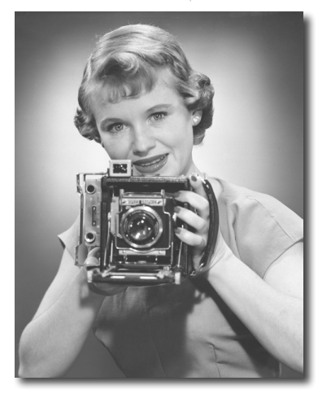
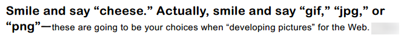
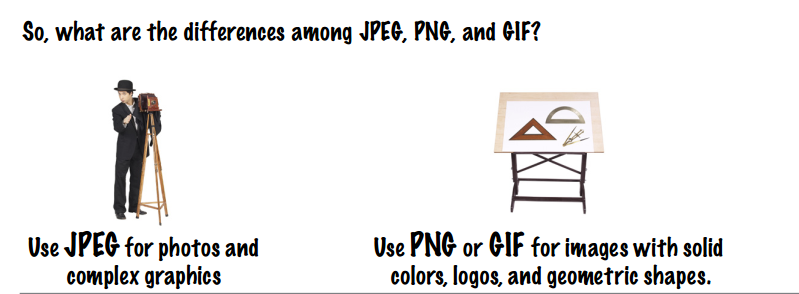
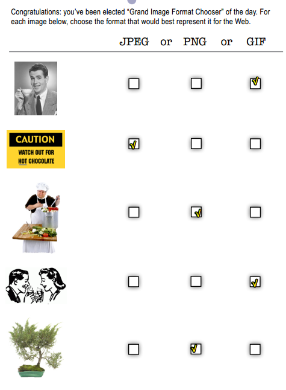

# 为你的页面增加图像



没想到是cheese（奶酪），而不是茄子……我觉得读「cheese」好很多，尤其是你微笑着读「cheese」……



当你为Web「冲印照片（developing pictures ）」时，你就会用到 `gif`、`jpg`、`png`等

> 关于照片冲印，你需把拍摄的照片交给冲印店……
>
> 所以为Web冲印照片，相当于是Web是消费者，而我们前端开发者就像是冲印店……也就是洗照片的人……然后我们可以给Web一张gif图片，也开始jgp、png等格式的图片……
>
> **➹：**[大家觉得哪个网站冲印的相片质量最好？ - 知乎](https://www.zhihu.com/question/19726037)

##★浏览器如何处理图像？

你要知道浏览器处理img元素可是跟其它元素（p元素、h1元素等）不同的哈！

也就是说浏览器看到p标签等，只需要把它们的内容显示出来即可，而看到img元素时，则会做不同的处理了，如显示图像之前，需要先获取这个图像才行……

我们在浏览器的地址栏输入 `http://xxx.com/yyy/index.html`:

浏览器收到了我们的请求，然后它向服务器发出请求，假设这个页面有4张图像。

1. 在响应回来前，页面是空白的
2. 接着显示了页面内容，即DOM树已经弄好了，当然你是看不见图像的，不过坑已经挖好了……
3. 开始按顺序请求图片，响应一张就渲染一张，直到请求和响应完毕……

> 这似乎告诉我，为啥要预先把图片的大小写在img标签上，以及这个：
>
> 
>
> - `DOMContentLoaded` —— 浏览器已经完全加载了 HTML，DOM 树已经构建完毕，但是像是 `` 和样式表等外部资源可能并没有下载完毕。
> - `load` —— 浏览器已经加载了所有的资源（图像，样式表等）。
>
> 关于这些事件，有些需要我们用户去触发，如鼠标、键盘等，有些则是页面加载到某个时间段触发的，即这是页面这个家伙去搞的……其实我这要想表达的是要站在对方的角度去考虑……不要觉得所有事件都是由用户去触发的！如：
>
> `DOMContentLoaded` 由 `document` 对象触发。
>
> 我们使用 `addEventListener` 来监听它：
>
> ```js
> document.addEventListener("DOMContentLoaded", ready);
> ```
>
> 触发对象是document……像是点击事件这些，一般是按钮对象吧！
>
> **➹：** [浏览器中的进程与线程 - Lugus's Personal Website](https://lugusliu.com/2018/02/02/%E6%B5%8F%E8%A7%88%E5%99%A8%E4%B8%AD%E7%9A%84%E8%BF%9B%E7%A8%8B%E4%B8%8E%E7%BA%BF%E7%A8%8B/)
>
> **➹：**[[译]页面生命周期：DOMContentLoaded, load, beforeunload, unload解析 · Issue #3 · fi3ework/blog](https://github.com/fi3ework/blog/issues/3)

## ★图像是如何工作的？

图像就是图像，不过这世界上有很多种图像格式，它们各有优缺点……

当然，庆幸的是，在web上常用的只有三种：JPEG、PNG、GIF

所以问题来了——如何确定在什么情况下使用哪一种格式呢？像我这个markdown笔记，大都是png格式的图片，因为我觉得它较小一点……我测试了截取同一块区域，然后一个保存为png格式的，一个为jpeg格式的，结果后者要大得多，不过这应该是由png是8还是24还是32决定的……

### ◇在网页上使用图像需要考虑的事儿

1. 图像不要太多了，不然这会影响网页显示的速度，即网页加载好慢啊！
2. 图像不要过度失真，不然这会影响网站的整体设计
3. 用简单的图像做出动画效果
4. ……

**➹：**[[WEB]JPG 、GIF、PNG 三種格式的比較 @ 老周的部落 :: 痞客邦 ::](http://mingwang0824.pixnet.net/blog/post/27833076-%5Bweb%5Djpg-%E3%80%81gif%E3%80%81png-%E4%B8%89%E7%A8%AE%E6%A0%BC%E5%BC%8F%E7%9A%84%E6%AF%94%E8%BC%83)

### ◇三种格式之间的区别

1. 照片和复杂图像，请使用JPEG
2. 单色图像、logo和几何图形，请使用PNG或GIF



为什么这么说呢？

- JPEG：一种「有损」格式，即缩小文件大小时会丢掉图像的一些信息，颜色数量很多
- PNG：无损、允许将颜色设置为透明（即图像下面的东西可以显示出来），体积一般相较于PNG要大点，颜色数量一般
- GIF：无损、动画是优势，最多有256颜色

**➹：**[图片格式 jpg、png、gif各有什么优缺点？什么情况下用什么格式的图片呢？ - 知乎](https://www.zhihu.com/question/20028452)

**➹：**[jpg和png有什么区别？ - 知乎](https://www.zhihu.com/question/29758228)

**➹：**[两张尺寸、像素、分辨率都相同的PNG图片，图片内容也相同，为什么文件体积不一样大？是越大越清晰吗？ - 知乎](https://www.zhihu.com/question/37411752)

总之：jpg是有损压缩适合照片，文件小，png适合透明图，小图，做照片文件偏大。

### ◇采访这三种格式

1. GIF是Web最早的图像格式

2. 由于GIF只有区区256种颜色，所以它无法很好地表示复杂图像，如照片……所以在jpeg多达1600万种不同颜色看来，只能呵呵了……

3. PNG倒是牛逼一点，可以像JPEG那样表示复杂图像，也可以像GIF那样是无损的，可见所有优点都集中于一身……

4. 无损格式：用一种无损格式（如png、gif……）存储图像时，你不会丢失图像中的**任何信息或细节**。

   为什么需要这种格式？

   因为凡事总有取舍。有时你可能只想要一个很小的文件，可以快速下载，而且质量很不错。我们并不总需要最完美的质量。所以JPEG图像就已经让人很满意了。

   当然，如果那些线条、logo、小文本和单色图像……用了JPEG格式的话，那么它们看起来则不咋滴……

5. 文件大小对比：在三者格式对比中，PNG有时可能比较大，因为PNG它有PNG-32，当然这是可选的，它还有PNG-24和PNG-8

   2^24^=16777216种颜色，即1600多万种颜色，那PNG-32是不是有2^32^ = 4294967296种颜色，即10亿多种颜色？

   非也，它是根据RGBA来搞事情的，即透明度也要占8个bit……总之它每个像素的深度为32bits哈！

   既然如此，那PNG-24就是咩有透明度咯！即RGB都各8bit

   那么PNG-8呢？

   把图片中用到的每种颜色都存储在一个长度为255的数组中，称之为**条色盘**，然后每个像素上存储对应颜色在**条色盘**上的位置。因为颜色上限是255种，所以每个像素只需要8bits就可以表示对应的颜色信息。这种表示颜色的方式也被称之为索引色。

   PNG-8相比PNG-24、PNG-32之下确实使用了更少的空间来存储颜色，但是他能表达的颜色种类是有上限的，所以在将PNG-32转换成PNG-8时会在一些颜色过渡的地方会明显的看到不平滑的渐变。

6. 在透明度方面，PNG比GIF更6，毕竟GIF仅限于一种颜色，不然会有锯齿透明区，而png的透明区边缘则是平滑的！在Web上到处都在用PNG的透明性

7. JPEG擅长照片、PNG适用于多种颜色和透明，如logo……、GIF则是动画吧！

---

### ◇练习



---


## ★总结

- 以后再学习一下ps

## ★Q&A

### ①关于RGB？

自然界中的所有颜色都可以由红、绿、蓝(R，G，B)组合而成。有的颜色含有红色成分多一些，如深红；有的含有红色成分少一些，如浅红。针对含有红色成分的多少，可以分成0到255共256个等级，0级表示不含红色成分；255级表示含有100%的红色成分。同样，绿色和蓝色也被分成256级。这种分级概念称为量化。

这样，根据红、绿、蓝各种不同的组合我们就能表示出256×256×256，约1600万种颜色。这么多颜色对于我们人眼来说已经足够丰富了。

**➹：**[第1章 Windows位图和调色板](http://man.lupaworld.com/content/other/book1/chap01.htm)

### ②关于扁平化？

**➹：**[什么是扁平化设计 (Flat Design)，扁平化设计是未来的趋势吗？ - 知乎](https://www.zhihu.com/question/20881633)

### ③png？

**➹：**[PNG 8,24,32 ......什么？ - PATRICK HANSEN](http://www.patrickhansen.com/2011/02/04/png-8-24-32-what/)

**➹：**[PNG-8、24、32区别介绍 - 简书](https://www.jianshu.com/p/31207790bad2)

