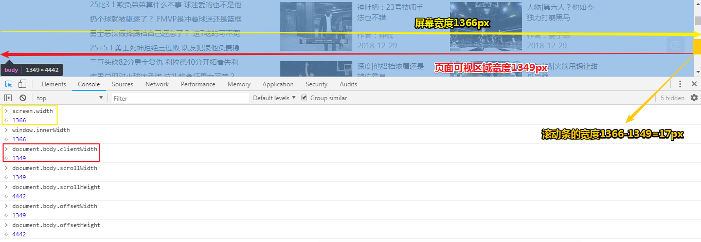

# 为你的页面增加图像


没想到是cheese（奶酪），而不是茄子……我觉得读「cheese」好很多，尤其是你微笑着读「cheese」……


当你为Web「冲印照片（developing pictures ）」时，你就会用到 `gif`、`jpg`、`png`等

> 关于照片冲印，你需把拍摄的照片交给冲印店……
>
> 所以为Web冲印照片，相当于是Web是消费者，而我们前端开发者就像是冲印店……也就是洗照片的人……然后我们可以给Web一张gif图片，也开始jgp、png等格式的图片……
>
> **➹：**[大家觉得哪个网站冲印的相片质量最好？ - 知乎](https://www.zhihu.com/question/19726037)

## ★浏览器如何处理图像？

你要知道浏览器处理img元素可是跟其它元素（p元素、h1元素等）不同的哈！

也就是说浏览器看到p标签等，只需要把它们的内容显示出来即可，而看到img元素时，则会做不同的处理了，如显示图像之前，需要先获取这个图像才行……

我们在浏览器的地址栏输入 `http://xxx.com/yyy/index.html`:

浏览器收到了我们的请求，然后它向服务器发出请求，假设这个页面有4张图像。

1. 在响应回来前，页面是空白的
2. 接着显示了页面内容，即DOM树已经弄好了，当然你是看不见图像的，不过坑已经挖好了……
3. 开始按顺序请求图片，响应一张就渲染一张，直到请求和响应完毕……

> 这似乎告诉我，为啥要预先把图片的大小写在img标签上，以及这个：
>
> 
>
> - `DOMContentLoaded` —— 浏览器已经完全加载了 HTML，DOM 树已经构建完毕，但是像是 `` 和样式表等外部资源可能并没有下载完毕。
> - `load` —— 浏览器已经加载了所有的资源（图像，样式表等）。
>
> 关于这些事件，有些需要我们用户去触发，如鼠标、键盘等，有些则是页面加载到某个时间段触发的，即这是页面这个家伙去搞的……其实我这要想表达的是要站在对方的角度去考虑……不要觉得所有事件都是由用户去触发的！如：
>
> `DOMContentLoaded` 由 `document` 对象触发。
>
> 我们使用 `addEventListener` 来监听它：
>
> ```js
> document.addEventListener("DOMContentLoaded", ready);
> ```
>
> 触发对象是document……像是点击事件这些，一般是按钮对象吧！
>
> **➹：** [浏览器中的进程与线程 - Lugus's Personal Website](https://lugusliu.com/2018/02/02/%E6%B5%8F%E8%A7%88%E5%99%A8%E4%B8%AD%E7%9A%84%E8%BF%9B%E7%A8%8B%E4%B8%8E%E7%BA%BF%E7%A8%8B/)
>
> **➹：**[[译]页面生命周期：DOMContentLoaded, load, beforeunload, unload解析 · Issue #3 · fi3ework/blog](https://github.com/fi3ework/blog/issues/3)

## ★图像是如何工作的？

图像就是图像，不过这世界上有很多种图像格式，它们各有优缺点……

当然，庆幸的是，在web上常用的只有三种：JPEG、PNG、GIF

所以问题来了——如何确定在什么情况下使用哪一种格式呢？像我这个markdown笔记，大都是png格式的图片，因为我觉得它较小一点……我测试了截取同一块区域，然后一个保存为png格式的，一个为jpeg格式的，结果后者要大得多，不过这应该是由png是8还是24还是32决定的……

### ◇在网页上使用图像需要考虑的事儿

1. 图像不要太多了，不然这会影响网页显示的速度，即网页加载好慢啊！
2. 图像不要过度失真，不然这会影响网站的整体设计
3. 用简单的图像做出动画效果
4. ……

**➹：**[[WEB]JPG 、GIF、PNG 三種格式的比較 @ 老周的部落 :: 痞客邦 ::](http://mingwang0824.pixnet.net/blog/post/27833076-%5Bweb%5Djpg-%E3%80%81gif%E3%80%81png-%E4%B8%89%E7%A8%AE%E6%A0%BC%E5%BC%8F%E7%9A%84%E6%AF%94%E8%BC%83)

### ◇三种格式之间的区别

1. 照片和复杂图像，请使用JPEG
2. 单色图像、logo和几何图形，请使用PNG或GIF


为什么这么说呢？

- JPEG：一种「有损」格式，即缩小文件大小时会丢掉图像的一些信息，颜色数量很多
- PNG：无损、允许将颜色设置为透明（即图像下面的东西可以显示出来），体积一般相较于PNG要大点，颜色数量一般
- GIF：无损、动画是优势，最多有256颜色

**➹：**[图片格式 jpg、png、gif各有什么优缺点？什么情况下用什么格式的图片呢？ - 知乎](https://www.zhihu.com/question/20028452)

**➹：**[jpg和png有什么区别？ - 知乎](https://www.zhihu.com/question/29758228)

**➹：**[两张尺寸、像素、分辨率都相同的PNG图片，图片内容也相同，为什么文件体积不一样大？是越大越清晰吗？ - 知乎](https://www.zhihu.com/question/37411752)

总之：jpg是有损压缩适合照片，文件小，png适合透明图，小图，做照片文件偏大。

### ◇采访这三种格式

1. GIF是Web最早的图像格式

2. 由于GIF只有区区256种颜色，所以它无法很好地表示复杂图像，如照片……所以在jpeg多达1600万种不同颜色看来，只能呵呵了……

3. PNG倒是牛逼一点，可以像JPEG那样表示复杂图像，也可以像GIF那样是无损的，可见所有优点都集中于一身……

4. 无损格式：用一种无损格式（如png、gif……）存储图像时，你不会丢失图像中的**任何信息或细节**。

   为什么需要这种格式？

   因为凡事总有取舍。有时你可能只想要一个很小的文件，可以快速下载，而且质量很不错。我们并不总需要最完美的质量。所以JPEG图像就已经让人很满意了。

   当然，如果那些线条、logo、小文本和单色图像……用了JPEG格式的话，那么它们看起来则不咋滴……

5. 文件大小对比：在三者格式对比中，PNG有时可能比较大，因为PNG它有PNG-32，当然这是可选的，它还有PNG-24和PNG-8

   2^24^=16777216种颜色，即1600多万种颜色，那PNG-32是不是有2^32^ = 4294967296种颜色，即10亿多种颜色？

   非也，它是根据RGBA来搞事情的，即透明度也要占8个bit……总之它每个像素的深度为32bits哈！

   既然如此，那PNG-24就是咩有透明度咯！即RGB都各8bit

   那么PNG-8呢？

   把图片中用到的每种颜色都存储在一个长度为255的数组中，称之为**条色盘**，然后每个像素上存储对应颜色在**条色盘**上的位置。因为颜色上限是255种，所以每个像素只需要8bits就可以表示对应的颜色信息。这种表示颜色的方式也被称之为索引色。

   PNG-8相比PNG-24、PNG-32之下确实使用了更少的空间来存储颜色，但是他能表达的颜色种类是有上限的，所以在将PNG-32转换成PNG-8时会在一些颜色过渡的地方会明显的看到不平滑的渐变。

6. 在透明度方面，PNG比GIF更6，毕竟GIF仅限于一种颜色，不然会有锯齿透明区，而png的透明区边缘则是平滑的！在Web上到处都在用PNG的透明性

7. JPEG擅长照片、PNG适用于多种颜色和透明，如logo……、GIF则是动画吧！

---

### ◇练习


---

## ★介绍img元素

与处理其它HTML标记相比，处理图像要做更多工作，如需要发请求……

### ◇基本知识


它还有其它属性吗？还有如何引入不在自己网站上的图片呢？

### ◇img元素不再只是相对链接

也就是说你可以是使用URL哈！总之：

1. 图像跟HTML页面 一样，它们都是放在Web服务器中，即它们都有自己的URL
2. 对于相同网站上的链接和图像，最好使用相对路径

举个例子——使用URL链接一个图像：


这个URL就是图像的路径啦！

练习——使用URL在Web页面中显示这张图片：


### ◇关于图像的问题

1. img元素只是提供了一种方法来指定需要在页面中显示的图像的位置。也就是说通过img元素以及它的src属性就可以把一张图片显示到Web页面的某个位置咯！

   通过CSS，我们有许多更改图像视觉样式的方法……

   关于图像本身还有许多知识需要了解，如不同的图像格式会有什么作用？、为啥要使用这种格式而不是其它格式？、图像文件的大小？、如何准备在 Web页面中使用的图像？

2. void元素指的是没有内容和结束标签的元素，而img元素也是属于void元素这一类的！但是我们在页面中可以看到图片呀，难道图片不是内容吗？

   > 更确切地讲，void元素是指HTML页面中在开始标签和结束标签之间没有任何内容的元素。没错，图像也是内容，不过``元素只是指向图像。**图像并不是HTML页面本身的一部分**。实际上，浏览器显示页面时，图像会取代``元素。另外要记住，**HTML页面是纯文本**，所以图像绝对无法直接作为页面的一部分。它是单独存在的。

   关于void元素的定义，按照我的理解就是 :`<p></p>`，p元素此时没有内容，那么它也可以说是void元素，不过这显然不对头……毕竟不写内容的p元素是很没有意义的！

   HTML页面是纯文本，目前我了解页面上有的感觉媒体有图片、音频、视屏……纯文本，讲真也可以说是感觉媒体！

   **➹：**[媒体_百度百科](https://baike.baidu.com/item/%E5%AA%92%E4%BD%93)

   既然说页面是纯文本，那么图片、音视频等显然不是HTML页面的本身一部分啦！如果针对void元素这个概念来说，它们是不属于HTML页面本身的一部分的！毕竟浏览器在显示页面时img元素GG了，即被图像给取代了 ！而像p元素这些，在页面所显示的内容，确实是我们在p元素里所写的内容，而不是凭空出现的内容！

   再次回顾void元素的概念，我们在写img元素确实没写上任何内容，至于它为什么在页面上显示有内容并不是我们所关注的！我们只需要关注你到底有没有在元素中写内容！

3. 

   通常浏览器会同时请求多个图像，然后会一个接一个显示图像，但这个过程极快，导致它们像是一同出现一样！

4. 

   说到logo，那就用png好了！如果是动画，那就gif

---

### ◇一定要提供候选方案


可见你无法确定用户是如何访问你的页面，所以页面上的图像很有可能无法显示，所以alt属性就出现了！

它是一个候选做法，即使用img元素的alt属性可以为访问者提供一些指示，告诉它们图像里有什么信息，就像是这样：


「如果无法找到图像，那么就显示alt属性的内容」——不过，并不是所有浏览器都会这样做，所以你多测试几个浏览器就好了！

### ◇img元素属性

#### 调整图像大小

img元素的另一个属性，只是一个吗？——不，应该是一对属性才对：width和height

使用这些属性**可以提前告诉浏览器你的页面中一个图像的大小**……

举个例子：


> width属性告诉浏览器「图像应该在页面中显示多宽」。

1. 宽度和高度都使用像素数指定。

2. 如果没有指定宽度和高度，那么浏览器会在显示图片之前自动确定图片的大小。。

#### 一些疑问


1. 如果不指定这些属性，那么就会重新调整页面布局！
2. 最好成对使用这两个属性
3. 如果需要调整图像大小，那就用CSS好了，如果你设置的值与图片原本的尺寸一致，那么这些属性只是提供信息而已，而不是为了表现……

---

## ★一个案例

1. 如今数码相机拍摄的大多数图像都很大，甚至非常大，如果让图片保持原样来让用户浏览的话，那么访问者要想看完整的图片就得拖动滚动条啦！

   其实这很糟糕：

   

   > 浏览器窗口的大小包含滚动条
   >
   > 还有一个就是页面可视区域宽度
   >
   > chrome的滚动条宽度为17px
   >
   > **➹：**[javascript - 各浏览器滚动条默认宽度是多少？ - SegmentFault 思否](https://segmentfault.com/q/1010000004817695)

### ◇疑问

1. 不要让用户用滚动条查看图像。为什么这么说呢？——因为一般来说，如果页面中有大图，那么这个页面就很难使用了！毕竟访问者不仅不能一次看到整个图像，而且使用滚动条也很麻烦……

   况且大型图像还需要在服务器和浏览器之间传输更多数据，这需要大量时间，可能会导致页面显示速度非常慢，尤其是对于拨号或其他连接速度较慢的用户

2. 不要直接使用width属性和height属性来调整页面上的图像大小。因为浏览器仍然需要检索整个大图像，然后才能按比例缩小以适合您的页面。简而言之，依旧需要下载大图片，这显然很操蛋……

3. 关于浏览器窗口宽度是800px的理解：

   你要知道你的笔记本显示屏是由数百万个称为像素的点组成的！

   

   有些人的显示器屏幕很小，有些人的则很大，为此分辨率的大小就很重要了！像我这台笔记本电脑的分辨率就是1366px*768px，当我们全屏打开一个浏览器：

   

   > `window.innerWidth` 浏览器可用宽度
   >
   > `document.body.clientWidth` body的宽度（在body没有`margin`、`padding`、`border`的情况下得到的）
   >
   > `screen.width`屏幕分辨率宽度
   > `document.body.scrollWidth` 页面完整宽度
   > `document.body.scrollHeight` 页面完整高度
   > `document.body.offsetWidth` 网页可见区域宽度
   > `document.body.offsetHeight` 网页可见区域高度

   大多数人通常将浏览器的宽度设置在800到1280像素之间。因此，对于图像的最大宽度(你的web页面的最大宽度也是如此)大约是800像素就是一个很好的经验法则……

4. 像素的数量与屏幕上图像的大小有什么关系？

   一个很好的经验法则是每英寸96像素，尽管有了今天的高分辨率显示器和视网膜显示器，分辨率还可以更高。我们过去使用的标准是每英寸72像素(ppi)，但为了处理现代显示器，为此，CSS像素的概念就被创建了。CSS像素是1英寸(96 ppi)的1/96英寸。所以对于一个`3"宽×3"高`的图像，你会使用`96(像素)×3(英寸)= 288×288像素`。

   ps：这里的 `3"宽`是3英寸宽…… **➹：**[请问这个符号 '' 是什么长度单位？ - 知乎](https://www.zhihu.com/question/26021862)

   

   效果：

   

   上面这张图片是：分辨率96px/英寸和243KB大小！

   下面这张图片是：分辨率72px/英寸和136.7KB，也是3英寸*3英寸的图片

   

   我以为了设置 3*3英寸的图片，那么所呈现的图片应该是大小一致的，没想到最后都转化成了像素，为此导致了大小不一……

   我保存了这张3*3英寸，且分辨率为72px/英寸的图片：

   

   所以这张图片的大小为：`216*216*24=1119744Bit=136.6875KB`，然而这张图片的大小是：

   

   或许这是我用软件保存后的结果……

   如果我用png格式保存的话：

   

   我只是单纯地来位深度来衡量大小：为保存图片之前，它们都是136.7KB的大小，但各自保存为jpg和png的格式后，jpg显然要更小一点！

   所以像素的数量与屏幕上图像的大小有什么关系？

   同样一张3*3英寸高的图片，它们一个按照分辨率为72px/英寸，一个按照分辨率为96px/英寸来在屏幕中显示的话，它们是大小不一的！一般来说文档类型为Web的话，默认分辨率是72px/英寸，如果是为移动设备做的图片呢？——分辨率为326px/英寸

   

   之前说到CSS的1px关于分辨率为96px/英寸的，也就是说调用一个div为96px*96px的，也就是1英寸吗？

   可是默认的Web是72px/英寸，难道书上的介绍是错误的？——不，书上说为了应对现代显示器高分辨率的情况而产生了CSS像素这么一个概念

5. 应该把图像设置为多大？

   1. 宽度小于800px，这由图像的用途而定
   2. 如果是个logo，那么就在100px~200px之间，毕竟不需要让logo与整个Web页面一样宽
   3. 总之这是页面设计来定的！
   4. 对于照片，我们通常希望它越大越好，所以我们可以使用一个小缩略图，为此这个页面就可以快速加载了，然后允许用户通过单击各个缩略图来查看原来的大图像，即又发了一个请求，而不是一次性把大图的也发过来，总之先排小的过去，然后如果用户有意，那就排大的过去！

6. 有些浏览器可以对不适合浏览器宽度的图像调整大小，为此就可以让图像在窗口里看起来刚好合适了！不过这样做不好哈！因为终究需要传递一个大图，即需要让服务器传输更多的数据，这样会导致页面加载很慢，为此可用性降低。还有一点就是，用移动设备查看网页的人越来越多了，所以太大的图像将影响这些设备上的数据使用

---

### ◇设置正确的图像大小


## ★总结

- 以后再学习一下ps

- 把Web、img、gif、jpeg、png等当作是个会讲话的家伙……即把它们拟人化……这样一来，它们会很有趣！

- 关于对图片属性的启发：

  1. 简单使用：就一个img元素和src属性
  2. 安全点：添加个alt属性
  3. 性能好点：添加与图片尺寸一致的width属性和height属性

  这告诉了我「你所看到某个元素身上有很多属性，它们都是一步一步堆积起来的！而且每一步都是特别的意义，不会傻傻地写个没吊用的属性……」

  总之，不要想着写一个src属性就意味着结束对img元素书写……因为它还可以变得更好……

- 突然想到关于对布局的理解，以我们所租的房子（只要一个卫生间、一个阳台和一个大厅）为例，把大厅当作是一张网页的话，那么床该放在哪个位置呢？电脑做又该放置在哪儿呢？还有茶几等这些又放置在哪儿呢？可以一行铺两张床，也可以分两行即上下铺两张床：


---


可见这就是所谓的布局，而床等这些就是HTML页面上的元素啦！

- 我是否可以把浏览器窗口的宽看作是一张图片的宽呢？

- 回忆烤好的面包，即烤好的CSS：

  


## ★Q&A

### ①关于RGB？

自然界中的所有颜色都可以由红、绿、蓝(R，G，B)组合而成。有的颜色含有红色成分多一些，如深红；有的含有红色成分少一些，如浅红。针对含有红色成分的多少，可以分成0到255共256个等级，0级表示不含红色成分；255级表示含有100%的红色成分。同样，绿色和蓝色也被分成256级。这种分级概念称为量化。

这样，根据红、绿、蓝各种不同的组合我们就能表示出256×256×256，约1600万种颜色。这么多颜色对于我们人眼来说已经足够丰富了。

**➹：**[第1章 Windows位图和调色板](http://man.lupaworld.com/content/other/book1/chap01.htm)

### ②关于扁平化？

**➹：**[什么是扁平化设计 (Flat Design)，扁平化设计是未来的趋势吗？ - 知乎](https://www.zhihu.com/question/20881633)

### ③png？


**➹：**[PNG 8,24,32 ......什么？ - PATRICK HANSEN](http://www.patrickhansen.com/2011/02/04/png-8-24-32-what/)

**➹：**[PNG-8、24、32区别介绍 - 简书](https://www.jianshu.com/p/31207790bad2)

### ④分辨率和像素？

我的笔记本的分辨率：16:9的屏幕比例


**➹：**[分辨率和像素是什么关系？ - 知乎](https://www.zhihu.com/question/21149600)

1英寸：2.54cm，大概是键盘上的两个键的宽度！

dpi：每英寸点数！

ppi：每英寸像素数！

72pt (點) = 1inch (英吋) = *2.54 cm* (公分)。

### ⑤哪些东西看起来一英寸大小？

根据这个

> 牡丹1元硬币：直径25mm，厚度1.85mm，重量6.05g
> 菊花1元硬币：直径25mm，厚度1.85mm，重量6.1g

25mm=2.5cm，所以一英寸大概是一枚1元硬币的直径宽度！

注意有以英寸为单位的尺子：


**➹：**[美国标准长度](https://www.shuxuele.com/measure/us-standard-length.html)

### ⑥webp格式？

**webp格式**概况 与JPEG相同，**WebP是**一种有损压缩。 但谷歌表示，这种**格式**的主要优势在于高效率。 他们发现，“在质量相同的情况下，**WebP格式**图像的体积要比JPEG**格式**图像小40%。

**➹：**[WebP 相对于 PNG、JPG 有什么优势？ - 知乎](https://www.zhihu.com/question/27201061)

