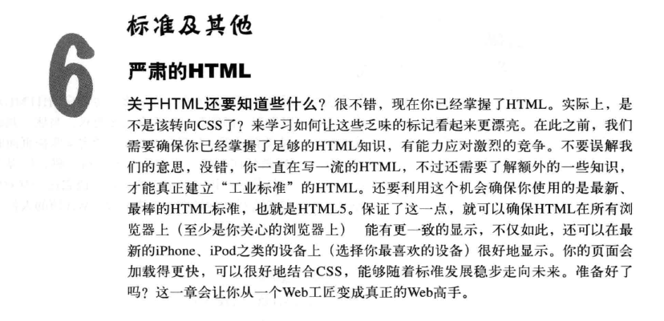
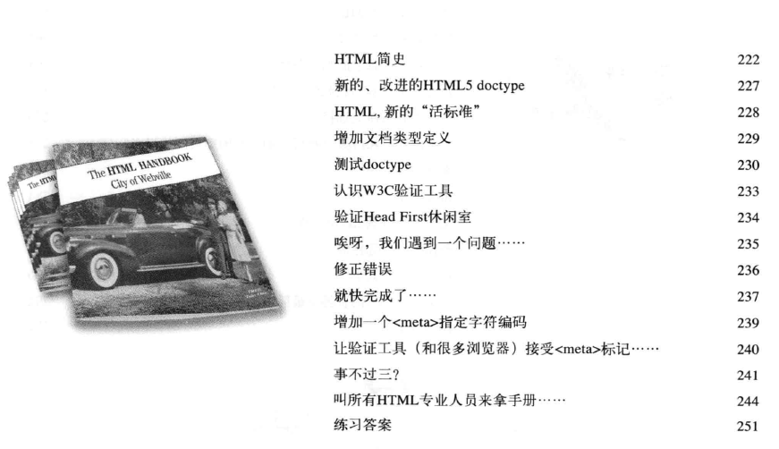
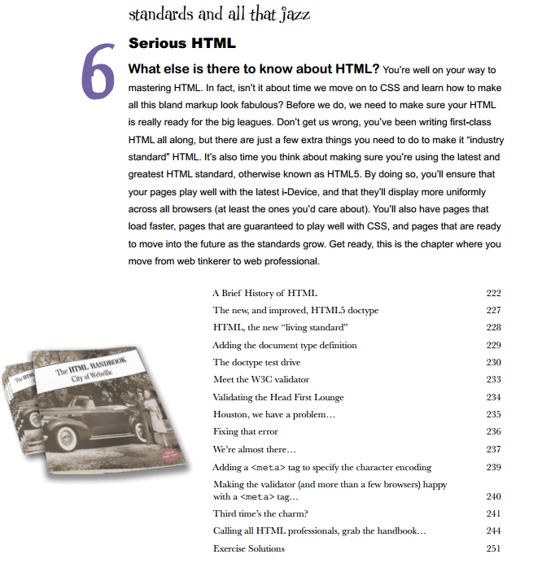

# README

## ★目录

### ◇中文

### ◇英文

### ◇自己的翻译

> 当然得借助有道翻译以及默认的中文翻译

标准和其它等等

认真的HTML

关于HTML还有什么需要知道的呢？您正在精通HTML的道路上。

事实上，我们是不是应该转向CSS并学习如何使所有这些**平淡无奇**的标记看起来非常漂亮？

在此之前，我们需要确保您的HTML已经为大赛做好了准备。不要误解我们，您一直以来都在编写一流的HTML，但是要使其成为行业标准HTML，您还需要做一些额外的事情。也是时候考虑一下是否使用最新最好的HTML标准了，也就是众所周知的HTML5。通过这样做，您将确保您的页面能够与最新的i-Device（智能设备）很好地兼容，并且它们将在所有浏览器(至少是您所关心的浏览器)上显示得更加一致。您还将拥有加载速度更快的页面，保证能够很好地使用CSS的页面，以及准备随着标准的成长而迁移到未来的页面。

准备好了，这是你从Web修补匠到Web专业人员的一章。

> 从拧螺丝到叫人拧螺丝的一章……
>
> 所以你必须要写遵循HTML5标准的HTML，因为这样一来，你的页面将会有很多优势：
>
> 1. 更好地兼容最新设备
> 2. 让页面加载速度更快
> 3. 会让你写起CSS来更加的得心应手

- HTML的简史

- 新的，改进的HTML5 doctype 
- HTML，新的“生活标准”

- 添加文档类型定义
- doctype测试驱动程序
- 认识W3C验证器工具
- 验证Head First Lounge 
- 哎呀，我们有一个问题…

- 修正这个错误
- 我们就快成功了……

- 添加一个`<meta>`标签来指定字符编码
- 让验证器(以及多个浏览器)对`<meta>`标签感到满意……

- Third time's the charm?

  > 第三次就是魔力？No！
  >
  > Third time is the charm 意思就是要**鼓励人不要放弃**，继续努力尝试下去，虽然前两次可能没有什么结果，但是说不定这一次( 第三次) 就开花结果了。
  >
  > 当然这不一定真的要定位在第三次的尝试上，其实只要是想要鼓励他人先前努力虽然没有结果，但是要在继续坚持下去这样的意思上，就可以了。所以，像是男生追女生，前几次都没消没息，这时候你就可以跟他说，third time is the charm ，别放弃了喔
  >
  > 总之就是鼓励你不要放弃，不管是1次、两次、还是10次、百次……
  >
  > **➹：**[夏老师- 疯英文: Third time is the charm! 第三次就是魅力??!!](http://shalliker.blogspot.com/2013/05/third-time-is-charm.html)

- 呼叫所有HTML专业人士来拿手册……

- 练习答案

