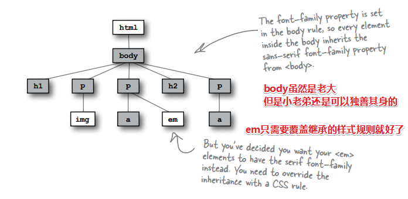
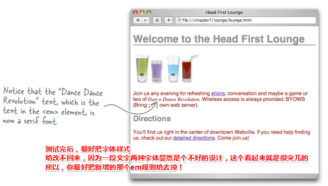
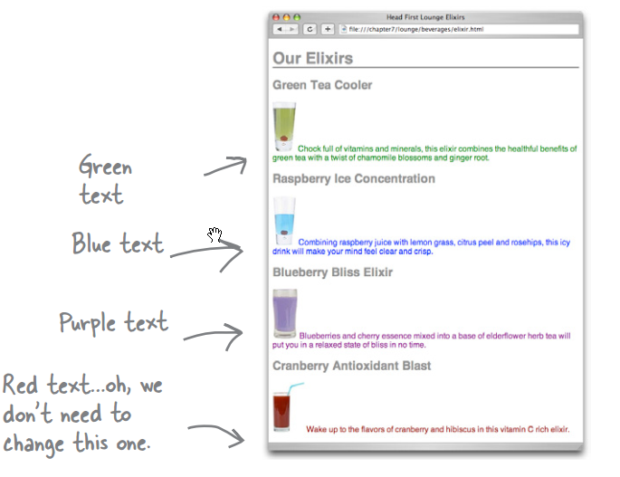
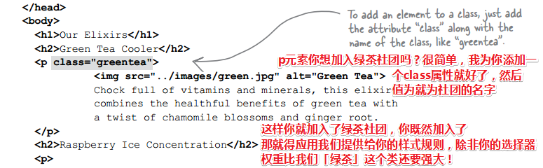
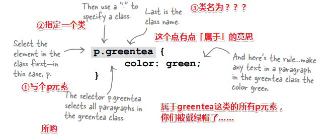
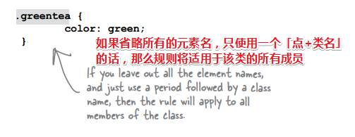

# README

> 我知道我无须记住理解的经过，我只需要知道理解过后的结论即可！

## ★新的语言-CSS

之前花了很多时间学习HTML，当然并没有具体到某些元素的细节，不过原理已经讲得很清楚了，而在这个过程中，你了解了标记（用标签标记内容，如p、h1之类的）、结构（如这是一个段落、标题之类的）、验证（打开那个w3c校验器即可）、正确的语法（有些不需要闭合标签、有些则需要，属性最好是带双引号的……）、什么是嵌套（一个元素的内容是另外一个或一堆元素的容器……）、什么是符合标准（声明这个是html5文档、添加meta元素搞个编码……）

可见，我们的HTML写得已经足够好了，同时也花费很多功夫，但是页面的内容不具备表现力哈，如枯木般萧索……当然并不是说写HTML不重要，而是非常重要哈！因为只有充分掌握了HTML，才能写出更好地CSS……而不是草草了事哈！

如果有一天，你能够在 写CSS的过程中，不用再对HTML「指手画脚」，即对它添加元素或者其它什么的……那么其实你的CSS写得真的是很不错了，不用为了样式，而让HTML源码作出妥协……

言归正传，为啥需要CSS呢？——我想上面已经解释得很清楚了，我们之前一直很专心地学习HTML来创建Web页面结构，但是用户总是喜欢炫彩缤纷的页面，而且也可以减轻用户的阅读负担……总之，我就是想要页面更具表现力，没有任何道理可言！

可是为啥要用CSS呢？HTML元素的属性不是也可以改变样式吗？——我想是为了HTML更简洁，而且更健壮吧！毕竟有些元素的样式是重复的……

## ★一种比喻

HTML元素和CSS有什么关系？——这种比喻我从未想过，当我看到这种比喻，我那一直恐惧写CSS的畏惧感，也就轰然破碎了……

那门这是一种怎样的比喻呢？或许之前你们都听说……


- 每个CSS规则：就像是一个个场所，如卧室、客厅、厨房、浴室、阳台等什么的……总之它们就是HTML元素
- 场所中有哪些东西呢？——它是我们为场所所添加的，即就像是为元素添加附加信息……如窗帘、地毯、小猪佩奇等……总之它们就是这个场所的属性
- 之所以在这些场所中放着相应的东西，那是因为它们外观表现和场所很搭啊！当然这是我的主观看法啦！比如我身为一个男的，我就喜欢浴室有粉红色的窗帘，难道你们就不能允许我有少女心吗？

> 我发觉，这就像是为抽象的编程世界给具象化了……

## ★简单地写一个样式


我们只写了一个样式，如果想要添加更多的样式，你就继续添加属性和值呗……当然这有一个专属名称，叫做「一个CSS声明」。而我们把花括号以及其里面的一个个CSS声明叫做「CSS声明块」

而p这个楞头货则是「一个CSS选择器」，如果有多个选择器一起，那就是一组选择器啦！

选择器加上声明块那就是一个规则集啦！简称规则！

**➹：**[CSS 语法 - MDN](https://developer.mozilla.org/zh-CN/docs/Learn/CSS/Introduction_to_CSS/Syntax)

### ◇一些思考

1. 如何让两个p元素有不同的颜色，即两个段落有不同的颜色？

2. 我怎么知道一个元素有哪些可以设置样式的CSS属性呢？——看[MDN](https://developer.mozilla.org/zh-CN/docs/Web/CSS/Reference)就好了，或者可以看开发者工具哈！

   或者可以看一下这个的回答：

   **➹：**[CSS 那么多属性，而且每个属性都有多个值怎么记？ - 知乎](https://www.zhihu.com/question/31317160)

3. 元素是用HTML写的，那么用HTML设置样式不是更好吗？为啥非要用不同的语言来定义所有的这些样式？

   1. CSS比HTML更适合为页面指定样式信息
   2. 一点点CSS，就会对HTML建立相当复杂的效果
   3. CSS更有利于处理多个页面的样式，如为页面添加样式之前需要初始化页面样式的，如reset.css！

4. 为啥改变字体颜色的CSS属性为`color`？而不是 `font-color`或者是`text-color`呢？——没有道理可言！或许是为了凸显出继承吧，因为`color`看起来更像是一个类，即表示的范围更大一些……

5. 如果你为某个嵌套了a元素的段落添加了color属性，那么a元素的内容可不会因此而变色！即链接的颜色没有变！即便了改变了p元素的背景色，链接的颜色依旧没有变

   

   可以说是背景色是背景色，前景色是前景色，即字体颜色是字体颜色！

## ★所有？个别？

我们知道，在一个页面中可能会有多个标题，如h1、h2这样的……

它们除了字体大小不一致之外，其余的基本上是一致的：


既然样式规则中有重叠，为啥不能写在一起呢？特殊的就分开写不就好吗？


**➹：**[CSS选择器笔记 - 阮一峰的网络日志](http://www.ruanyifeng.com/blog/2009/03/css_selectors.html)

效果：


### ◇一些思考

1. 如果一个元素有多个规则，那么该如何处理呢？把共有的提取出来，特别的就另外写呗！

   

   可是这有啥好处呢？单独地组织各个元素不是更好吗？为此，你就清楚地知道每个元素的样式是什么了呀！

   你说这不是很好吗？——不见得呀！因为如果把共同的样式合并在一起，倘若它们有改变，你**只需要在一个规则中修改**。如果把它们分开，就必须**修改多个规则**，这很容易出错，简而言之就是容易出现代码，而且更改繁琐！

2. 为什么要使用一个下边框为文本加下划线？文本不是有一个`underline`（下划线）样式吗？

   underline（下划线）样式，我们当然也可以使用这个样式。不过，**这两个样式在页面上的效果稍有不同**。如果使用`border-bottom`，**这条线会延伸到页面边缘**。而使用underline时，**下划线只出现在文本下面，不会继续延伸到页面边缘。**设置文本下划线的属性名为`text-decoration`，值为“`underline`”时表示文本有下划线。你可以试一试，看看有什么不同。

   

## ★选择器的工作原理

我们已经知道了如何通过选择一个元素来为其添加样式，就像这样：


总之，`样式应用于选择器所描述的元素身上`

CSS这家伙允许你指定各种选择器，以**确定你所写的样式应用于哪些元素**。所以，**了解如何使用这些选择器是掌握CSS的第一步**，不过，要做到这一点，你得需要了解正在样式化的HTML的组织结构是怎样的？

毕竟，如果您对其中的HTML没有一个清楚的认识，如不知道其中有什么元素，以及元素之间有什么关系……那么你该如何选择元素来为其样式化呢？——显然做不到吧！

如何才能清楚知道HTML的组织结构？——画一颗DOM树不就好了吗？也可以说结构树……

接着，我们只需要把选择器映射到这颗树就好了！

如：


继续搞多几个例子：

看看多元素选择器（就是之前我说的合并选择器）：


看看匹配多个p元素的情况：


更多选择器的用法，请参考：

**➹：**[CSS选择器笔记 - 阮一峰的网络日志](http://www.ruanyifeng.com/blog/2009/03/css_selectors.html)

## ★为什么要引入link元素？

在此解释之前，你需要知道一些概念：

1. 我们通常把CSS文件称为样式表（stylesheets）

在CSS文件中，不能出现style标签哈！因为CSS文件只包含CSS，不包含HTML！

之所以引入link元素是因为一个网站如果有上百个页面的话，当然，几个页面也行……你要知道，为了让网站处于同一个基调，很多页面的背景色、字体大小等都是一致的，如果每个页面都是用style标签来添加样式的话，那岂不是当遇到需要更改网站基调的时候，每个页面都得改一遍样式？显然这费时费力，而且容易出错！毕竟如果用户突然无法访问网站，那么用户粘性就下降了……毕竟用户会觉得这网站很辣鸡，不值得自己费时费力去浏览……

所以，现在我们需要一种方法来告诉浏览器，它应该使用外部样式表中的样式来样式化这个页面。为此，`link`元素就出马了！注意，它是个void元素！


就这样，我们就不再需要style元素了，当然你可以在测试的时候用……

请拿上你的放大镜仔细看看这个link元素：


`rel`属性指定了HTML文件与所链接的文件之间的关系。我们要链接到一个样式表，所以这里使用值“`stylesheet`”。

信息的类型是 `text/css`，换句话说，就是一个CSS样式表！

> 既然是链入，那就意味着把样式表往HTML页面里塞咯！就像是我们那些js文件一样，都是需要往页面里塞的……还有图片也是这样，给个地址，就能把图片往页面里塞……
>
> 而我们的超链接就不同了，是往外拐的……我们是跳到另外一个页面的……当然你可以使用iframe元素……
>
> **➹：**[`<iframe>` - MDN](https://developer.mozilla.org/zh-CN/docs/Web/HTML/Element/iframe)
>
> 不过似乎很少用到了！
>
> **➹：**[Iframe 有什么好处，有什么坏处？国内还有哪些知名网站仍用Iframe，为什么？有哪些原来用的现在抛弃了？又是为什么？ - 知乎](https://www.zhihu.com/question/20653055)

总之：

如果你在写一个页面的过程中，把样式规则放在style元素中，以及还大量使用古老的HTML元素，如font元素、center元素等之类的过时元素的话，显然，当你因为某种原因需要更改网站的外观的时候，那么网站中的每个页面都得要更改才行，而且还需要检查哪些具有样式行为的HTML元素，然后更改它们才行……
所以，你必须使用HTML5、外部样式表……而且使用外部样式表的话，如果你有时间还可以尝试多种设计，如做一个线上简历的网页，可以浮动、flex、grid这三种布局各搞一遍……

ps：可以叫外部样式文件（external style file ）或者是样式表（“stylesheet” ）

## ★使用CSS的好处

显然为页面提供了灵活性（flexibility）呀！

按照我自己的理解就是，灵活在样式与结构分离，当我们在写CSS的时候，无须理会结构！当然，前提是你得保证你的HTML是紧跟标准的，千万不要出现font元素之类的……

## ★衬线字体和非衬线字体

衬线字体——serif，长这样：


通常这种字体在计算机屏幕上阅读的话，会比较困难

所以我们一般选择非衬线字体，而改变字体样式属性为 `font-family`，而对应sans-serif 字体的值是 `sans-serif`

```css
font-family: sans-serif;
```

## ★继承

### ◇为什么需要继承？

我们想要页面中的所有p元素都为非衬线字体，所以 写了这样的样式：`font-family: sans-serif;`

形象一点就是让每间**卧室**的**床**都是**硬的**，即木板床……而不是软的……

如果我们往p元素里嵌套一个 `blockquote`，而且我们同样想要这个元素里的内容为非衬线字体，那么是不是得对其添加同样的样式呢？

为啥不能告诉整个页面都采用 sans-serif 字体呢？

不知道，你有没有发现这样一个现象，假设p元素中有a元素，你改变了p元素的默认字体样式，然后你会发现a元素的内容，其中它的字体样式也发生了改变，而且是更p元素的内容的字体样式一致的……所以，什么鬼？？？


我只是想要个木板床而已，为啥棉被、枕头都是硬的？

因为p元素中的元素继承了来自p元素的 `font-family`样式！

这就像是我们自己可能会从父母那里继承了黄皮肤、乌黑的头发一样……所以，同样的，元素也可以从它们的父元素继承样式也就不足为奇了！

> 注意：不是所有样式都能继承，而是只有一部分能继承，如font-size……

所以说，`<a>`和`<em>`元素就从`<p>`元素继承了`font-family`样式，而p元素就是它们的父元素！

总之改变段落样式也会改变段落中元素的样式，而且而这很合理，毕竟，如果不这样做的话，那么只能对每个子孙后代元素都搞一遍同样的CSS规则了，而这显然是很可怕的！总之这很容易出错、很麻烦，另外还费时间……

### ◇继承的原理

> 即它到底是怎样工作的？

跟选择器一样，同样得在你脑海中构建出一颗树才行……


更进一步，在这颗家族树上的body身上添加`font-family`属性，这样一来的话其子孙后代的所有元素的字体都会改变，当然，总会有漏网之鱼的！


整个网站的字体都会改变！

### ◇因继承而作出的优化


虽然`font-family`去到了另一个规则里了，但是如果你继续向页面添加一些新元素的话，如h3之类的，它们会自动继承sans-serif字体。此时，你看页面是没有发生任何变化，因为样式没变，但是你会感觉到你的CSS比以前好了很多！毕竟重复的CSS声明缩减至一条了……

### ◇覆盖继承

如果某个后代子元素不希望继承，如em元素想要衬线字体，当然这不是一个好主意，毕竟一个段落出现两种字体就很不一致了，这是一个很糟糕的设计，不过为了测试，还是可以试一下这样做的：



直接这样干：


效果：



ps：改不——改

### ◇一些思考

**①一个元素有两个样式规则，一个来自继承的，一个自己覆盖的。**那么选择哪个呢？

对于CSS来说，总会选择最特定的那个规则！那么如何知道哪个规则最特定呢？——你可以去看看有关CSS权重的知识！

**②话说，有些CSS属性是可以被子孙后代继承的，而有些则不可以？所以我该如何区别它们呢？**

一般来说，如果样式会影响文本外观，那么所有这些样式都能继承，如字体颜色`color`、`font-family`，以及所有与字体相关的属性，如`font-size`字体大小、`font-weight`字体粗细 (for bold text), and `font-style`字体是否倾斜 (for italics) ……而其它属性，如`border`……是不能继承的！而且这很合理，因为如果body有边框，那么难道你希望子孙后代也有边框吗？这显然很不合理呀！所以有时候你可以根据常识来判断，或者可以自己用demo测试一下。随着你对各种属性及其作用的熟悉，那么你就能很好地掌握哪些属性可继承，哪些属性不可继承……

**③不希望继承，那么继承而来的属性是否都能覆盖？**

没错，总能使用更特定的选择器来覆盖来自父元素的CSS属性。

**④这个内容有些复杂，所以有什么方法可以让我添加注释来提醒自己这些规则是做什么的吗？**

要在CSS中写注释，直接用这个`/* */`包围注释就好了！

```css
/* this rule selects all paragraphs and colors them blue */
/* 这个规则选择或者说匹配所有段落，指定它们的字体颜色为蓝色 */
```

其中，注释可以跨多行，还可以注释CSS，注意，被注释的CSS，浏览器会将其给忽略掉！

```css
/* this rule will have no
effect because it's in a
comment
p { color: blue; } */
```

这个规则没有任何效果，因为它在一个注释里！还有一定要正确地结来注释，不然，你的CSS不会起作用！

## ★类

### ◇为什么需要类？

需求：为单独的段落指定样式

我们想要让解释饮料的文本的颜色与饮料颜色一致……

> 从美学角度来讲，对于这种建议我们并不太赞同，不过，既然你是顾客，还是顾客至上。



也就是说我们要单独地为这些段落分别设置样式——文本与饮料颜色一致！

此刻我们知道，一个p元素选择器就针对所有段落了，有没有什么办法可以让我们单独地选择这些段落？

有……

就这样我们引入了类（class）的概念

结合HTML和CSS，我们可以定义一类元素，然后将样式应用到属于该类的任何元素……所以类到底是什么呢？

可以把它想象成是一个社团，比如有人创办了一个“绿茶（greentea）”社团，要加入这个社团，你就必须认可这个社团的所有权利和责任，比如遵守他们的样式标准之类的……总之随你怎样理解这个类的概念，实在理解不了的话，那就先创建个类，然后看看它是如何工作 的！

### ◇如何创建一个类？

1. 通过向HTML中的元素添加class属性，这就意味着我们将会把该元素添加到某个类中去
2. 在CSS中选择这个类

> 说好的写CSS，就不会管HTML呢？可是你居然想让HTML元素加入某个社团，好让自己能更好地写CSS。为此满足那些奇葩的样式需求……

例子：



> 有了class属性，别忘了提供类名，如 `greentea`

接着提供一些规则来样式化这类（greentea）元素。

### ◇如何创建一个类选择器？

要在CSS中创建一个类并在该类中选择一个元素，可以写一个类选择器，就像这样：



整体来看，这个规则可以让页面中属于greentea这一类的所有p元素的文本颜色变为绿色……

同理，其余的段落也是如此……

最终效果其实看起还不错……有时候只能做了才知道好不好，看来这设计还是可以的！

### ◇我要深入了解一下你——类

其实主要是处理class选择器的问题哈！

需求：我发现很多元素（如：h1、h2……）都想加入绿茶社团，因为它们想天天喝绿茶……

所以我只好这样做了：

首先各自在它们身上添加class属性—— `class="greentea"`

接着指定样式规则：

```css
h1.greentea, h2.greentea {
	color: green;
}
```

可是还有很多小伙伴要加入啊！难道，我还要继续这样做：

```css
h1.greentea,……，……， h2.greentea {
	color: green;
}
```

显然，这很不合理啊！因为需要写一个很庞大的选择器！

有没有啥办法不用写这个呢？

有啊！如果你希望greentea类中的所有元素都有同一种样式，即绿茶社团里的所有社员都能喝到绿茶，或者说都希望穿上绿色的绿茶社服……那么你就这样干吧：

```css
.greentea {
    color: green;
}
```



> 为啥得加一个元素才叫类选择器？不加元素，难道不是很正常的事儿吗？
>
> 想当初学习都是先 `.className {}`，接着才过渡到 `element.className {}`
>
> 而书中是颠倒的，不过这反而会对类选择器有了更深地了解，因为我这次的理解是逆向的……这让我感到很特别！

既然在一个类中，就相当于是一个社团里，那么我们一个元素能不能加入多个社团呢？即一个元素可以在多个类中吗?

这是可以的，我们的元素当然可以在多个类中。

把一个元素放到多个类中，这是很容易就能做到的，如：

```html
<p class="xxx yyy zzz">我是一个段落！</p>
```

直接将每个类名放入class属性的值中，然后各个类名之间用一个空格分割，而且**类名的顺序并不重要**

举个例子来说，我们可以把h1元素放在一个 `products`（商品）类中，而这个类定义了字体的大小和字体粗细，另外还把这个h1放在 `specials`（降价）类中，如果某个饮料降价促销，就可以将它的颜色改为红色了！

> 这一刻，我感觉到JS的魔力，很多时候我们使用JS都是为了切换类，如我们激活了导航栏中的某个选项，那么这个选项就会加入到 `active`社团，当我们离开后，它就退出了这个社团，而这中简单的逻辑，就是由JS完成的！
>
> 对了，我感觉加入CSS中的类，就像是Java中的接口概念一样，即定义了一些名字，然后咩有实现，我们定义了一些CSS属性，当然我们是有值的！
>
> 突然有个疑问「为啥要用 花括号`{}`？如CSS，判断语句等……」
>
> **➹：**[为什么很多编程语言采用花括号区分 block 而非缩进？ - 知乎](https://www.zhihu.com/question/19620446)
>
> **➹：**[编译原理词法分析，语法分析，语义分析能检测出什么错误？ - 知乎](https://www.zhihu.com/question/31065265)
>
> 词法分析（给词分类）、语法分析（这是啥语句？赋值语句？条件语句？）、语义分析（这是啥类型的变量？你这个变量声明并定义了么？……）

那么什么时候使用多个类呢？

如果你希望一个元素拥有不同类中定义的不同样式，就要使用多个类。如商品有默认状态和促销状态，那么如果商品此时需要被促销，那么你就对其添加一个促销类呗！

话说如果一个元素属于多个类，所有这些类都定义了相同的属性，那么这会有什么结果呢？

如一个p元素，参加了3个社团，分别是a、b、c，选择器都是p.类名这样的，然后定义color属性，分别是红绿蓝……你说这个段落最终是什么颜色呢？

## ★应用样式指南

> 这是一份很牛逼的应用样式指南，如何个牛逼法呢？比如说它是最简短、最快捷的，总之内容少，而且很快就能让你知道怎么确定这个元素将会被应用于那个样式……

目的：知道哪些样式被应用到哪些元素上

我们知道了元素、文档树、样式规则、还有类……而我们必须得知道所有的这些东西是如何被组织到一起的！唯有这样你才能知道哪些样式被应用到哪些元素上。当然，在此之前，你得对CSS有更多的了解才行！

### ◇常识性经验法则

> 一些关于如何应用样式的常识性经验法则。

需求：我想知道一个元素的`font-family`属性值

1. 有选择器选择你的元素吗？
2. 继承呢？
3. 都没有？那就使用默认值
4. 如果有多个选择器选择一个元素呢？
5. 如果仍然没有一个明确的赢家呢？


## ★总结

## ★Q&A

### ①入链和出链？

> 入链（英文：incoming link，inbound link，inlink，inward link），指的是指向某一网站或网页的超级链接。一个网站的入链的数量和质量是其在搜索结果中排序的重要依据。
>
> 事实上，“入链”和“出链”（outbound link）都是通常意义上的链接，即对于同一个链接，对链接所在的网页来说，它是出链，对指向的网页来说，它是入链。

比如这个链接：

**➹：**[入链_百度百科](https://baike.baidu.com/item/%E5%85%A5%E9%93%BE)

在我这个页面页面看来它是入链，而在这个链接的目标文件看来，它是我的一个出链……

**➹：**[如何查询到一个网页的所有链入页面？ - 知乎](https://www.zhihu.com/question/21398149)

