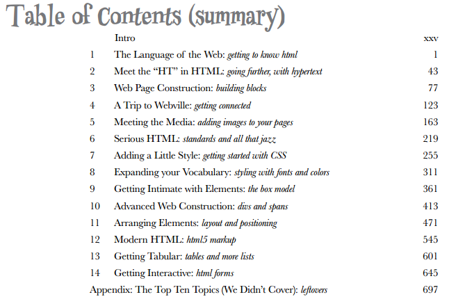
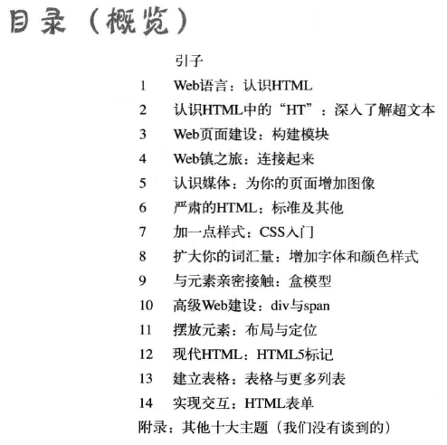
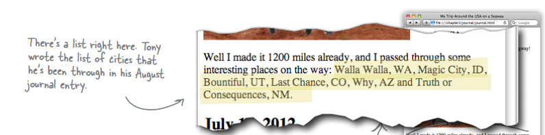
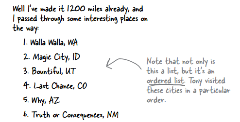
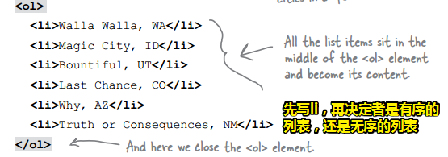
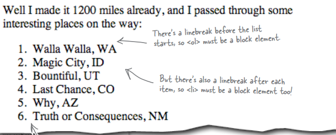

# head-first-html-css

## ★学到什么

1. 学会从HTML和CSS来创建你想要的Web页面，从而能与他人有着**更有效地交流**
2. 使用最新的HTML标准，能保证**随时间维护和扩展你的Web页面**，使它们在**所有浏览器和移动设备**中都能正常工作！

3. ……

## ★怎么学？

为什么总是遗忘？

- 你要知道你的大脑总是渴望新奇，它不断地寻找、扫描和等待不同寻常的东西。它天生
  如此，助你永葆活力。
- 当你遇到寻常而普通的东西时，大脑是如何应对的呢？它竭尽所能，避免这些东西干扰它做重要的工作——记住重要的东西。它不会劳神去记住无聊的东西，因为这些东西显然是不重要的。
- 大脑怎么知道哪些东西重要呢？假设有一天你去徒步旅行，面前突然出现了一只老虎，你的大脑和身体会有何反应呢？
  神经元受到刺激，情绪激动，肾上腺素激增。
  大脑于是明白：
  **这一定很重要！可别忘了！**
- 所以枯燥乏味的的内容，大脑认为这些内容不值得记忆。

为此这本书遵循了一些学习原则，**✎：**

- 使用视觉化元素
- 使用个性化的对话
- 激发学习者更深入地思考
- 引起并保持读者的兴趣

如何让大脑认为「HTML&CSS」与老虎一样重要？

> 有缓慢乏味的方式，也有快速高效的方式。

- 缓慢的方式就是没完没了地重复。
- 快速的方式是竭尽所能地刺激大脑活动，尤其是不同类型的大脑活动。如将描述文字放在图片中……

## ★目录概览

### ◇英文

### ◇中文

## ★总结

- 目录概览：20页；第一章：21页！

- 直到读到第三章，我才有了以下感慨：

  我从未想过理解一个知识点的姿势竟会如此多样，我喜欢这本书的姿势，这真得很有趣，通过一个个贴近生活的例子，去不断地去引出需要讲的新知识点，而每个知识点的衔接都很有逻辑，不会让人觉得一下子就要学好多东西一样，而是层层递进……通过「没有蠢问题」这个小点，可以让我们深入对这个知识点的理解……还有就是大量的图，让人不会觉得学这个新知识点是多么的枯燥乏味……

  对于课后的拼图练习，我想作者一定花了很多心思……

- 理解一个新知识点的姿势——它是什么？为什么要使用它？没有使用它之前用的是什么？为什么这样使用就比原先的使用姿势要好？最后就是如何使用它？测试效果以及不断提问深入这个知识点

  举个栗子，**✎：**

  它是「列表」，在我的日记中我罗列了一些我游历的景点，**✎：**

  

  可是这看起来就很索然无味了啊！浏览器认为这只是一个段落中的一部分而已，而且这是在一行之中的，而我想要浏览器知道它是这个样子的，**✎：**

  

  即这是一个像是一段一段的东西……

  那我该用什么元素去描述这个结构呢？——p元素吧！ `
1. Walla Walla, WA
`，你看这是不是很nice？既可以换行，又可以添加编号……

  可是这样很不好啊！浏览器认为这些都是一个个段落啊！完全咩有让浏览器认为这些内容是一个列表，可见这所谓的结构化很不语义化！我们只是取巧欺骗了用户而已…让用户看起来像是一个列表……

  对于我们前端开发者来说，如果在此之前写错了这些列表项，比如列表中间少写了一个列表项，那么后面的列表项的编号岂不是得重新计算一遍？即加上一个1……

  所以还是不用p元素为妙，毕竟对浏览器和开发者都不好……

  那么用什么好呢？肯定用HTML给我们提供的ol元素和li元素呀！

  为什么这个就比p元素好呢？显然「使用p元素」作为做这个事情的工具的弊端，在ol元素和li元素都没有……当然，还有其它很多的优点，如使用CSS为列表写样式时贼方便……

  那么我们该如何用呢？

  

  测试一下效果：

  

  最后，你想要深入这个知识点吗？那你就不断地提问吧！如「ol元素总是要和li元素一起使用吗？」、「还有其它列表吗？」……

- 很多时候我们学习一个新东西的最快捷姿势就是——CRM（拷贝、运行、修改）

  如果更上进一点，那么还会通过不断提问来加深对这个知识点的理解

  之后就是通过大量的实战来熟练使用这个知识点，当然，在实战过程中，理所应当也要提问，毕竟你很难确定我是不是完全掌握了这个知识点！

  总之，不断试错，不断改错，不断加深，直到……嗯……似乎可以歇息一下了……

## ★Q&A

### ①桌面隐喻？

> **桌面比拟**（英语：Desktop metaphor），在[图形使用者介面](https://www.wikiwand.com/zh-hans/%E5%9C%96%E5%BD%A2%E4%BD%BF%E7%94%A8%E8%80%85%E4%BB%8B%E9%9D%A2)（GUI）中，是一个将“人们在实际生活中的操作与[电脑](https://www.wikiwand.com/zh-hans/%E9%9B%BB%E8%85%A6)操作”合一的[概念](https://www.wikiwand.com/zh-hans/%E6%A6%82%E5%BF%B5)，帮助使用者容易地与电脑互动。桌面比拟将[计算机](https://www.wikiwand.com/zh-hans/%E8%A8%88%E7%AE%97%E6%A9%9F)的[显示器](https://www.wikiwand.com/zh-hans/%E9%A1%AF%E7%A4%BA%E5%99%A8)比拟成使用者的[桌面](https://www.wikiwand.com/zh-hans/%E6%A1%8C%E9%9D%A2)，其上可以放置文件与[文件夹](https://www.wikiwand.com/zh-hans/%E6%96%87%E4%BB%B6%E5%A4%B9)。文件可以开一个[视窗](https://www.wikiwand.com/zh-hans/%E8%A6%96%E7%AA%97)呈现，代表一份[文本](https://www.wikiwand.com/zh-hans/%E6%96%87%E6%9C%AC)的[拷贝](https://www.wikiwand.com/zh-hans/%E6%8B%B7%E8%B4%9D)放在桌上。也有称为办公桌配件（像是桌面计算机之类）的小程式可以使用。

**➹：**[桌面比拟 - Wikiwand](https://www.wikiwand.com/zh-hans/%E6%A1%8C%E9%9D%A2%E6%AF%94%E6%93%AC)

**➹：**[比拟和比喻的区别_百度知道](https://zhidao.baidu.com/question/52639472.html)

### ②活动流？

> \- [活动流（Activity Stream 2.0）](http://www.w3.org/TR/2015/WD-activitystreams-core-20150129/)：该规范定义了一个基于JSON格式描述潜在的和已完成的活动（Activity）的模型。活动是对各种动作（action）的抽象，如“张三在2015年2月2日在某博客帐号'张三微博'发布了一个新的博客文章”，这是一个活动。该规范试图基于JSON格式定义一个丰富的、适合人理解及机器处理的、可扩展的描述模型。
>
> \- [活动词汇表（Activity Vocabulary）](http://www.w3.org/TR/2015/WD-activitystreams-vocabulary-20150129/)：该规范定义了一组抽象类和属性来描述过去的、现在正在进行的和未来可能发生的活动。 

ps：从最基本的意义来说，一个“活动（Activity）”就是对一个动作（action）的语义描述。

按我的理解就是，「李四点了网站的图标跳转到了该网站的首页」，这就是一个活动哈！

**➹：**[W3C发布活动流、活动词汇表 基于JSON格式描述社交网络活动 - W3C中国](http://www.chinaw3c.org/archives/782/)

